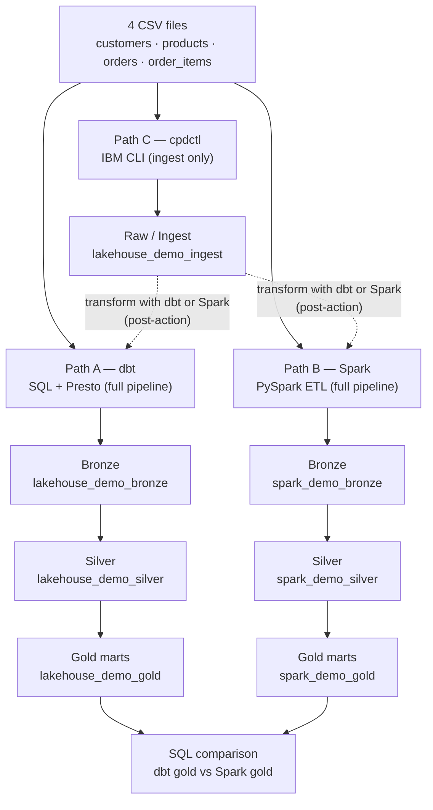
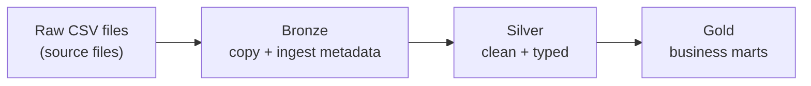

<section class="hero">
  IBM watsonx.data · Ingestion Workshop
  <h1>Two full pipelines and one native loader — transform with dbt or Spark, ingest with cpdctl</h1>
  

    A hands-on workshop for anyone new to watsonx.data. dbt and Spark are two interchangeable,
    full ingest+transform medallion pipelines; cpdctl is an ingestion-only loader (like dbt seed)
    that you pair with dbt or Spark. You load the same four CSV files, then compare the dbt and
    Spark gold outputs. No prior experience with dbt, Spark, or IBM tools required.
  

  

    <a class="primary" href="setup/">Start Preparation</a>
    <a href="lineage/">See Architecture</a>
    <a href="dbt-demo/">Run dbt</a>
    <a href="spark-demo/">Run Spark</a>
    <a href="ingestion/">Try cpdctl</a>
  

</section>

Built on

## What you will learn

!!! info "Workshop learning goals"
    By the end of this workshop you will be able to:

    - Explain what watsonx.data is and how its parts (catalog, engines, object storage) fit together
    - Describe two full load+transform engines (dbt, Spark) and one native ingestion loader (cpdctl), and choose the right one — including when cpdctl must be paired with dbt or Spark to build a medallion
    - Run a governed SQL pipeline with dbt and Presto, including tests and lineage
    - Run a distributed Python ETL job with Spark and verify its output with SQL

## What we are building

A small online shop has four CSV files: customers, products, orders, and order items — 1,704 rows
in total (50 customers, 20 products, 500 orders, 1,134 order items). Two of the paths (dbt and
Spark) are full ingest+transform medallion engines: each takes the CSVs all the way to Bronze,
Silver, and Gold (in `lakehouse_demo_*` and `spark_demo_*` respectively). cpdctl is an
ingestion-only loader — like `dbt seed` — that lands the raw CSVs in `lakehouse_demo_ingest` and
stops there. To turn cpdctl-ingested data into a medallion you run dbt or Spark as a post-action
over `lakehouse_demo_ingest`. At the end, you compare the dbt and Spark gold outputs side by side.

## The three ingestion paths

Every path reads the same source files and produces Iceberg tables in Parquet format. The
difference is which tool drives the work and what governance features come with it.

| Path | Tool | Language | Best for | Shows in UI ingestion history? |
|------|------|----------|----------|-------------------------------|
| A — dbt | dbt + Presto | SQL | Governed analytics, built-in tests, column lineage | No |
| B — Spark | PySpark on watsonx.data Spark engine | Python | Large files, distributed ETL, complex transformations | No (appears under Spark Applications) |
| C — cpdctl | IBM CLI (`cpdctl`) | Shell | Native UI-tracked ingestion, no code required | Yes |

All three paths write Iceberg tables stored as Parquet files in MinIO object storage. dbt and Spark
write full medallions to `lakehouse_demo_*` and `spark_demo_*`; cpdctl writes only raw tables to
`lakehouse_demo_ingest`. You compare the dbt and Spark gold layers directly; the cpdctl raw tables
become comparable only after a dbt or Spark transform.

!!! note "Why three paths instead of one?"
    Real teams choose different tools for different reasons — governance requirements, file size,
    skill set, or whether they want ingestion history in the UI. Two of these (dbt, Spark) are
    complete, interchangeable ingest+transform pipelines. The third (cpdctl) is an ingestion loader,
    like `dbt seed` — it gets raw data in fast and with UI audit history, then you point dbt or Spark
    at `lakehouse_demo_ingest` to build the medallion. **cpdctl + dbt/Spark together form one full
    pipeline.**

## The medallion pattern

The medallion pattern is a way to organize data by quality level, moving from raw files to
production-ready analytics tables in three named layers. Each layer adds something the previous
one lacked — metadata, type safety, or business logic. The dbt and Spark paths follow the full
Bronze → Silver → Gold progression. cpdctl ingests only the Raw layer (`lakehouse_demo_ingest`); to
carry it through Bronze → Silver → Gold you run dbt or Spark transformations on the ingested data.

| Layer | Plain-English meaning | What is added |
|-------|-----------------------|---------------|
| Raw | The original CSV files exactly as exported from the shop system | Nothing — this is the starting point |
| Bronze | A first managed copy in the lakehouse | Ingest timestamp, source file name, batch ID |
| Silver | Clean, typed, validated business entities | Proper dates, numeric types, status enums, deduplication |
| Gold | Pre-aggregated answers to business questions | Daily sales totals, category rankings, customer lifetime value |

!!! tip "Table vs. view in the gold layer"
    In the dbt path, `gold_daily_sales` is a physical **table** (data stored on disk). The other
    two gold objects — `gold_category_performance` and `gold_customer_360` — are **views** (saved
    queries that re-run on demand). The Spark path writes all gold outputs as physical Iceberg
    tables. Both approaches are valid; the dbt mix shows how you choose per use case.

## Workshop flow

Work through the pages in this order. Each step builds on the last.

1. **Prepare** ([setup.md](setup.md)) — ~15 min
   Install Python dependencies, configure the watsonx.data connection, and verify access to the
   Presto endpoint at `ibm-lh-lakehouse-presto651-presto-svc.apps.watson.ibmas-zocp-techcluster.org:443`.

2. **Understand the architecture** ([lineage.md](lineage.md)) — read only
   See the full column-by-column lineage and understand how schemas relate before you run anything.

3. **Run Path A: dbt** ([dbt-demo.md](dbt-demo.md)) — ~20 min
   Create schemas, load seeds into `lakehouse_demo_raw`, build Bronze/Silver/Gold models, run dbt
   tests, and query the gold layer.

4. **Run Path B: Spark** ([spark-demo.md](spark-demo.md)) — ~15 min
   Upload the PySpark job and CSV files to MinIO, submit the job to the watsonx.data Spark engine,
   and verify the `spark_demo_*` schemas.

5. **Run Path C: cpdctl** ([ingestion.md](ingestion.md)) — ~10 min
   Use the IBM CLI to ingest the CSV files via the native watsonx.data ingestion API (raw load only),
   then check the ingestion history in the UI. To build a medallion on this data, run dbt or Spark
   over `lakehouse_demo_ingest` afterward.

6. **Compare results with SQL** ([sql-demo.md](sql-demo.md))
   Run side-by-side queries across the dbt and Spark gold schemas to confirm they produce the same
   numbers, and inspect the cpdctl raw tables in `lakehouse_demo_ingest`. (cpdctl has no gold layer
   of its own — it would need a dbt or Spark transform first.)

7. **Explore lineage in OpenMetadata** ([openmetadata.md](openmetadata.md))
   Open OpenMetadata at `http://localhost:8585` to visualize the dbt lineage graph — from seed
   tables through to gold marts.

!!! warning "Complete the setup page before running any path"
    Paths A, B, and C all require a working connection profile and Python environment. Skipping
    the setup page is the most common reason commands fail.

## The words you will keep seeing

  

    <h3>watsonx.data</h3>
    
IBM's lakehouse platform — the environment where this workshop runs. It provides the catalog (index of all tables), query engines, and object storage access in one place.

  

  

    <h3>Iceberg</h3>
    
The open table format used for every table in this workshop. It gives plain Parquet files database features: safe updates, snapshot history, and partition management.

  

  

    <h3>Presto</h3>
    
The SQL query engine built into watsonx.data. dbt sends SQL to Presto, Presto executes it against the Iceberg catalog, and results come back as a result set.

  

  

    <h3>dbt</h3>
    
A tool that turns SQL SELECT statements into managed data pipelines. You write each transformation as a <code>.sql</code> file; dbt runs them in the right order, tests them, and tracks lineage.

  

  

    <h3>Spark</h3>
    
A distributed processing engine that runs Python (PySpark) jobs across multiple workers. Used in Path B to read CSV files from MinIO and write Iceberg tables.

  

  

    <h3>cpdctl</h3>
    
The IBM Cloud Pak for Data CLI. In Path C it calls the watsonx.data ingestion API directly, producing an ingestion job that appears in the platform UI history.

  

