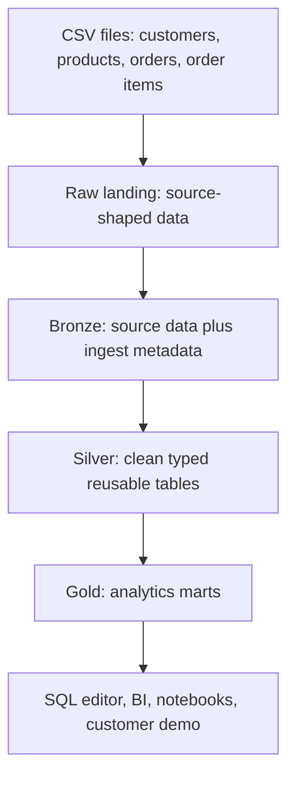
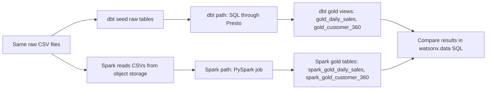

<section class="hero">
  <h1>Learn watsonx.data, dbt, Spark, and lakehouse layers in one demo</h1>
  <p>
    This guide is for a technical beginner: someone who can run commands, but has never seen
    watsonx.data, dbt, Spark, or a medallion lakehouse before. You will load small CSV files,
    build clean lakehouse tables, run tests, submit a Spark job, and compare the results.
  </p>
  <div class="hero-actions">
    <a class="primary" href="setup/">Start the setup</a>
    <a href="dbt-demo/">Run dbt path</a>
    <a href="spark-demo/">Run Spark path</a>
    <a href="sql-demo/">Copy SQL demo</a>
  </div>
</section>

## The Idea In One Minute

Imagine a shop exports four CSV files: customers, products, orders, and order lines. Those files are useful, but they are not yet a proper analytics system.

This demo turns those files into a lakehouse:

<div class="quick-grid">
  <div class="card">
    <div class="metric">1</div>
    <h3>Land the data</h3>
    <p>Keep the original CSV-shaped data visible so you can trace where records came from.</p>
  </div>
  <div class="card">
    <div class="metric">2</div>
    <h3>Add metadata</h3>
    <p>Bronze tables record ingest time, source file, and batch id.</p>
  </div>
  <div class="card">
    <div class="metric">3</div>
    <h3>Clean and type</h3>
    <p>Silver tables turn strings into dates, numbers, statuses, and reusable entities.</p>
  </div>
  <div class="card">
    <div class="metric">4</div>
    <h3>Publish marts</h3>
    <p>Gold tables answer business questions like daily sales and customer value.</p>
  </div>
</div>

## Raw Means Files First

In this demo, the **true raw layer** is the original CSV files:

```text
seeds/raw_customers.csv
seeds/raw_products.csv
seeds/raw_orders.csv
seeds/raw_order_items.csv
```

dbt and Spark use those raw files differently:

| Path | What happens to raw CSV files? | Why |
| --- | --- | --- |
| dbt | `dbt seed` loads the CSV files into `lakehouse_demo_raw` tables. | dbt transforms data with SQL, so the CSVs need to become queryable tables first. |
| Spark | Spark reads the uploaded CSV files directly from `s3a://iceberg-bucket/spark_demo/raw`. | Spark can read files from object storage directly, so it does not need a separate `spark_demo_raw` table schema. |

So the raw flow is:

```text
CSV files = true raw landing data

dbt path:
CSV files -> dbt seed raw tables -> bronze -> silver -> gold

Spark path:
CSV files in object storage -> bronze -> silver -> gold
```

## What Each Technology Does

<div class="concept-grid">
  <div class="card">
    <h3>watsonx.data</h3>
    <p>The lakehouse platform. It provides the catalog, engines, object storage access, and SQL surface.</p>
  </div>
  <div class="card">
    <h3>Iceberg</h3>
    <p>The open table format. It gives tables metadata, snapshots, partitions, and time travel.</p>
  </div>
  <div class="card">
    <h3>Presto</h3>
    <p>The SQL query engine used by dbt and the watsonx.data SQL editor in this demo.</p>
  </div>
  <div class="card">
    <h3>dbt</h3>
    <p>The SQL modeling tool. It builds, tests, and documents transformations.</p>
  </div>
  <div class="card">
    <h3>Spark</h3>
    <p>The distributed processing engine. It is strong for larger file and ETL jobs.</p>
  </div>
  <div class="card">
    <h3>MinIO</h3>
    <p>The S3-compatible object store where the Spark job reads its application and CSV files.</p>
  </div>
</div>

## How The Demo Flows



The same source files are used in two different execution paths:



!!! note "Why two paths?"
    The demo keeps dbt and Spark separate so customers can compare them clearly. In real projects they often work together: Spark prepares big or complex data assets, then dbt governs the SQL models consumed by analytics teams.

## Medallion Layers

<div class="layer-grid">
  <div class="card">
    <h3>Raw</h3>
    <p>Original CSV payload, kept close to the source. Useful for traceability.</p>
  </div>
  <div class="card">
    <h3>Bronze</h3>
    <p>First managed Iceberg copy. Adds metadata like source file and batch id.</p>
  </div>
  <div class="card">
    <h3>Silver</h3>
    <p>Typed, cleaned, reusable business entities with validation tests.</p>
  </div>
  <div class="card">
    <h3>Gold</h3>
    <p>Business-facing marts for dashboards, SQL demos, and customer conversations.</p>
  </div>
</div>

## Why Table Names Look Different

The dbt and Spark outputs are separated on purpose:

| dbt object | Spark object | Why |
| --- | --- | --- |
| `lakehouse_demo_gold.gold_daily_sales` | `spark_demo_gold.spark_gold_daily_sales` | Same business result, separate schema and Spark prefix. |
| `lakehouse_demo_gold.gold_customer_360` | `spark_demo_gold.spark_gold_customer_360` | Same customer mart, separate schema and Spark prefix. |

dbt gold models are **views** by default. Spark gold outputs are **physical Iceberg tables** because the Spark job writes dataframes into the catalog. That is normal.

## Strengths And Limits

| Tool | Strong at | Weaker at | In this demo |
| --- | --- | --- | --- |
| dbt | SQL transformations, tests, documentation, lineage, repeatable analytics models. | Heavy file processing, distributed non-SQL ETL, ML-style processing. | Builds `lakehouse_demo_*` schemas through Presto. |
| Spark | Distributed processing, large files, complex ETL, feature engineering, batch jobs near object storage. | Lightweight SQL governance, built-in model documentation, analyst-friendly review workflows. | Builds `spark_demo_*` schemas from uploaded CSV files. |
| watsonx.data | Shared Iceberg catalog, Presto SQL, Spark execution, object storage-backed lakehouse tables. | Transformation logic itself; dbt and Spark provide that logic. | Hosts the catalog, engines, and tables. |
{: .comparison-table }

## The Best Demo Order

<div class="path-list">
  <div class="path-step"><div><strong>Prepare the Python environment</strong><span>Create the virtual environment and install requirements.</span></div></div>
  <div class="path-step"><div><strong>Import the connection JSON</strong><span>Read watsonx.data host, instance id, and SSL certificate into local config.</span></div></div>
  <div class="path-step"><div><strong>Run the dbt path</strong><span>Create schemas, load seeds, build models, run tests, query gold.</span></div></div>
  <div class="path-step"><div><strong>Run the Spark path</strong><span>Upload Spark assets, submit the job, check status.</span></div></div>
  <div class="path-step"><div><strong>Compare outputs</strong><span>Use SQL to compare dbt and Spark gold results side by side.</span></div></div>
</div>

Start here: [Setup Order](setup.md).
