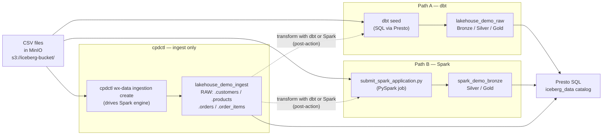

# Loading Data: Two Transform Engines (dbt, Spark) + One Native Loader (cpdctl)

!!! abstract "The central question"
    You have four CSV files. **dbt** and **Spark** are two full pipelines that load **and**
    clean/transform the CSVs into a medallion (Bronze → Silver → Gold). **cpdctl** is a native
    loader that lands the raw CSVs as-is in `lakehouse_demo_ingest` (clean them afterward with dbt
    or Spark). This page compares all three at a glance, then walks through **cpdctl native
    ingestion** in step-by-step detail — including how to finish the job with a dbt or Spark
    post-action.

---

## At a glance — two pipelines and one loader

Each path is a different philosophy: one uses SQL, one uses Python, one uses an IBM CLI that talks
directly to the platform's ingestion service. But note a difference **in kind**: dbt and Spark
perform the whole medallion (raw → bronze → silver → gold), while cpdctl performs only the raw
ingest step — the equivalent of `dbt seed` or Spark's raw CSV read.

| Path | Tool | Language | Who uses it | Shows in UI Ingestion history? | Best for | Schema written to |
|------|------|----------|-------------|-------------------------------|----------|-------------------|
| A · dbt | dbt-watsonx-presto adapter | SQL | Analytics engineers, data teams | No — visible in dbt logs and OpenMetadata lineage | Governed SQL transforms, tests, documentation, pull-request review | `lakehouse_demo_raw`, `bronze`, `silver`, `gold` |
| B · Spark | `submit_spark_application.py` | Python | Data engineers, ML engineers | No — visible under Infrastructure manager → Spark → Applications | Large data, Python libraries, distributed joins, ML feature prep | `spark_demo_bronze`, `spark_demo_silver`, `spark_demo_gold` |
| C · cpdctl | `cpdctl wx-data ingestion` | CLI (drives Spark) | Platform operators, anyone who wants UI-tracked loads | **Yes** — appears under Data manager → Ingestion | IBM-native loads that appear in the platform audit history | `lakehouse_demo_ingest` |

All three paths produce **Apache Iceberg tables** stored in **MinIO** (the S3-compatible object
store) and queryable through **Presto SQL** at the same endpoint. The difference: dbt and Spark
produce transformed bronze/silver/gold tables, while cpdctl produces only **raw** ingest tables in
`lakehouse_demo_ingest`.



---

## When to use each path

### Path A · dbt — SQL governance

Use dbt when your team needs to **review every transformation** as code. dbt compiles SQL
`SELECT` statements into Presto-executed `CREATE TABLE AS` or `INSERT` statements, runs
configurable data tests, generates a documentation website, and emits lineage metadata that
OpenMetadata can consume.

- Seeds 1,704 rows from CSV into `lakehouse_demo_raw` (50 customers, 20 products, 500 orders, 1,134 order_items)
- Bronze models clean nulls and cast types; silver models join and enrich; gold models aggregate
- `gold_daily_sales` is a TABLE; `gold_category_performance` and `gold_customer_360` are VIEWs
- Every model is version-controlled SQL — reviewable in a pull request

!!! tip "Best fit"
    Analytics engineering teams that treat data transformations as software: code review, CI tests,
    documentation-as-code.

### Path B · Spark — Python ETL

Use Spark when the volume or complexity exceeds what a single Presto query can do efficiently.
The Spark engine inside watsonx.data is a distributed compute cluster; you submit a PySpark
application that reads raw CSV, applies Python logic, and writes partitioned Iceberg tables.

- Writes PARQUET format; silver/gold tables partitioned by `month(order_date)` (partition column `order_date_month`)
- Medallion layers: `spark_demo_bronze` (raw copy), `spark_demo_silver` (cleaned and joined),
  `spark_demo_gold` (aggregated)
- You can import any Python library available on the Spark cluster

!!! tip "Best fit"
    Data engineers processing large files, binary formats, ML feature engineering, or complex
    multi-dataset joins.

### Path C · cpdctl — native ingestion

Use the cpdctl ingestion path when you want the load to appear in the **watsonx.data console
under Data manager → Ingestion**. This is the platform's native ingestion service — it runs on
the Spark engine, but you do not write any Spark code. You point the CLI at a CSV in object
storage, name a target Iceberg table, and the service does the rest.

- No transformation logic — loads raw CSV as-is into `lakehouse_demo_ingest.<table>`
- Jobs appear in the platform UI audit history immediately
- Same result is achievable from the watsonx.data web console without a terminal

!!! tip "Best fit"
    Platform operators who want a traceable, UI-visible load without writing transformation code,
    or anyone demonstrating the platform's built-in ingestion capability.

**Why cpdctl instead of `dbt seed` (or Spark's raw CSV read)?**

cpdctl is an alternative to the **raw-load step** only — not a substitute for the dbt or Spark
transformation engine. Compare it to `dbt seed` / Spark's raw read, not to the entire pipeline:

| Question | Answer |
|---|---|
| Speed for a one-off load | cpdctl is faster to set up than either path — no Python environment, no PySpark script. Point at a file and go. |
| Works from your laptop | You upload the CSV from your local machine directly into MinIO and trigger the load via CLI — no cluster-side code to write or deploy. |
| Audit history in the UI | Every cpdctl ingestion run appears under **Data manager → Ingestion** in the watsonx.data console. Neither dbt seed nor Spark jobs appear there — they are visible only in dbt logs or the Spark engine's own UI. |
| No code to maintain | `dbt seed` requires a CSV to live in the dbt project and be committed to Git. `Spark` requires a Python script. cpdctl needs only a command and a file path — nothing to version or review. |
| Enterprise operator workflow | A DBA or data steward who does not know Python or SQL can run cpdctl from a terminal or trigger the same action from the console GUI. |

**When NOT to use cpdctl:**

- You need transformation logic during load (use dbt or Spark).
- You need to load data on a schedule or in a pipeline (use dbt + Airflow, or Spark).
- You need the load to appear in dbt lineage or OpenMetadata (use `dbt seed` + dbt models).
- The source file is not a flat CSV (use Spark for JSON, Parquet, binary formats).

---

## What cpdctl does NOT do — and how to finish the job

cpdctl is a **loader**, the analogue of `dbt seed` or Spark's raw CSV read. It lands raw CSV in
`lakehouse_demo_ingest` and **stops at raw** — it does not build Bronze, Silver, or Gold. To turn
cpdctl-ingested data into a medallion you run a **dbt or Spark transform as a post-action** that
reads from `lakehouse_demo_ingest`:

> **cpdctl (ingest front-end) + dbt or Spark (transform back-end) = one full pipeline.**
>
> By contrast, dbt and Spark are each **self-contained** — each ingests *and* transforms on its own.

=== "Finish with dbt"

    Point a dbt model at the cpdctl-ingested raw table using `{{ ref() }}`-style CTAS against the
    ingest schema. (The IBM `dbt-watsonx-presto` adapter does not support `{{ source() }}`, so
    reference the table by its fully qualified name in the model SQL.)

    ```sql
    -- models/bronze_from_cpdctl/bronze_orders_cpdctl.sql
    {{ config(materialized='table') }}
    select
      order_id, customer_id, order_ts, status, payment_method,
      current_timestamp as _ingested_at,
      'cpdctl' as _ingested_by
    from iceberg_data.lakehouse_demo_ingest.orders
    where order_id is not null
    ```

=== "Finish with Spark"

    Read the cpdctl-ingested raw table with Spark and write a managed bronze Iceberg table.

    ```python
    df = spark.table("iceberg_data.lakehouse_demo_ingest.orders")
    (
        df.writeTo("iceberg_data.spark_demo_bronze.bronze_orders_cpdctl")
          .using("iceberg")
          .tableProperty("write.format.default", "parquet")
          .createOrReplace()
    )
    ```

From that bronze table you continue through silver and gold exactly as Paths A and B do.

---

## The same data, three schemas

Each path ingests the same four source CSV files, but produces a **different layer**: dbt and Spark
land *transformed bronze* tables, while cpdctl lands *raw ingest* tables (the analogue of dbt's
`lakehouse_demo_raw` seed layer — not bronze).

| Source CSV | dbt — Bronze (transformed) | Spark — Bronze (transformed) | cpdctl — Raw ingest (no transform) |
|-----------|-----------|-------------|--------------|
| `raw_customers.csv` (50 rows) | `lakehouse_demo_raw.raw_customers` → `lakehouse_demo_bronze.bronze_customers` | `spark_demo_bronze.bronze_customers` | `lakehouse_demo_ingest.customers` |
| `raw_products.csv` (20 rows) | `lakehouse_demo_raw.raw_products` → `lakehouse_demo_bronze.bronze_products` | `spark_demo_bronze.bronze_products` | `lakehouse_demo_ingest.products` |
| `raw_orders.csv` (500 rows) | `lakehouse_demo_raw.raw_orders` → `lakehouse_demo_bronze.bronze_orders` | `spark_demo_bronze.bronze_orders` | `lakehouse_demo_ingest.orders` |
| `raw_order_items.csv` (1,134 rows) | `lakehouse_demo_raw.raw_order_items` → `lakehouse_demo_bronze.bronze_order_items` | `spark_demo_bronze.bronze_order_items` | `lakehouse_demo_ingest.order_items` |

cpdctl's output corresponds to dbt's **raw seed** layer, not bronze — only dbt and Spark continue
past raw to transformed bronze/silver/gold. All three catalogs sit inside `iceberg_data` on the same
Presto engine, so you can `JOIN` across schemas in a single query (remembering cpdctl's tables are
raw, not transformed gold).

---

---

## Path C Walkthrough — cpdctl Native Ingestion

!!! info "What cpdctl is"
    `cpdctl` is the IBM Cloud Pak for Data command-line interface. The `wx-data` plugin lets you
    manage watsonx.data objects — buckets, engines, catalogs, and ingestion jobs — without opening
    a browser. When you run an ingestion job via `cpdctl`, it shows up in the watsonx.data console
    under **Data manager → Ingestion**, exactly like jobs started from the UI. The underlying
    compute engine is Spark; you do not write any Spark code.

---

### Step 1 — Install cpdctl

`cpdctl` is a single binary distributed as a `.tar.gz` archive from GitHub releases. Download it,
extract it to a directory on your `PATH`, and verify the version.

!!! note "Skip this step if cpdctl is already on PATH"
    Run `cpdctl version` first. If you get a version string back, jump to Step 2.

```bash
# macOS (Apple Silicon — arm64)
curl -fsSL -o cpdctl.tar.gz \
  https://github.com/IBM/cpdctl/releases/download/v1.8.233/cpdctl_darwin_arm64.tar.gz
tar -xzf cpdctl.tar.gz -C ~/.local/bin && chmod +x ~/.local/bin/cpdctl
cpdctl version
```

!!! tip "Other operating systems"
    Replace `darwin_arm64` with `linux_amd64`, `linux_arm64`, or `windows_amd64` for your
    platform. The full list is at
    [github.com/IBM/cpdctl/releases](https://github.com/IBM/cpdctl/releases).

---

### Step 2 — Configure the profile

A `cpdctl` profile stores the connection details for one watsonx.data instance. You create it
once; every subsequent command uses `--profile wxd-demo` (or sets it as the default).

The values come from your `.env` file in the project root.

```bash
# Load all environment variables from .env
set -a; source .env; set +a

# Create (or overwrite) the profile named wxd-demo
cpdctl config profile set wxd-demo \
  --url "https://${WXD_CPD_HOST}" \
  --username "${WXD_CPD_USERNAME}" \
  --apikey "${WXD_API_KEY}" \
  --env "WATSONX_DATA_INSTANCE_ID=${WXD_INSTANCE_ID}"
```

What each flag does:

| Flag | What it sets | Example value |
|------|-------------|---------------|
| `--url` | HTTPS endpoint of the Cloud Pak for Data cluster | `https://cpd.apps.watson.ibmas-zocp-techcluster.org` |
| `--username` | CPD username for this instance | `admin` |
| `--apikey` | API key that authenticates this user | `<your-key>` |
| `--env WATSONX_DATA_INSTANCE_ID` | The internal ID of the watsonx.data service on this CPD cluster | `1234-abcd-...` |

---

### Step 3 — Trust the cluster CA

watsonx.data runs on OpenShift with a custom TLS certificate that was not issued by a public
certificate authority. Without this step, `cpdctl` will reject the connection with an SSL
verification error.

```bash
export SSL_CERT_FILE="$PWD/certs/watsonxdata-ca.pem"
```

This environment variable tells the Go TLS library (used by `cpdctl`) to trust the CA certificate
bundled in this repository's `certs/` directory. Set it in every terminal session before running
`cpdctl` commands, or add it to your shell profile.

!!! note "Where the certificate comes from"
    The `certs/watsonxdata-ca.pem` file is included in this repo. It was exported from the
    OpenShift cluster's ingress CA. Do not use `--insecure` as an alternative — it disables all
    TLS verification and is not safe in a workshop environment with real credentials.

---

### Step 4 — Stage CSV files in object storage

The watsonx.data ingestion service reads CSV files from MinIO (the S3-compatible object store
inside the cluster). The CSV files need to be uploaded there before the ingestion job can read
them.

The Spark demo path already uploads these files — run the same upload script:

```bash
python scripts/upload_spark_assets.py
```

This uploads the four CSV files to `s3://iceberg-bucket/spark_demo/raw/` under the paths the
ingestion script expects. If you already ran the Spark demo, the files are already there.

!!! info "What MinIO is"
    MinIO is an open-source object store that is API-compatible with Amazon S3. watsonx.data
    uses it as the backing store for Iceberg table data and as a staging area for file ingestion.
    The `s3://iceberg-bucket/` path maps to a bucket registered in the watsonx.data catalog.

---

### Step 5 — Run the ingestion script

The ingestion script creates the target schema if it does not exist, then submits one ingestion
job per CSV file.

```bash
export WXD_CPDCTL_PROFILE=wxd-demo
python scripts/ingest_with_cpdctl.py
```

Internally, for each CSV file the script calls `cpdctl wx-data ingestion create`. The equivalent
bare CLI command for the customers file looks like this:

```bash
cpdctl wx-data ingestion create \
  --instance-id "${WXD_INSTANCE_ID}" \
  --source-data-files s3://iceberg-bucket/spark_demo/raw/raw_customers.csv \
  --source-file-type csv \
  --target-table iceberg_data.lakehouse_demo_ingest.customers \
  --engine-id "${WXD_SPARK_ENGINE_ID}" \
  --job-id ingest-customers-demo
```

The script runs this pattern for all four CSVs (`customers`, `products`, `orders`, `order_items`)
and prints each `job_id` and the console link to monitor progress.

Expected output:

```text
Submitting ingestion job for: raw_customers.csv
  job_id: ingest-customers-demo
  target: iceberg_data.lakehouse_demo_ingest.customers
  console: https://cpd.apps.watson.ibmas-zocp-techcluster.org/...

Submitting ingestion job for: raw_products.csv
  job_id: ingest-products-demo
  target: iceberg_data.lakehouse_demo_ingest.products
  ...

All 4 ingestion jobs submitted.
```

!!! warning "Do not pass `--storage-name` for a registered bucket"
    `iceberg-bucket` is already **registered** in watsonx.data, so the service auto-detects it
    from the `s3://` path. Passing `--storage-name` then triggers the *unregistered/transient*
    storage flow and the job fails with `I002 Invalid input provided`. Only set
    `WXD_INGEST_STORAGE_NAME` (which adds `--storage-name` to the command) when ingesting from
    storage that is **not** registered in the watsonx.data catalog.

---

### Step 6 — Watch the jobs

Poll the ingestion job list from the terminal, or open the UI to watch job state move from
`starting` to `running` to `FINISHED`.

```bash
# List the 10 most recent ingestion jobs
cpdctl wx-data ingestion list \
  --instance-id "${WXD_INSTANCE_ID}" \
  --jobs-per-page 10
```

To watch a specific job:

```bash
cpdctl wx-data ingestion get \
  --instance-id "${WXD_INSTANCE_ID}" \
  --job-id ingest-customers-demo
```

In the UI: open the watsonx.data console, navigate to **Data manager → Ingestion**. Each job
listed there is exactly what `cpdctl wx-data ingestion list` returns — the CLI and the UI share
the same job store.

!!! note "Ingestion runs on the Spark engine"
    The jobs execute on the Spark engine (`spark656` in this cluster). Folder ingestion — loading
    an entire directory of identically shaped files into one table — is a Spark-only capability.
    Because the four CSVs in this demo have different column shapes, each is ingested into its own
    table.

---

## What to query after ingestion

Once all four jobs show `FINISHED`, the tables are live Iceberg tables queryable through Presto.
Connect to the Presto endpoint and run:

```sql
-- Confirm the tables exist
SHOW TABLES IN iceberg_data.lakehouse_demo_ingest;
```

```text
     Table
------------
 customers
 order_items
 orders
 products
(4 rows)
```

```sql
-- Spot-check row counts (should match seed data)
SELECT
    'customers'   AS tbl, COUNT(*) AS rows FROM iceberg_data.lakehouse_demo_ingest.customers
UNION ALL SELECT 'products',   COUNT(*) FROM iceberg_data.lakehouse_demo_ingest.products
UNION ALL SELECT 'orders',     COUNT(*) FROM iceberg_data.lakehouse_demo_ingest.orders
UNION ALL SELECT 'order_items',COUNT(*) FROM iceberg_data.lakehouse_demo_ingest.order_items;
```

```text
    tbl      | rows
-------------+------
 customers   |   50
 products    |   20
 orders      |  500
 order_items | 1134
(4 rows)
```

```sql
-- Join across the cpdctl schema — same Presto catalog, same Iceberg format
SELECT
    c.first_name || ' ' || c.last_name AS customer_name,
    c.country,
    COUNT(DISTINCT o.order_id)         AS total_orders,
    SUM(oi.quantity * p.unit_price)    AS total_revenue
FROM iceberg_data.lakehouse_demo_ingest.customers   c
JOIN iceberg_data.lakehouse_demo_ingest.orders      o  ON c.customer_id  = o.customer_id
JOIN iceberg_data.lakehouse_demo_ingest.order_items oi ON o.order_id     = oi.order_id
JOIN iceberg_data.lakehouse_demo_ingest.products    p  ON oi.product_id  = p.product_id
GROUP BY c.first_name, c.last_name, c.country
ORDER BY total_revenue DESC
LIMIT 10;
```

!!! example "Cross-schema join"
    Because dbt and Spark (full pipelines) and cpdctl (raw loader) all write to the same
    `iceberg_data` catalog, you can join the `lakehouse_demo_ingest` tables against
    `lakehouse_demo_raw` (dbt) or `spark_demo_bronze` (Spark) in a single query — but remember
    cpdctl's tables are **raw**, not transformed gold.

```sql
-- Compare customer counts across all three paths in one query
SELECT 'dbt'    AS path, COUNT(*) AS customers FROM iceberg_data.lakehouse_demo_raw.raw_customers
UNION ALL
SELECT 'spark',  COUNT(*) FROM iceberg_data.spark_demo_bronze.bronze_customers
UNION ALL
SELECT 'cpdctl', COUNT(*) FROM iceberg_data.lakehouse_demo_ingest.customers;
```

---

## Next step

The dbt and Spark paths have built full medallions; cpdctl has loaded the raw ingest landing
(`lakehouse_demo_ingest`). To turn that raw landing into a medallion, run dbt or Spark
transformations against `lakehouse_demo_ingest` (see [What cpdctl does NOT do](#what-cpdctl-does-not-do-and-how-to-finish-the-job)
above) — cpdctl (ingest front-end) + dbt or Spark (transform back-end) = one complete pipeline.

The SQL demo page runs queries that compare the **dbt and Spark gold layers** side by side, and
shows how to inspect the cpdctl raw ingest tables.

[SQL — Compare All Paths →](sql-demo.md){ .md-button .md-button--primary }
