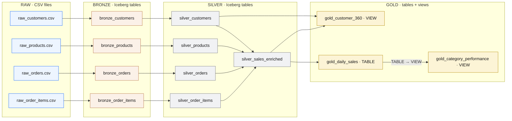
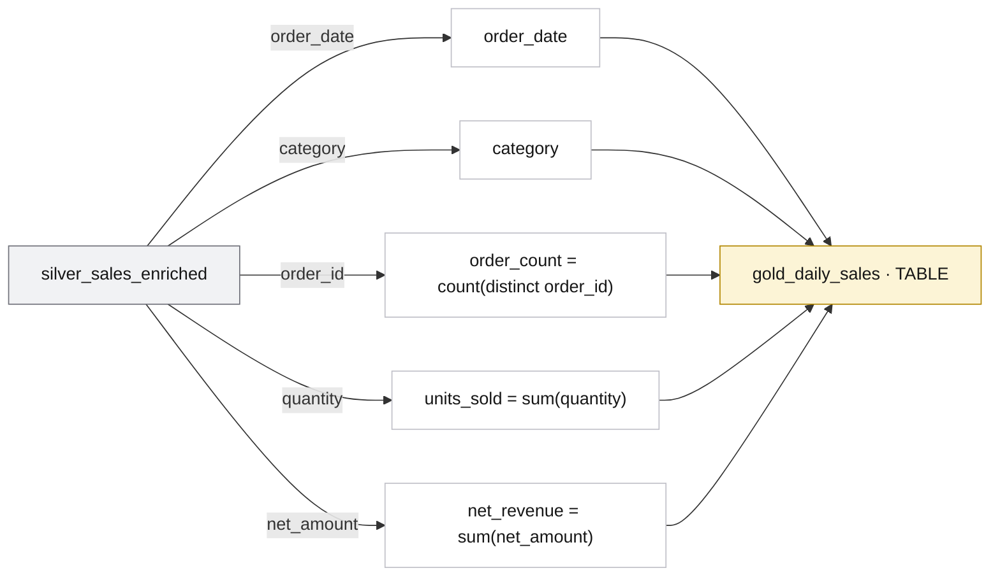
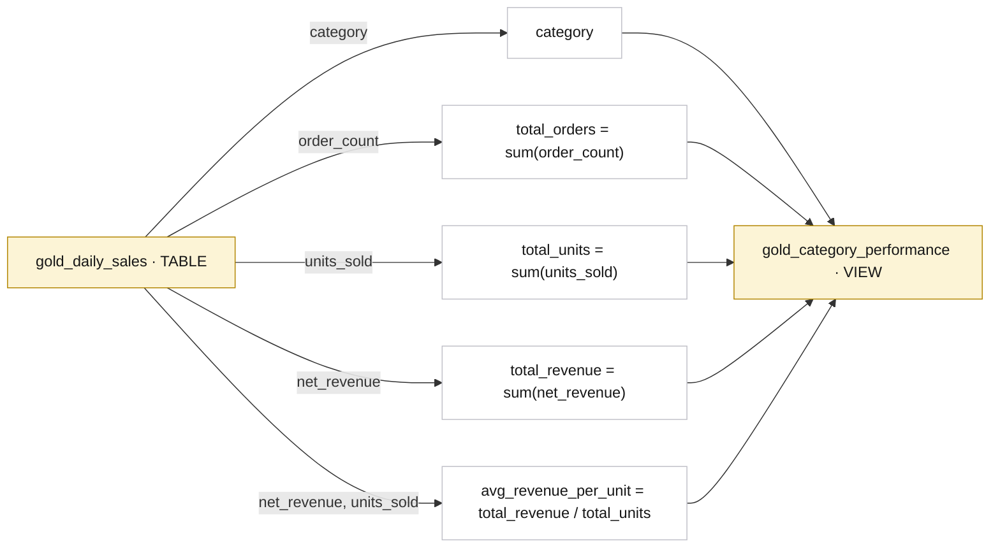
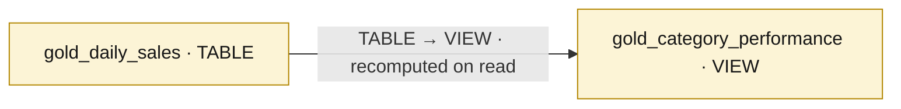
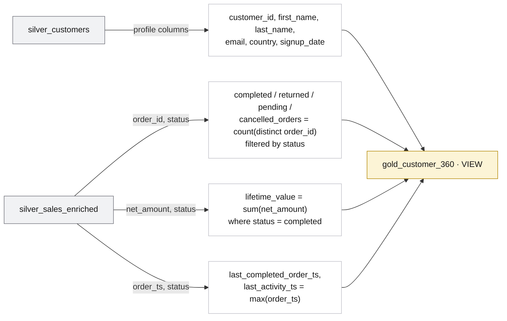

<section class="hero">
  <span class="eyebrow">Medallion Architecture</span>
  <h1>From four CSV files to governed gold marts — traced column by column</h1>
  <p>
    This page shows the full <strong>medallion lineage</strong> of the demo: how the raw
    CSV files flow through bronze, silver, and gold, and exactly which column becomes
    which. Use it to explain to a customer how a single field — say a discount percentage —
    travels from a spreadsheet cell into <code>net_revenue</code> on a dashboard.
  </p>
</section>

<div class="brand-strip" markdown>
<span class="brand-label">Built on</span>


</div>

## The Four Medallion Layers

<p class="lede">Each layer has one job. Data only ever moves left to right, and every layer keeps the one before it intact — so you can always trace a number back to the file it came from.</p>

<div class="layer-grid">
  <div class="card raw">
    <span class="layer-tag">Raw</span>
    <h3>Source files</h3>
    <p>The original CSV exports. The true landing zone — strings only, nothing cleaned. Kept for full traceability.</p>
  </div>
  <div class="card bronze">
    <span class="layer-tag">Bronze</span>
    <h3>Ingested copy</h3>
    <p>First managed Iceberg tables. Same columns as the source, plus ingest metadata (when, by what, from which file, which batch).</p>
  </div>
  <div class="card silver">
    <span class="layer-tag">Silver</span>
    <h3>Clean &amp; typed</h3>
    <p>Strings become real dates, integers, and decimals. Trimmed, lower-cased, validated, deduplicated business entities.</p>
  </div>
  <div class="card gold">
    <span class="layer-tag">Gold</span>
    <h3>Business marts</h3>
    <p>Views that answer questions: daily sales by category, and a customer 360 with lifetime value. What dashboards read.</p>
  </div>
</div>

!!! info "How to read the object types"
    Every box in this demo is one of three things:
    <span class="obj csv">CSV</span> a flat file in object storage &nbsp;·&nbsp;
    <span class="obj table">TABLE</span> a physical Iceberg table &nbsp;·&nbsp;
    <span class="obj view">VIEW</span> a logical query that runs on read.
    Raw → bronze → silver are **tables**; gold is a **mix** — `gold_daily_sales` is a table, and the other gold marts are views built on top of it.

## End-to-End Lineage

This is the whole pipeline at a glance. The four sources fan in through the layers and converge into the two gold marts.



## Column-Level Lineage

Below, each entity is traced field by field. <span class="new">Green</span> marks a column that is **created** in that layer (it has no upstream source).

### Customers

<div class="lineage-table-wrap" markdown>
<table class="lineage">
  <thead>
    <tr>
      <th class="raw">raw_customers.csv → seed</th>
      <th class="arrow"></th>
      <th class="bronze">bronze_customers</th>
      <th class="arrow"></th>
      <th class="silver">silver_customers</th>
    </tr>
  </thead>
  <tbody>
    <tr><td><code>customer_id</code> (string)</td><td class="arrow">→</td><td><code>customer_id</code></td><td class="arrow">→</td><td><code>customer_id</code> · <code>cast → integer</code></td></tr>
    <tr><td><code>first_name</code></td><td class="arrow">→</td><td><code>first_name</code></td><td class="arrow">→</td><td><code>first_name</code> · <code>trim()</code></td></tr>
    <tr><td><code>last_name</code></td><td class="arrow">→</td><td><code>last_name</code></td><td class="arrow">→</td><td><code>last_name</code> · <code>trim()</code></td></tr>
    <tr><td><code>email</code></td><td class="arrow">→</td><td><code>email</code></td><td class="arrow">→</td><td><code>email</code> · <code>lower(trim())</code></td></tr>
    <tr><td><code>signup_date</code></td><td class="arrow">→</td><td><code>signup_date</code></td><td class="arrow">→</td><td><code>signup_date</code> · <code>cast → date</code></td></tr>
    <tr><td><code>country</code></td><td class="arrow">→</td><td><code>country</code></td><td class="arrow">→</td><td><code>country</code> · <code>upper(trim())</code></td></tr>
    <tr><td></td><td class="arrow"></td><td class="new">+ _ingested_at, _ingested_by,<br>_source_file, _ingest_batch_id</td><td class="arrow">→</td><td class="new">transformed_at</td></tr>
  </tbody>
</table>
</div>

!!! note "Filter applied at silver"
    `where email is not null` — rows without an email are dropped, because customer marts key on it.

### Products

<div class="lineage-table-wrap" markdown>
<table class="lineage">
  <thead>
    <tr>
      <th class="raw">raw_products.csv → seed</th>
      <th class="arrow"></th>
      <th class="bronze">bronze_products</th>
      <th class="arrow"></th>
      <th class="silver">silver_products</th>
    </tr>
  </thead>
  <tbody>
    <tr><td><code>product_id</code> (string)</td><td class="arrow">→</td><td><code>product_id</code></td><td class="arrow">→</td><td><code>product_id</code> · <code>cast → integer</code></td></tr>
    <tr><td><code>product_name</code></td><td class="arrow">→</td><td><code>product_name</code></td><td class="arrow">→</td><td><code>product_name</code> · <code>trim()</code></td></tr>
    <tr><td><code>category</code></td><td class="arrow">→</td><td><code>category</code></td><td class="arrow">→</td><td><code>category</code> · <code>trim()</code></td></tr>
    <tr><td><code>unit_price</code></td><td class="arrow">→</td><td><code>unit_price</code></td><td class="arrow">→</td><td><code>unit_price</code> · <code>cast → decimal(12,2)</code></td></tr>
    <tr><td></td><td class="arrow"></td><td class="new">+ ingest metadata (×4)</td><td class="arrow">→</td><td class="new">transformed_at</td></tr>
  </tbody>
</table>
</div>

!!! note "Filter applied at silver"
    `where product_id is not null`.

### Orders

<div class="lineage-table-wrap" markdown>
<table class="lineage">
  <thead>
    <tr>
      <th class="raw">raw_orders.csv → seed</th>
      <th class="arrow"></th>
      <th class="bronze">bronze_orders</th>
      <th class="arrow"></th>
      <th class="silver">silver_orders</th>
    </tr>
  </thead>
  <tbody>
    <tr><td><code>order_id</code> (string)</td><td class="arrow">→</td><td><code>order_id</code></td><td class="arrow">→</td><td><code>order_id</code> · <code>cast → integer</code></td></tr>
    <tr><td><code>customer_id</code></td><td class="arrow">→</td><td><code>customer_id</code></td><td class="arrow">→</td><td><code>customer_id</code> · <code>cast → integer</code></td></tr>
    <tr><td><code>order_ts</code></td><td class="arrow">→</td><td><code>order_ts</code></td><td class="arrow">→</td><td><code>order_ts</code> · <code>cast → timestamp</code></td></tr>
    <tr><td><code>order_ts</code></td><td class="arrow">→</td><td>—</td><td class="arrow">→</td><td class="new">order_date · <code>cast(order_ts → date)</code></td></tr>
    <tr><td><code>status</code></td><td class="arrow">→</td><td><code>status</code></td><td class="arrow">→</td><td><code>status</code> · <code>lower(trim())</code></td></tr>
    <tr><td><code>payment_method</code></td><td class="arrow">→</td><td><code>payment_method</code></td><td class="arrow">→</td><td><code>payment_method</code> · <code>lower(trim())</code></td></tr>
    <tr><td></td><td class="arrow"></td><td class="new">+ ingest metadata (×4)</td><td class="arrow">→</td><td class="new">transformed_at</td></tr>
  </tbody>
</table>
</div>

!!! note "Filter + partitioning at silver"
    `where order_id is not null`. The table is **partitioned by `day(order_date)`** (PARQUET) so date-range queries prune files.

### Order items

<div class="lineage-table-wrap" markdown>
<table class="lineage">
  <thead>
    <tr>
      <th class="raw">raw_order_items.csv → seed</th>
      <th class="arrow"></th>
      <th class="bronze">bronze_order_items</th>
      <th class="arrow"></th>
      <th class="silver">silver_order_items</th>
    </tr>
  </thead>
  <tbody>
    <tr><td><code>order_item_id</code> (string)</td><td class="arrow">→</td><td><code>order_item_id</code></td><td class="arrow">→</td><td><code>order_item_id</code> · <code>cast → integer</code></td></tr>
    <tr><td><code>order_id</code></td><td class="arrow">→</td><td><code>order_id</code></td><td class="arrow">→</td><td><code>order_id</code> · <code>cast → integer</code></td></tr>
    <tr><td><code>product_id</code></td><td class="arrow">→</td><td><code>product_id</code></td><td class="arrow">→</td><td><code>product_id</code> · <code>cast → integer</code></td></tr>
    <tr><td><code>quantity</code></td><td class="arrow">→</td><td><code>quantity</code></td><td class="arrow">→</td><td><code>quantity</code> · <code>cast → integer</code></td></tr>
    <tr><td><code>discount_pct</code></td><td class="arrow">→</td><td><code>discount_pct</code></td><td class="arrow">→</td><td><code>discount_pct</code> · <code>cast → decimal(5,2)</code></td></tr>
    <tr><td></td><td class="arrow"></td><td class="new">+ ingest metadata (×4)</td><td class="arrow">→</td><td class="new">transformed_at</td></tr>
  </tbody>
</table>
</div>

!!! note "Filter applied at silver"
    `where quantity > 0`.

### Silver enrichment (the join layer)

The four tables above are clean, but they are still *separate*. In a lakehouse medallion design,
silver does one more job: it **conforms and joins** the four entities into a single wide
fact table — <code>silver_sales_enriched</code> (Spark: <code>spark_silver_sales_enriched</code>).
Every row is one **order line** (one product on one order), with the customer, order, and
product details already attached. Downstream gold no longer has to re-join anything — it
just reads this one table. Two columns are **computed** here so the math lives in one place.

<div class="lineage-table-wrap" markdown>
<table class="lineage">
  <thead>
    <tr>
      <th class="silver">upstream silver column</th>
      <th class="arrow"></th>
      <th class="silver">silver_sales_enriched (order-line grain)</th>
    </tr>
  </thead>
  <tbody>
    <tr><td><code>silver_order_items.order_item_id</code></td><td class="arrow">→</td><td><code>order_item_id</code></td></tr>
    <tr><td><code>silver_order_items.order_id</code></td><td class="arrow">→</td><td><code>order_id</code></td></tr>
    <tr><td><code>silver_orders.order_date</code></td><td class="arrow">→</td><td><code>order_date</code></td></tr>
    <tr><td><code>silver_orders.order_ts</code></td><td class="arrow">→</td><td><code>order_ts</code></td></tr>
    <tr><td><code>silver_orders.status</code></td><td class="arrow">→</td><td><code>status</code></td></tr>
    <tr><td><code>silver_orders.payment_method</code></td><td class="arrow">→</td><td><code>payment_method</code></td></tr>
    <tr><td><code>silver_customers.customer_id</code></td><td class="arrow">→</td><td><code>customer_id</code></td></tr>
    <tr><td><code>silver_customers.country</code></td><td class="arrow">→</td><td><code>customer_country</code></td></tr>
    <tr><td><code>silver_products.product_id</code></td><td class="arrow">→</td><td><code>product_id</code></td></tr>
    <tr><td><code>silver_products.product_name</code></td><td class="arrow">→</td><td><code>product_name</code></td></tr>
    <tr><td><code>silver_products.category</code></td><td class="arrow">→</td><td><code>category</code></td></tr>
    <tr><td><code>silver_order_items.quantity</code></td><td class="arrow">→</td><td><code>quantity</code></td></tr>
    <tr><td><code>silver_products.unit_price</code></td><td class="arrow">→</td><td><code>unit_price</code></td></tr>
    <tr><td><code>silver_order_items.discount_pct</code></td><td class="arrow">→</td><td><code>discount_pct</code></td></tr>
    <tr><td><code>quantity × unit_price</code></td><td class="arrow">→</td><td class="new">gross_amount · computed</td></tr>
    <tr><td><code>quantity × unit_price × (1 − discount_pct)</code></td><td class="arrow">→</td><td class="new">net_amount · computed</td></tr>
    <tr><td></td><td class="arrow"></td><td class="new">transformed_at</td></tr>
  </tbody>
</table>
</div>

!!! note "Joins behind silver_sales_enriched"
    `silver_order_items ⋈ silver_orders` on `order_id`, then `⋈ silver_products` on `product_id`,
    then `⋈ silver_customers` on `customer_id`. The result is one tidy fact at order-line grain.

## Silver → Gold: where columns are computed

The gold layer turns the enriched silver fact into business answers. Because the join already
happened at silver, gold mostly **aggregates and reshapes**. Following the medallion pattern,
gold mixes physical **tables** (computed rows stored on disk) with **views** (saved queries that
run on read).

!!! abstract "Table vs. view at the gold layer"
    A <span class="obj table">TABLE</span> **stores the computed rows on disk**. The numbers are
    crunched once, written down, and every read after that is fast and identical — ideal for BI
    dashboards that hit the same data over and over. A <span class="obj view">VIEW</span> stores
    **only the query text**, not the rows; each time you read it, the database re-runs the query
    against its source table. That means a view is always fresh and costs no extra storage, but
    it does the work again on every read. Here `gold_daily_sales` is a **table** (heavy aggregation,
    read often), while `gold_category_performance` and `gold_customer_360` are **views** on top of
    it / the enriched fact. This table-plus-view mix is the standard **medallion gold pattern**.

### `gold_daily_sales` <span class="obj table">TABLE</span>

A physical table built **from `silver_sales_enriched`** — one row per `order_date` × `category`.
The aggregation is materialized to disk so dashboards read it instantly.



Source: `silver_sales_enriched`. Filter `status = 'completed'`, grouped by `order_date, category`.

### `gold_category_performance` <span class="obj view">VIEW</span>

A view built **on top of the `gold_daily_sales` table** — it rolls the daily rows up to one row
per category. Nothing is stored; it recomputes from the table on every read, so it is always in
sync with `gold_daily_sales`.



The table-to-view relationship at a glance:



### `gold_customer_360` <span class="obj view">VIEW</span>

A view built **from `silver_sales_enriched` joined to `silver_customers`** — one row per customer
with their profile and lifetime metrics. As a view it stays fresh automatically as silver changes.



Joins: `silver_customers` LEFT JOIN `silver_sales_enriched` on `customer_id`. Grouped per customer.

!!! tip "Trace one number end to end"
    `net_revenue` on the daily-sales dashboard = `sum(net_amount)`, where
    `net_amount` (computed in `silver_sales_enriched`) =
    `raw_order_items.csv:quantity` × `raw_products.csv:unit_price` × (1 − `raw_order_items.csv:discount_pct`),
    summed for `completed` orders on a given `order_date` and `category`.
    Every factor is visible at every layer — that is the point of medallion.

## Two engines, same blueprint

dbt and Spark build the **same medallion shape** from the same CSVs, into separate schemas so you can compare them side by side.

| Layer | dbt path (Presto) | Spark path (PySpark) |
| --- | --- | --- |
| Raw | `dbt seed` → `lakehouse_demo_raw.*` <span class="obj table">TABLE</span> | CSVs read from `s3a://iceberg-bucket/spark_demo/raw` <span class="obj csv">CSV</span> |
| Bronze | `lakehouse_demo_bronze.bronze_*` <span class="obj table">TABLE</span> | `spark_demo_bronze.*` <span class="obj table">TABLE</span> |
| Silver | `lakehouse_demo_silver.silver_*` <span class="obj table">TABLE</span>, incl. the enriched fact `silver_sales_enriched` | `spark_demo_silver.*` <span class="obj table">TABLE</span>, incl. `spark_silver_sales_enriched` |
| Gold | `gold_daily_sales` <span class="obj table">TABLE</span>, `gold_category_performance` <span class="obj view">VIEW</span>, `gold_customer_360` <span class="obj view">VIEW</span> in `lakehouse_demo_gold` | `spark_gold_daily_sales`, `spark_gold_category_performance`, `spark_gold_customer_360` in `spark_demo_gold` — all physical Iceberg <span class="obj table">TABLE</span>s |
{: .comparison-table }

Next: see the [dbt Demo Path](dbt-demo.md) or [Spark Demo Path](spark-demo.md) to build these layers yourself, then [compare them in SQL](sql-demo.md).

## Why we partition tables

!!! tip "Think of it like filing folders"
    Imagine you have thousands of paper receipts and you need to find all receipts from January 2026. If they are all dumped in one big box, you have to flip through every single one. But if you filed them into folders labelled by month — `January 2026`, `February 2026`, and so on — you just grab the right folder and you are done in seconds. Partitioning does exactly that for data: the engine skips every folder (partition) that cannot possibly contain the rows you asked for, so your query only touches the data it actually needs.

Both `silver_sales_enriched` and `gold_daily_sales` are partitioned by `order_date`. That means object storage (the lakehouse equivalent of a filing cabinet) organises each table's Parquet files into date-stamped sub-folders automatically:

```
iceberg-bucket/
└── lakehouse_demo_gold/
    └── gold_daily_sales/
        ├── order_date=2026-01/
        │   └── part-00000-abc123.parquet
        ├── order_date=2026-02/
        │   └── part-00000-def456.parquet
        └── order_date=2026-03/
            └── part-00000-ghi789.parquet
```

A query like `WHERE order_date = '2026-02-14'` reads only the `order_date=2026-02/` folder — every other month's files are skipped entirely. On top of that, Parquet is **column-oriented**: instead of reading whole rows, the engine fetches only the columns your query references, ignoring all others. The combination of partition pruning and column projection means even a multi-year table answers a single-day question by reading a tiny fraction of the stored data.

| Table | Partition column | Benefit |
| --- | --- | --- |
| `silver_sales_enriched` | `order_date` | Date-range queries skip irrelevant months; Iceberg tracks file statistics per partition |
| `gold_daily_sales` | `order_date` | BI tools filtering by date read only the matching folder; row counts per partition stay small and consistent |

## The semantic layer

!!! info "What is a semantic layer?"
    A **semantic layer** (sometimes called a presentation layer) sits on top of the gold marts and acts as the single source of truth for every BI tool, dashboard, and analyst in the organisation. Instead of everyone writing their own slightly-different SQL to calculate `net_revenue`, the semantic layer pre-aggregates and exposes the result using plain business-language column names. One definition, everywhere — no more "whose number is right?" arguments in Monday morning meetings.

The gold objects that make up this layer are:

| Object | Type | Format | Partitioned? |
| --- | --- | --- | --- |
| `gold_daily_sales` | Table | Parquet (Iceberg) | Yes — by `order_date` |
| `gold_category_performance` | Materialized view | — (derived from table) | No |
| `gold_customer_360` | View | — (query on read) | No |

!!! info "View vs. materialized view — the cooking analogy"
    Think of a regular **view** like ordering a meal at a restaurant: every time you ask for it, the kitchen cooks it fresh from raw ingredients right then and there. It is always up to date, but you wait for it each time.

    A **materialized view** is like meal-prepping on Sunday: you cook a big batch, store it in labelled containers, and just grab one whenever you are hungry. It is instant because the work is already done — but the containers show what was cooked on Sunday, not what is in the fridge today. To get fresh results you have to cook (refresh) again.

    In this pipeline, `gold_category_performance` is a materialized view. dbt runs `REFRESH MATERIALIZED VIEW gold_category_performance` automatically after every successful build, so the pre-computed results stay in sync with the latest `gold_daily_sales` data without you having to do anything manually.

### dbt semantic models

!!! info "MetricFlow-compatible definitions in semantic_models.yml"
    dbt ships a sub-framework called **MetricFlow** that lets you describe your data in business terms — dimensions (things you can filter or group by, like `category` or `order_date`) and measures (numbers you aggregate, like `net_revenue` or `order_count`) — inside a file called `semantic_models.yml`.

    Once those definitions exist, connected BI tools (Tableau, Looker, Power BI, and others) can query the semantic layer by picking dimensions and measures from a menu instead of writing raw SQL. The tool generates the correct, consistent SQL for them every time. That means:

    - A junior analyst and a senior data scientist will always get the same `net_revenue` number for the same filters.
    - Renaming a column in dbt only needs to be updated in one place — the semantic model — and every downstream report picks up the change automatically.
    - New metrics can be added to `semantic_models.yml` and become available to all tools instantly, with no dashboard rewiring required.
