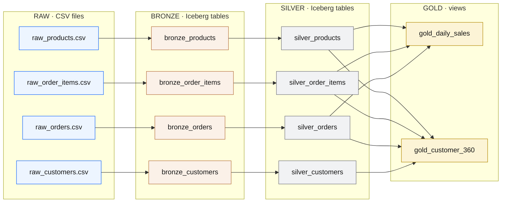
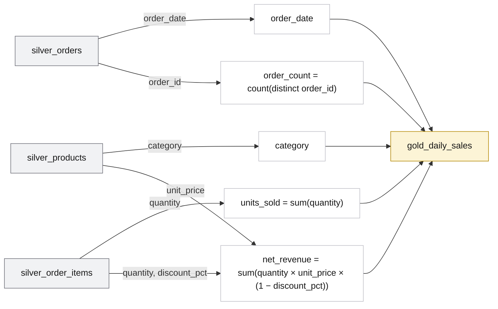
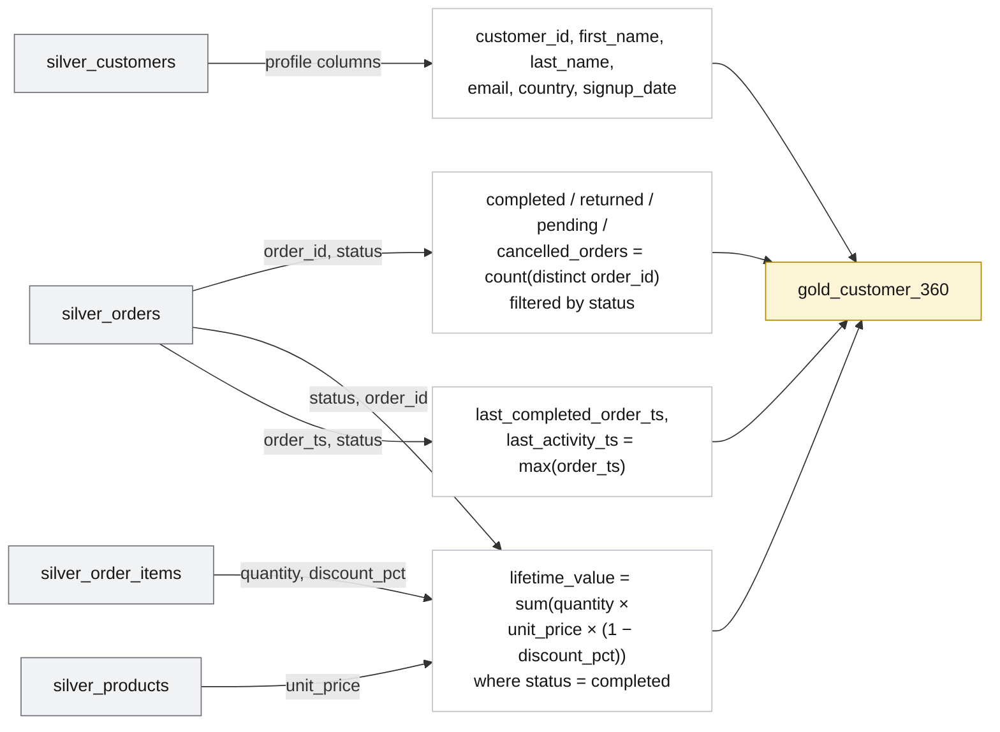

<section class="hero">
  Medallion Architecture
  <h1>From four CSV files to governed gold marts — traced column by column</h1>
  

    This page shows the full <strong>medallion lineage</strong> of the demo: how the raw
    CSV files flow through bronze, silver, and gold, and exactly which column becomes
    which. Use it to explain to a customer how a single field — say a discount percentage —
    travels from a spreadsheet cell into <code>net_revenue</code> on a dashboard.
  

</section>

Built on

## The Four Medallion Layers

Each layer has one job. Data only ever moves left to right, and every layer keeps the one before it intact — so you can always trace a number back to the file it came from.

  

    Raw
    <h3>Source files</h3>
    
The original CSV exports. The true landing zone — strings only, nothing cleaned. Kept for full traceability.

  

  

    Bronze
    <h3>Ingested copy</h3>
    
First managed Iceberg tables. Same columns as the source, plus ingest metadata (when, by what, from which file, which batch).

  

  

    Silver
    <h3>Clean &amp; typed</h3>
    
Strings become real dates, integers, and decimals. Trimmed, lower-cased, validated, deduplicated business entities.

  

  

    Gold
    <h3>Business marts</h3>
    
Views that answer questions: daily sales by category, and a customer 360 with lifetime value. What dashboards read.

  

!!! info "How to read the object types"
    Every box in this demo is one of three things:
    CSV a flat file in object storage &nbsp;·&nbsp;
    TABLE a physical Iceberg table &nbsp;·&nbsp;
    VIEW a logical query that runs on read.
    Raw → bronze → silver are **tables**; gold is **views**.

## End-to-End Lineage

This is the whole pipeline at a glance. The four sources fan in through the layers and converge into the two gold marts.

## Column-Level Lineage

Below, each entity is traced field by field. Green marks a column that is **created** in that layer (it has no upstream source).

### Customers

<table class="lineage">
  <thead>
    <tr>
      <th class="raw">raw_customers.csv → seed</th>
      <th class="arrow"></th>
      <th class="bronze">bronze_customers</th>
      <th class="arrow"></th>
      <th class="silver">silver_customers</th>
    </tr>
  </thead>
  <tbody>
    <tr><td><code>customer_id</code> (string)</td><td class="arrow">→</td><td><code>customer_id</code></td><td class="arrow">→</td><td><code>customer_id</code> · <code>cast → integer</code></td></tr>
    <tr><td><code>first_name</code></td><td class="arrow">→</td><td><code>first_name</code></td><td class="arrow">→</td><td><code>first_name</code> · <code>trim()</code></td></tr>
    <tr><td><code>last_name</code></td><td class="arrow">→</td><td><code>last_name</code></td><td class="arrow">→</td><td><code>last_name</code> · <code>trim()</code></td></tr>
    <tr><td><code>email</code></td><td class="arrow">→</td><td><code>email</code></td><td class="arrow">→</td><td><code>email</code> · <code>lower(trim())</code></td></tr>
    <tr><td><code>signup_date</code></td><td class="arrow">→</td><td><code>signup_date</code></td><td class="arrow">→</td><td><code>signup_date</code> · <code>cast → date</code></td></tr>
    <tr><td><code>country</code></td><td class="arrow">→</td><td><code>country</code></td><td class="arrow">→</td><td><code>country</code> · <code>upper(trim())</code></td></tr>
    <tr><td></td><td class="arrow"></td><td class="new">+ _ingested_at, _ingested_by, _source_file, _ingest_batch_id</td><td class="arrow">→</td><td class="new">transformed_at</td></tr>
  </tbody>
</table>

!!! note "Filter applied at silver"
    `where email is not null` — rows without an email are dropped, because customer marts key on it.

### Products

<table class="lineage">
  <thead>
    <tr>
      <th class="raw">raw_products.csv → seed</th>
      <th class="arrow"></th>
      <th class="bronze">bronze_products</th>
      <th class="arrow"></th>
      <th class="silver">silver_products</th>
    </tr>
  </thead>
  <tbody>
    <tr><td><code>product_id</code> (string)</td><td class="arrow">→</td><td><code>product_id</code></td><td class="arrow">→</td><td><code>product_id</code> · <code>cast → integer</code></td></tr>
    <tr><td><code>product_name</code></td><td class="arrow">→</td><td><code>product_name</code></td><td class="arrow">→</td><td><code>product_name</code> · <code>trim()</code></td></tr>
    <tr><td><code>category</code></td><td class="arrow">→</td><td><code>category</code></td><td class="arrow">→</td><td><code>category</code> · <code>trim()</code></td></tr>
    <tr><td><code>unit_price</code></td><td class="arrow">→</td><td><code>unit_price</code></td><td class="arrow">→</td><td><code>unit_price</code> · <code>cast → decimal(12,2)</code></td></tr>
    <tr><td></td><td class="arrow"></td><td class="new">+ ingest metadata (×4)</td><td class="arrow">→</td><td class="new">transformed_at</td></tr>
  </tbody>
</table>

!!! note "Filter applied at silver"
    `where product_id is not null`.

### Orders

<table class="lineage">
  <thead>
    <tr>
      <th class="raw">raw_orders.csv → seed</th>
      <th class="arrow"></th>
      <th class="bronze">bronze_orders</th>
      <th class="arrow"></th>
      <th class="silver">silver_orders</th>
    </tr>
  </thead>
  <tbody>
    <tr><td><code>order_id</code> (string)</td><td class="arrow">→</td><td><code>order_id</code></td><td class="arrow">→</td><td><code>order_id</code> · <code>cast → integer</code></td></tr>
    <tr><td><code>customer_id</code></td><td class="arrow">→</td><td><code>customer_id</code></td><td class="arrow">→</td><td><code>customer_id</code> · <code>cast → integer</code></td></tr>
    <tr><td><code>order_ts</code></td><td class="arrow">→</td><td><code>order_ts</code></td><td class="arrow">→</td><td><code>order_ts</code> · <code>cast → timestamp</code></td></tr>
    <tr><td><code>order_ts</code></td><td class="arrow">→</td><td>—</td><td class="arrow">→</td><td class="new">order_date · <code>cast(order_ts → date)</code></td></tr>
    <tr><td><code>status</code></td><td class="arrow">→</td><td><code>status</code></td><td class="arrow">→</td><td><code>status</code> · <code>lower(trim())</code></td></tr>
    <tr><td><code>payment_method</code></td><td class="arrow">→</td><td><code>payment_method</code></td><td class="arrow">→</td><td><code>payment_method</code> · <code>lower(trim())</code></td></tr>
    <tr><td></td><td class="arrow"></td><td class="new">+ ingest metadata (×4)</td><td class="arrow">→</td><td class="new">transformed_at</td></tr>
  </tbody>
</table>

!!! note "Filter + partitioning at silver"
    `where order_id is not null`. The table is **partitioned by `day(order_date)`** (PARQUET) so date-range queries prune files.

### Order items

<table class="lineage">
  <thead>
    <tr>
      <th class="raw">raw_order_items.csv → seed</th>
      <th class="arrow"></th>
      <th class="bronze">bronze_order_items</th>
      <th class="arrow"></th>
      <th class="silver">silver_order_items</th>
    </tr>
  </thead>
  <tbody>
    <tr><td><code>order_item_id</code> (string)</td><td class="arrow">→</td><td><code>order_item_id</code></td><td class="arrow">→</td><td><code>order_item_id</code> · <code>cast → integer</code></td></tr>
    <tr><td><code>order_id</code></td><td class="arrow">→</td><td><code>order_id</code></td><td class="arrow">→</td><td><code>order_id</code> · <code>cast → integer</code></td></tr>
    <tr><td><code>product_id</code></td><td class="arrow">→</td><td><code>product_id</code></td><td class="arrow">→</td><td><code>product_id</code> · <code>cast → integer</code></td></tr>
    <tr><td><code>quantity</code></td><td class="arrow">→</td><td><code>quantity</code></td><td class="arrow">→</td><td><code>quantity</code> · <code>cast → integer</code></td></tr>
    <tr><td><code>discount_pct</code></td><td class="arrow">→</td><td><code>discount_pct</code></td><td class="arrow">→</td><td><code>discount_pct</code> · <code>cast → decimal(5,2)</code></td></tr>
    <tr><td></td><td class="arrow"></td><td class="new">+ ingest metadata (×4)</td><td class="arrow">→</td><td class="new">transformed_at</td></tr>
  </tbody>
</table>

!!! note "Filter applied at silver"
    `where quantity > 0`.

## Silver → Gold: where columns are computed

The gold layer is where four clean tables combine into business answers. These columns are **derived** — they don't exist upstream, they are calculated from joined silver columns.

### `gold_daily_sales` VIEW

Joins: `silver_orders ⋈ silver_order_items` on `order_id`, then `⋈ silver_products` on `product_id`. Filter `status = 'completed'`, grouped by `order_date, category`.

### `gold_customer_360` VIEW

Joins: `silver_customers` LEFT JOIN `silver_orders` on `customer_id`, LEFT JOIN `silver_order_items` on `order_id`, LEFT JOIN `silver_products` on `product_id`. Grouped per customer.

!!! tip "Trace one number end to end"
    `net_revenue` on the daily-sales dashboard =
    `raw_order_items.csv:quantity` × `raw_products.csv:unit_price` × (1 − `raw_order_items.csv:discount_pct`),
    summed for `completed` orders on a given `order_date` and `category`.
    Every factor is visible at every layer — that is the point of medallion.

## Two engines, same blueprint

dbt and Spark build the **same medallion shape** from the same CSVs, into separate schemas so you can compare them side by side.

| Layer | dbt path (Presto) | Spark path (PySpark) |
| --- | --- | --- |
| Raw | `dbt seed` → `lakehouse_demo_raw.*` TABLE | CSVs read from `s3a://iceberg-bucket/spark_demo/raw` CSV |
| Bronze | `lakehouse_demo_bronze.bronze_*` TABLE | `spark_demo_bronze.*` TABLE |
| Silver | `lakehouse_demo_silver.silver_*` TABLE | `spark_demo_silver.*` TABLE |
| Gold | `lakehouse_demo_gold.gold_*` VIEW | `spark_demo_gold.spark_gold_*` TABLE |
{: .comparison-table }

Next: see the [dbt Demo Path](dbt-demo.md) or [Spark Demo Path](spark-demo.md) to build these layers yourself, then [compare them in SQL](sql-demo.md).
