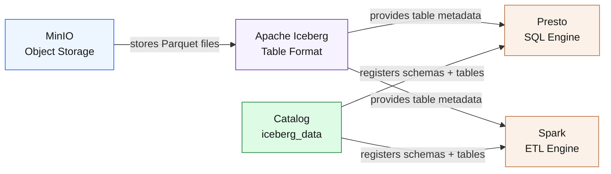
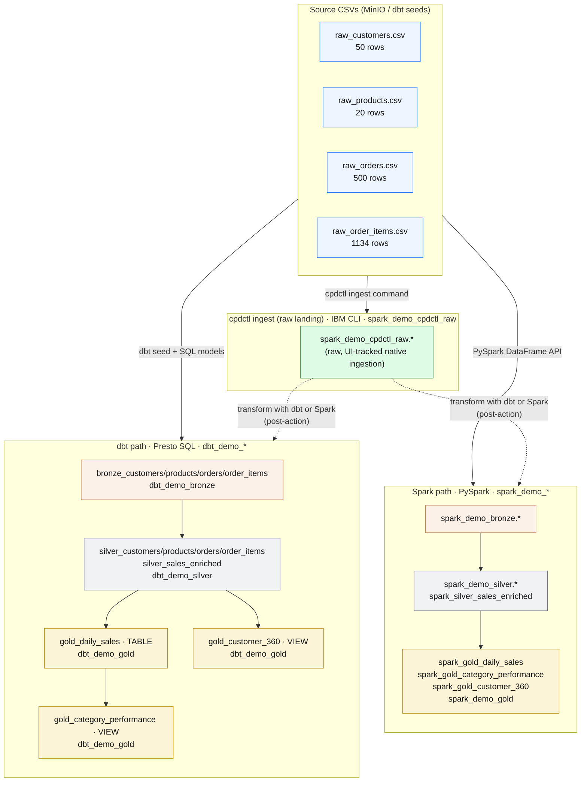
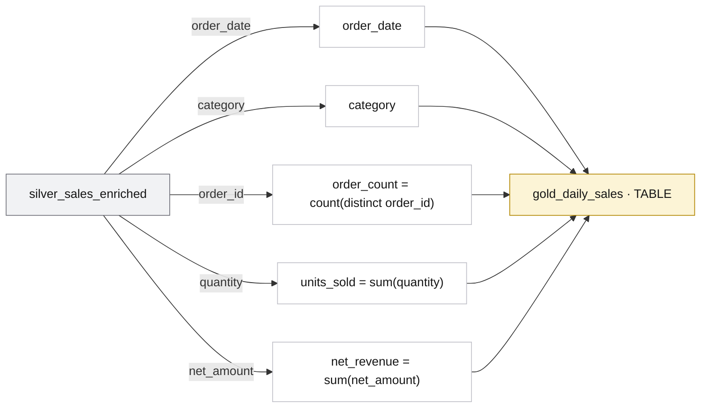
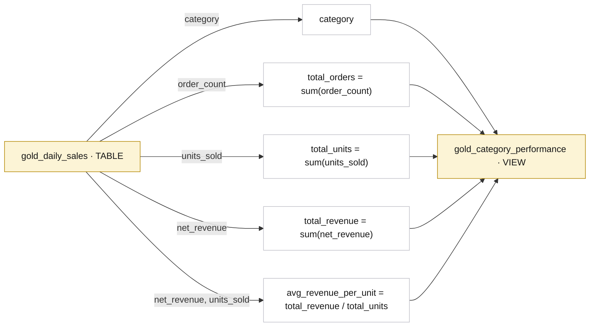
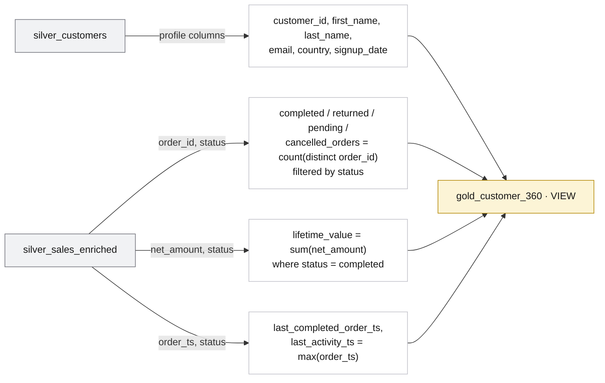

<section class="hero">
  <span class="eyebrow">Architecture</span>
  <h1>How watsonx.data works — storage, engines, catalog, and layers</h1>
  <p>
    watsonx.data is a lakehouse: object storage for data, a metadata catalog for structure, and
    SQL or Spark engines that run queries on top. This page explains what that looks like in
    practice, traces every column from CSV to gold mart, and shows why data moves through layers
    instead of going straight to a dashboard.
  </p>
</section>

<div class="brand-strip" markdown>
<span class="brand-label">Built on</span>


</div>

## The watsonx.data building blocks

A lakehouse has four moving parts. Every tool in this workshop touches at least one of them.



| Building block | What it is | Plain-English role |
|---|---|---|
| **MinIO** | S3-compatible object storage | The filing cabinet — holds the actual data files on disk |
| **Apache Iceberg** | Open table format specification | The index card — tracks which files belong to which table, and what the schema is |
| **Presto** | Distributed SQL query engine | The SQL interpreter — takes your SELECT and turns it into file reads |
| **Spark** | Distributed compute engine | The Python ETL runner — reads, transforms, and writes data at scale |
| **Catalog (`iceberg_data`)** | Hive Metastore-compatible registry | The phonebook — tells both engines where every schema and table lives |

!!! info "Why separate storage from compute?"
    Traditional databases keep data and the query engine in the same box. A lakehouse splits them apart: data lives in object storage (cheap, durable, infinite), and you pick whichever engine fits the job — SQL for analysts, Spark for engineers. Both engines read the exact same files. That is the core lakehouse idea.

!!! note "This workshop's connection endpoint"
    The Presto engine for this workshop runs at:
    ```text
    ibm-lh-lakehouse-presto651-presto-svc.apps.watson.ibmas-zocp-techcluster.org:443
    ```
    The catalog is named `iceberg_data`. Every schema and table you create lands under that catalog.

---

## Why the medallion pattern?

If you dump a raw CSV directly into a gold table, you have no way to fix bad data without
reprocessing everything from scratch. The medallion pattern solves this by keeping each stage
of processing in a separate, immutable layer. Each layer adds value without destroying what
came before — so when something goes wrong (and it will), you can replay from bronze without
re-ingesting the CSV.

!!! abstract "What each layer adds"
    **Raw** preserves the original files exactly as received — no cleaning, no casting. **Bronze**
    makes the data queryable for the first time (Iceberg tables, plus ingest metadata so you know
    when and how each row arrived). **Silver** makes it trustworthy — types are correct, strings
    are trimmed, nulls are filtered, and all four entities are joined into one enriched fact.
    **Gold** makes it answerable — aggregations and business metrics that a dashboard can read
    directly, with no extra joins required.

<div class="layer-grid">
  <div class="card raw">
    <span class="layer-tag">Raw</span>
    <h3>Source files</h3>
    <p>The original CSV exports. The true landing zone — strings only, nothing cleaned. Kept for full traceability. In this demo: 50 customers, 20 products, 500 orders, 1134 order items.</p>
  </div>
  <div class="card bronze">
    <span class="layer-tag">Bronze</span>
    <h3>Ingested copy</h3>
    <p>First managed Iceberg tables. Same columns as the source, plus ingest metadata: when the row arrived, which tool loaded it, which file it came from, and which batch run it belongs to.</p>
  </div>
  <div class="card silver">
    <span class="layer-tag">Silver</span>
    <h3>Clean &amp; typed</h3>
    <p>Strings become real dates, integers, and decimals. Values are trimmed, lower-cased, and validated. All four entities are joined into one enriched fact table — <code>silver_sales_enriched</code> — so gold never has to re-join anything.</p>
  </div>
  <div class="card gold">
    <span class="layer-tag">Gold</span>
    <h3>Business marts</h3>
    <p>Pre-aggregated answers to business questions: daily sales by category, per-category performance totals, and a customer 360 with lifetime value. What dashboards and BI tools read.</p>
  </div>
</div>

!!! info "How to read object types"
    Every box in this demo is one of three things:
    <span class="obj csv">CSV</span> a flat file in object storage &nbsp;·&nbsp;
    <span class="obj table">TABLE</span> a physical Iceberg table &nbsp;·&nbsp;
    <span class="obj view">VIEW</span> a logical query that runs on read.
    Raw → bronze → silver are **tables**; gold is a **mix** — `gold_daily_sales` is a table, and the other gold marts are views built on top of it.

---

## Data flow in this demo

dbt and Spark are two full ingest+transform medallion pipelines that read the same CSVs and produce
the same Bronze/Silver/Gold shape in different schemas. cpdctl is an ingestion-only loader (like
`dbt seed`) that lands the raw CSVs in `spark_demo_cpdctl_raw`; it needs a dbt or Spark transform on
that data to become a medallion.



!!! tip "Two full pipelines plus one native loader"
    After running the dbt and Spark paths you will have **two full medallion stacks** (dbt:
    `dbt_demo_bronze/silver/gold`; Spark: `spark_demo_bronze/silver/gold`) plus **one raw
    ingest landing** (cpdctl: `spark_demo_cpdctl_raw`). The raw ingest landing becomes a medallion
    only if you run dbt or Spark transforms over it. dbt and Spark are self-contained — each ingests
    and transforms on its own; cpdctl is the ingest front-end you pair with a dbt or Spark transform
    back-end (**cpdctl + dbt/Spark = one full pipeline**). The [SQL comparison page](sql-demo.md)
    runs queries across the dbt and Spark gold layers to verify they produce identical numbers, and
    shows how to inspect the cpdctl raw ingest tables.

---

## Column-by-column lineage

Every field is traced from the original CSV cell to the final gold column. Green marks a column
that is **created** in that layer — it has no upstream source, it is computed or added by the
pipeline itself.

### Customers

<div class="lineage-table-wrap" markdown>
<table class="lineage">
  <thead>
    <tr>
      <th class="raw">raw_customers.csv → seed</th>
      <th class="arrow"></th>
      <th class="bronze">bronze_customers</th>
      <th class="arrow"></th>
      <th class="silver">silver_customers</th>
    </tr>
  </thead>
  <tbody>
    <tr><td><code>customer_id</code> (string)</td><td class="arrow">→</td><td><code>customer_id</code></td><td class="arrow">→</td><td><code>customer_id</code> · <code>cast → integer</code></td></tr>
    <tr><td><code>first_name</code></td><td class="arrow">→</td><td><code>first_name</code></td><td class="arrow">→</td><td><code>first_name</code> · <code>trim()</code></td></tr>
    <tr><td><code>last_name</code></td><td class="arrow">→</td><td><code>last_name</code></td><td class="arrow">→</td><td><code>last_name</code> · <code>trim()</code></td></tr>
    <tr><td><code>email</code></td><td class="arrow">→</td><td><code>email</code></td><td class="arrow">→</td><td><code>email</code> · <code>lower(trim())</code></td></tr>
    <tr><td><code>signup_date</code></td><td class="arrow">→</td><td><code>signup_date</code></td><td class="arrow">→</td><td><code>signup_date</code> · <code>cast → date</code></td></tr>
    <tr><td><code>country</code></td><td class="arrow">→</td><td><code>country</code></td><td class="arrow">→</td><td><code>country</code> · <code>upper(trim())</code></td></tr>
    <tr><td></td><td class="arrow"></td><td class="new"><code>_ingested_at</code> · <code>current_timestamp</code></td><td class="arrow">→</td><td>— <em>dropped at silver</em></td></tr>
    <tr><td></td><td class="arrow"></td><td class="new"><code>_ingested_by</code> · <code>'dbt seed'</code></td><td class="arrow">→</td><td>—</td></tr>
    <tr><td></td><td class="arrow"></td><td class="new"><code>_source_file</code> · <code>'raw_customers.csv'</code></td><td class="arrow">→</td><td>—</td></tr>
    <tr><td></td><td class="arrow"></td><td class="new"><code>_ingest_batch_id</code> · <code>env WXD_INGEST_BATCH_ID</code></td><td class="arrow">→</td><td>—</td></tr>
    <tr><td></td><td class="arrow"></td><td>—</td><td class="arrow">→</td><td class="new"><code>transformed_at</code> · <code>current_timestamp</code></td></tr>
  </tbody>
</table>
</div>

!!! note "Filter applied at silver"
    `where email is not null` — rows without an email are dropped, because customer marts key on it.

### Products

<div class="lineage-table-wrap" markdown>
<table class="lineage">
  <thead>
    <tr>
      <th class="raw">raw_products.csv → seed</th>
      <th class="arrow"></th>
      <th class="bronze">bronze_products</th>
      <th class="arrow"></th>
      <th class="silver">silver_products</th>
    </tr>
  </thead>
  <tbody>
    <tr><td><code>product_id</code> (string)</td><td class="arrow">→</td><td><code>product_id</code></td><td class="arrow">→</td><td><code>product_id</code> · <code>cast → integer</code></td></tr>
    <tr><td><code>product_name</code></td><td class="arrow">→</td><td><code>product_name</code></td><td class="arrow">→</td><td><code>product_name</code> · <code>trim()</code></td></tr>
    <tr><td><code>category</code></td><td class="arrow">→</td><td><code>category</code></td><td class="arrow">→</td><td><code>category</code> · <code>trim()</code></td></tr>
    <tr><td><code>unit_price</code></td><td class="arrow">→</td><td><code>unit_price</code></td><td class="arrow">→</td><td><code>unit_price</code> · <code>cast → decimal(12,2)</code></td></tr>
    <tr><td></td><td class="arrow"></td><td class="new"><code>_ingested_at</code> · <code>current_timestamp</code></td><td class="arrow">→</td><td>— <em>dropped at silver</em></td></tr>
    <tr><td></td><td class="arrow"></td><td class="new"><code>_ingested_by</code> · <code>'dbt seed'</code></td><td class="arrow">→</td><td>—</td></tr>
    <tr><td></td><td class="arrow"></td><td class="new"><code>_source_file</code> · <code>'raw_products.csv'</code></td><td class="arrow">→</td><td>—</td></tr>
    <tr><td></td><td class="arrow"></td><td class="new"><code>_ingest_batch_id</code> · <code>env WXD_INGEST_BATCH_ID</code></td><td class="arrow">→</td><td>—</td></tr>
    <tr><td></td><td class="arrow"></td><td>—</td><td class="arrow">→</td><td class="new"><code>transformed_at</code> · <code>current_timestamp</code></td></tr>
  </tbody>
</table>
</div>

!!! note "Filter applied at silver"
    `where product_id is not null`.

### Orders

<div class="lineage-table-wrap" markdown>
<table class="lineage">
  <thead>
    <tr>
      <th class="raw">raw_orders.csv → seed</th>
      <th class="arrow"></th>
      <th class="bronze">bronze_orders</th>
      <th class="arrow"></th>
      <th class="silver">silver_orders</th>
    </tr>
  </thead>
  <tbody>
    <tr><td><code>order_id</code> (string)</td><td class="arrow">→</td><td><code>order_id</code></td><td class="arrow">→</td><td><code>order_id</code> · <code>cast → integer</code></td></tr>
    <tr><td><code>customer_id</code></td><td class="arrow">→</td><td><code>customer_id</code></td><td class="arrow">→</td><td><code>customer_id</code> · <code>cast → integer</code></td></tr>
    <tr><td><code>order_ts</code></td><td class="arrow">→</td><td><code>order_ts</code></td><td class="arrow">→</td><td><code>order_ts</code> · <code>cast → timestamp</code></td></tr>
    <tr><td><code>order_ts</code></td><td class="arrow">→</td><td>—</td><td class="arrow">→</td><td class="new">order_date · <code>cast(order_ts → date)</code></td></tr>
    <tr><td><code>status</code></td><td class="arrow">→</td><td><code>status</code></td><td class="arrow">→</td><td><code>status</code> · <code>lower(trim())</code></td></tr>
    <tr><td><code>payment_method</code></td><td class="arrow">→</td><td><code>payment_method</code></td><td class="arrow">→</td><td><code>payment_method</code> · <code>lower(trim())</code></td></tr>
    <tr><td></td><td class="arrow"></td><td class="new"><code>_ingested_at</code> · <code>current_timestamp</code></td><td class="arrow">→</td><td>— <em>dropped at silver</em></td></tr>
    <tr><td></td><td class="arrow"></td><td class="new"><code>_ingested_by</code> · <code>'dbt seed'</code></td><td class="arrow">→</td><td>—</td></tr>
    <tr><td></td><td class="arrow"></td><td class="new"><code>_source_file</code> · <code>'raw_orders.csv'</code></td><td class="arrow">→</td><td>—</td></tr>
    <tr><td></td><td class="arrow"></td><td class="new"><code>_ingest_batch_id</code> · <code>env WXD_INGEST_BATCH_ID</code></td><td class="arrow">→</td><td>—</td></tr>
    <tr><td></td><td class="arrow"></td><td>—</td><td class="arrow">→</td><td class="new"><code>transformed_at</code> · <code>current_timestamp</code></td></tr>
  </tbody>
</table>
</div>

!!! note "Filter + partitioning at silver"
    `where order_id is not null`. The table is **partitioned by `month(order_date)`** (PARQUET; partition column `order_date_month`) so date-range queries prune files automatically.

### Order items

<div class="lineage-table-wrap" markdown>
<table class="lineage">
  <thead>
    <tr>
      <th class="raw">raw_order_items.csv → seed</th>
      <th class="arrow"></th>
      <th class="bronze">bronze_order_items</th>
      <th class="arrow"></th>
      <th class="silver">silver_order_items</th>
    </tr>
  </thead>
  <tbody>
    <tr><td><code>order_item_id</code> (string)</td><td class="arrow">→</td><td><code>order_item_id</code></td><td class="arrow">→</td><td><code>order_item_id</code> · <code>cast → integer</code></td></tr>
    <tr><td><code>order_id</code></td><td class="arrow">→</td><td><code>order_id</code></td><td class="arrow">→</td><td><code>order_id</code> · <code>cast → integer</code></td></tr>
    <tr><td><code>product_id</code></td><td class="arrow">→</td><td><code>product_id</code></td><td class="arrow">→</td><td><code>product_id</code> · <code>cast → integer</code></td></tr>
    <tr><td><code>quantity</code></td><td class="arrow">→</td><td><code>quantity</code></td><td class="arrow">→</td><td><code>quantity</code> · <code>cast → integer</code></td></tr>
    <tr><td><code>discount_pct</code></td><td class="arrow">→</td><td><code>discount_pct</code></td><td class="arrow">→</td><td><code>discount_pct</code> · <code>cast → decimal(5,2)</code></td></tr>
    <tr><td></td><td class="arrow"></td><td class="new"><code>_ingested_at</code> · <code>current_timestamp</code></td><td class="arrow">→</td><td>— <em>dropped at silver</em></td></tr>
    <tr><td></td><td class="arrow"></td><td class="new"><code>_ingested_by</code> · <code>'dbt seed'</code></td><td class="arrow">→</td><td>—</td></tr>
    <tr><td></td><td class="arrow"></td><td class="new"><code>_source_file</code> · <code>'raw_order_items.csv'</code></td><td class="arrow">→</td><td>—</td></tr>
    <tr><td></td><td class="arrow"></td><td class="new"><code>_ingest_batch_id</code> · <code>env WXD_INGEST_BATCH_ID</code></td><td class="arrow">→</td><td>—</td></tr>
    <tr><td></td><td class="arrow"></td><td>—</td><td class="arrow">→</td><td class="new"><code>transformed_at</code> · <code>current_timestamp</code></td></tr>
  </tbody>
</table>
</div>

!!! note "Filter applied at silver"
    `where quantity > 0`.

### Silver enrichment (the join layer)

The four clean tables above are still separate entities. Silver's final job is to **join all four
into one wide fact table** — `silver_sales_enriched` — so downstream gold never has to re-join
anything. Every row is one order line (one product on one order) with the customer, order, and
product details already attached. Two columns are computed here so the revenue math lives in one
authoritative place.

<div class="lineage-table-wrap" markdown>
<table class="lineage">
  <thead>
    <tr>
      <th class="silver">upstream silver column</th>
      <th class="arrow"></th>
      <th class="silver">silver_sales_enriched (order-line grain)</th>
    </tr>
  </thead>
  <tbody>
    <tr><td><code>silver_order_items.order_item_id</code></td><td class="arrow">→</td><td><code>order_item_id</code></td></tr>
    <tr><td><code>silver_order_items.order_id</code></td><td class="arrow">→</td><td><code>order_id</code></td></tr>
    <tr><td><code>silver_orders.order_date</code></td><td class="arrow">→</td><td><code>order_date</code></td></tr>
    <tr><td><code>silver_orders.order_ts</code></td><td class="arrow">→</td><td><code>order_ts</code></td></tr>
    <tr><td><code>silver_orders.status</code></td><td class="arrow">→</td><td><code>status</code></td></tr>
    <tr><td><code>silver_orders.payment_method</code></td><td class="arrow">→</td><td><code>payment_method</code></td></tr>
    <tr><td><code>silver_customers.customer_id</code></td><td class="arrow">→</td><td><code>customer_id</code></td></tr>
    <tr><td><code>silver_customers.country</code></td><td class="arrow">→</td><td><code>customer_country</code></td></tr>
    <tr><td><code>silver_products.product_id</code></td><td class="arrow">→</td><td><code>product_id</code></td></tr>
    <tr><td><code>silver_products.product_name</code></td><td class="arrow">→</td><td><code>product_name</code></td></tr>
    <tr><td><code>silver_products.category</code></td><td class="arrow">→</td><td><code>category</code></td></tr>
    <tr><td><code>silver_order_items.quantity</code></td><td class="arrow">→</td><td><code>quantity</code></td></tr>
    <tr><td><code>silver_products.unit_price</code></td><td class="arrow">→</td><td><code>unit_price</code></td></tr>
    <tr><td><code>silver_order_items.discount_pct</code></td><td class="arrow">→</td><td><code>discount_pct</code></td></tr>
    <tr><td><code>quantity × unit_price</code></td><td class="arrow">→</td><td class="new">gross_amount · computed</td></tr>
    <tr><td><code>quantity × unit_price × (1 − discount_pct)</code></td><td class="arrow">→</td><td class="new">net_amount · computed</td></tr>
    <tr><td></td><td class="arrow"></td><td class="new">transformed_at</td></tr>
  </tbody>
</table>
</div>

!!! note "Joins behind silver_sales_enriched"
    `silver_order_items ⋈ silver_orders` on `order_id`, then `⋈ silver_products` on `product_id`,
    then `⋈ silver_customers` on `customer_id`. The result is one tidy fact at order-line grain.

---

## The two gold output types

Gold is where data becomes an answer. The two output types — TABLE and VIEW — exist for different
reasons and have different performance characteristics.

!!! abstract "TABLE vs VIEW at the gold layer"
    A <span class="obj table">TABLE</span> **stores the computed rows on disk**. The aggregation runs once during the dbt build, the result is written as Parquet files, and every subsequent read is instant — the math is already done. A <span class="obj view">VIEW</span> stores **only the query text**, not the rows. Each time you read a view, the engine re-runs the query against whatever its source tables currently contain. That means a view is always fresh and costs no extra storage, but it does the work again on every read.

| Gold object | Type | Storage cost | Freshness | When to use |
|---|---|---|---|---|
| `gold_daily_sales` | TABLE | Parquet files written to MinIO, partitioned by `month(order_date)` (partition column `order_date_month`) | Reflects the last `dbt run` | Heavy aggregation read often by dashboards — pre-compute it |
| `gold_category_performance` | VIEW | None — query text only | Always current against `gold_daily_sales` | Rolls up the daily table; light enough to recompute on read |
| `gold_customer_360` | VIEW | None — query text only | Always current against silver | Per-customer profile with lifetime metrics; simple grouping |

### `gold_daily_sales` — TABLE

`gold_daily_sales` is built from `silver_sales_enriched`. It aggregates completed orders to one
row per `order_date` × `category`. Because this is a physical table, Presto reads it from
pre-written Parquet files — no joins, no re-aggregation.



Filter: `status = 'completed'`. Grouped by `order_date, category`. Partitioned by `month(order_date)` (partition column `order_date_month`).

### `gold_category_performance` — VIEW

`gold_category_performance` reads from `gold_daily_sales` (the table above) and rolls the
daily rows up to one row per category. Nothing is stored; every read re-executes the aggregation
against the latest version of the underlying table.



### `gold_customer_360` — VIEW

`gold_customer_360` joins `silver_customers` to `silver_sales_enriched` and groups by customer.
Each row is one customer with their profile and lifetime metrics. Because it is a view, it
automatically reflects any changes made to the silver tables without needing a refresh.



Join: `silver_customers` LEFT JOIN `silver_sales_enriched` on `customer_id`. Grouped per customer.

!!! tip "Trace one number end to end"
    `net_revenue` on the daily-sales dashboard = `sum(net_amount)`, where
    `net_amount` (computed in `silver_sales_enriched`) =
    `raw_order_items.csv:quantity` × `raw_products.csv:unit_price` × (1 − `raw_order_items.csv:discount_pct`),
    summed for `completed` orders on a given `order_date` and `category`.
    Every factor is visible at every layer — that is the point of medallion.

---

## Iceberg + Parquet: what is actually stored

When dbt or Spark writes a table, data lands in MinIO as Parquet files. Iceberg is the metadata
layer that tracks which files belong to which table and in which partition. Understanding both
explains why lakehouse queries are fast even on large datasets.

### Why Parquet (not CSV, not ORC)

Parquet stores data **by column**, not by row. If your query only needs `net_revenue` and
`order_date`, Parquet skips every other column's bytes entirely — the disk I/O is proportional
to how many columns you ask for, not how many exist.

!!! info "Row storage vs column storage"
    A row-oriented format (CSV, JSON) stores `row1_col1, row1_col2, row1_col3, row2_col1, ...`.
    To read one column across all rows you must scan every byte. A column-oriented format (Parquet)
    stores `col1_row1, col1_row2, col1_row3 ... col2_row1, col2_row2, ...`. To read one column you
    jump straight to its block — all other columns are physically skipped.

All tables in this demo use **PARQUET** format. ORC is not used.

### Why partitioning matters

Partitioning tells Iceberg to group files by a column value, creating sub-folders in object
storage. When a query filters on that column, the engine skips every partition that cannot match.

!!! tip "Think of it like filing folders"
    Imagine thousands of paper receipts in one big box. Finding January 2026 means flipping through
    every single one. If you filed them by month — `January 2026/`, `February 2026/` — you grab
    the right folder and you are done in seconds. Partitioning does the same thing for data files
    in MinIO.

Both `silver_sales_enriched` and `gold_daily_sales` are partitioned by `month(order_date)` (partition column `order_date_month`):

```text
iceberg-bucket/
└── dbt_demo_gold/
    └── gold_daily_sales/
        ├── order_date_month=2026-01/
        │   └── part-00000-abc123.parquet
        ├── order_date_month=2026-02/
        │   └── part-00000-def456.parquet
        └── order_date_month=2026-03/
            └── part-00000-ghi789.parquet
```

A query with `WHERE order_date = DATE '2026-02-14'` reads only the `order_date_month=2026-02/` folder.
Every other month's files are skipped entirely by Presto before a single byte is read.

| Table | Partition column | What it skips |
|---|---|---|
| `silver_sales_enriched` | `order_date_month` | Date-range queries skip irrelevant months; Iceberg tracks file statistics per partition |
| `gold_daily_sales` | `order_date_month` | BI tools filtering by date read only the matching folder; row counts per partition stay small and consistent |

### Iceberg metadata: what makes it a "table format"

Iceberg keeps a **metadata tree** alongside the data files. That tree records the schema, the
partition spec, the list of data files, and row-level statistics for each file. When Presto plans
a query it reads the metadata first, uses the statistics to eliminate files, and only then opens
Parquet. This is called **partition pruning + file skipping**, and it is what separates an Iceberg
table from a raw folder of Parquet files.

!!! warning "Always use the Iceberg catalog — never query MinIO paths directly"
    Querying `s3a://iceberg-bucket/dbt_demo_gold/...` directly bypasses all metadata and
    forces a full scan of every file. Always go through the `iceberg_data` catalog so Presto can
    use the Iceberg statistics to skip irrelevant files.

---

## Two engines, same blueprint

dbt (Presto SQL) and Spark (PySpark) produce the same medallion shape from the same CSVs, written
to separate schemas so you can compare them side by side in the same catalog.

| Layer | dbt path (Presto) | Spark path (PySpark) |
|---|---|---|
| Raw | `dbt seed` → `dbt_demo_raw.*` <span class="obj table">TABLE</span> | CSVs read from `s3a://iceberg-bucket/spark_demo/raw` <span class="obj csv">CSV</span> |
| Bronze | `dbt_demo_bronze.bronze_*` <span class="obj table">TABLE</span> | `spark_demo_bronze.*` <span class="obj table">TABLE</span> |
| Silver | `dbt_demo_silver.silver_*` <span class="obj table">TABLE</span>, incl. `silver_sales_enriched` | `spark_demo_silver.*` <span class="obj table">TABLE</span>, incl. `spark_silver_sales_enriched` |
| Gold | `gold_daily_sales` <span class="obj table">TABLE</span>, `gold_category_performance` <span class="obj view">VIEW</span>, `gold_customer_360` <span class="obj view">VIEW</span> in `dbt_demo_gold` | `spark_gold_daily_sales`, `spark_gold_category_performance`, `spark_gold_customer_360` in `spark_demo_gold` — all physical Iceberg <span class="obj table">TABLE</span>s |
{: .comparison-table }

!!! info "Why Spark gold uses tables, not views"
    dbt has first-class VIEW materialization built in. PySpark's DataFrame API writes physical
    tables natively, so the Spark gold layer materializes all three objects as Iceberg tables
    rather than SQL views. The query results are identical; only the materialization strategy
    differs.

Next: see the [dbt Demo Path](dbt-demo.md) or [Spark Demo Path](spark-demo.md) to build these
layers yourself, then [compare them in SQL](sql-demo.md).
