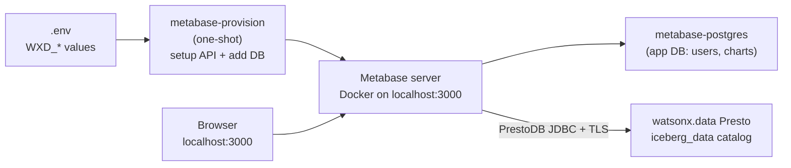
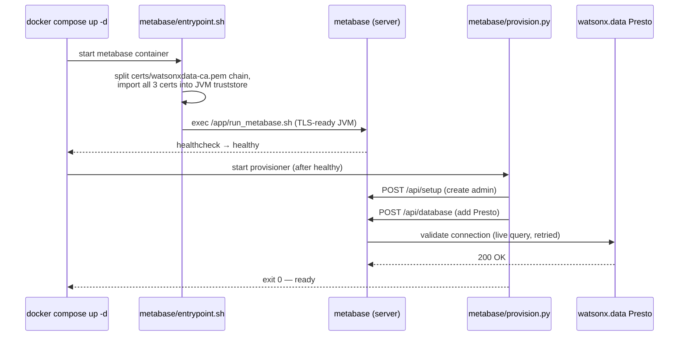

# Metabase: Explore & Chart the Lakehouse in a Local Docker UI

!!! info "What Metabase does"
    Metabase is a **business-intelligence (BI) tool** — a point-and-click way to browse tables, write SQL, and build charts and dashboards. Unlike [OpenMetadata](openmetadata.md) (which reads dbt's JSON files *offline* to draw lineage), Metabase connects **live to the Presto engine** in watsonx.data and queries the real data. Point it at the `iceberg_data` catalog and you can see every medallion schema — `dbt_demo_{raw,bronze,silver,gold}`, `spark_demo_{bronze,silver,gold}`, and `spark_demo_cpdctl_raw` — and chart Gold tables without leaving the browser at `localhost:3000`.

This stack is **self-provisioning**: a one-shot container creates the admin login and wires up the Presto connection for you on first boot, using the same `.env` values the rest of the demo uses. No setup wizard, no manual SSL fiddling.

!!! warning "Metabase is OPTIONAL in this demo"
    Nothing in the medallion pipeline needs Metabase. The [dbt](dbt-demo.md) and [Spark](spark-demo.md) paths build every `raw → bronze → silver → gold` table on their own, and you can query the results with `python scripts/query_gold.py` or the [SQL comparison demo](sql-demo.md). Metabase is here purely so you can *see and chart* those gold tables in a friendly browser UI. Skip it if you only want the pipeline; run it if you want a BI front end.

## Architecture



The same `WXD_*` values that drive dbt and Spark drive Metabase — nothing is duplicated. The watsonx.data CA (`certs/watsonxdata-ca.pem`) is read straight from the repo at boot and trusted by the JVM; it is never copied.

## Prerequisites

- **Docker Desktop 4.x or later** running (the whale icon must be green).
- A completed `.env` file — `cp .env.example .env` and fill in your `WXD_*` values (same file used by [dbt](dbt-demo.md) and [Spark](spark-demo.md)).
- Network access to your watsonx.data Presto host (the same reachability dbt needs).

---

## Step 1: Start Metabase

```bash
docker compose -f docker-compose-metabase.yml up -d
```

This starts three containers:

| Container | Role |
| --- | --- |
| `metabase` | The Metabase web server (port **3000**). |
| `metabase-postgres` | Metabase's own application database (your users, saved questions, dashboards). |
| `metabase-provision` | One-shot: creates the admin user and the Presto data source, then exits. |

!!! warning "First start pulls images and takes a few minutes"
    Metabase needs to migrate its app database and become healthy before the provisioner runs. The provisioner waits and retries automatically.

Watch the provisioner do its work:

```bash
docker compose -f docker-compose-metabase.yml logs -f metabase-provision
```

You're ready when you see exactly this — no further steps:

```text
[provision] admin user created: admin@admin.com
[provision] data source 'watsonx.data (Presto)' (id=2) connected to catalog 'iceberg_data'.
[provision] done — open http://localhost:3000
```

!!! success "Fully automated"
    A single `up -d` on a wiped stack (`down -v` first) brings up Metabase, creates the admin user, trusts the watsonx.data CA chain, and registers the Presto data source — **with no manual steps**. The provisioner is idempotent, so re-running `up -d` is always safe.

!!! warning "One external dependency: the Presto engine must be awake"
    Metabase validates the connection by running a real query, so the watsonx.data **Presto engine has to be running** — the same requirement [dbt](dbt-demo.md) and [Spark](spark-demo.md) have. If the engine is suspended/resuming it briefly returns `authenticator was not loaded`; the provisioner retries patiently (~5 minutes) to ride that out. If it still fails, start the engine and re-run `up -d`.

---

## Step 2: Log In

Open [http://localhost:3000](http://localhost:3000) and sign in with the credentials from `.env`:

| Field | Default | `.env` key |
| --- | --- | --- |
| Email | `admin@admin.com` | `MB_SETUP_EMAIL` |
| Password | `admin12345` | `MB_SETUP_PASSWORD` |

!!! note "Why not `admin / admin` like Airflow?"
    Metabase rejects trivially-common passwords through its setup API, so the literal `admin/admin` is not accepted. The defaults above are the closest compliant equivalent — change them in `.env` before first boot to set your own.

!!! note "📸 Screenshot: Metabase home / dashboard"
    Capture the Metabase home page at `http://localhost:3000` right after login (the welcome / "Browse data" landing with the watsonx.data data source visible), then save it to `docs/assets/images/screenshots/metabase-home.png` and replace this note with the image.

---

## Step 3: Browse `iceberg_data`

From the top nav choose **Browse data → watsonx.data (Presto)**. Metabase syncs the catalog and lists every schema under `iceberg_data`. Open any Gold table (for example a `dbt_demo_gold` or `spark_demo_gold` table) to preview rows, then use **Summarize** and **Visualization** to build a chart with no SQL.

Prefer SQL? Hit **+ New → SQL query**, pick the watsonx.data database, and run Presto SQL directly — the same engine the [SQL comparison demo](sql-demo.md) uses.

!!! note "📸 Screenshot: Presto data source browse view"
    Capture **Browse data → watsonx.data (Presto)** showing the `iceberg_data` schema list (`dbt_demo_*`, `spark_demo_*`), or a Gold table preview such as `gold_daily_sales`, then save it to `docs/assets/images/screenshots/metabase-browse-presto.png` and replace this note with the image.

!!! tip "Pin Metabase to one schema"
    By default Metabase browses every schema in the catalog. To focus the demo on a single namespace, set `WXD_METABASE_SCHEMA=dbt_demo_gold` in `.env` before first boot (any real schema works — for example `spark_demo_gold`).

---

## Step 4: Verify from the CLI (optional)

You don't need the browser to prove the connection works. These calls use Metabase's REST API to log in, sync the catalog, and list what Metabase can see — handy for screenshots or CI checks.

```bash
# 1. Log in and capture a session id
SID=$(curl -s -X POST http://localhost:3000/api/session \
  -H 'Content-Type: application/json' \
  -d '{"username":"admin@admin.com","password":"admin12345"}' \
  | python3 -c "import sys,json;print(json.load(sys.stdin)['id'])")

# 2. Trigger a schema sync on database id 2 (the Presto data source)
curl -s -X POST http://localhost:3000/api/database/2/sync_schema \
  -H "X-Metabase-Session: $SID" >/dev/null

# 3. List the schemas Metabase discovered under iceberg_data
curl -s http://localhost:3000/api/database/2/schemas \
  -H "X-Metabase-Session: $SID" \
  | python3 -c "import sys,json;print('\n'.join(json.load(sys.stdin)))"
```

Expected output (your schemas may differ depending on what dbt/Spark have built):

```text
dbt_demo_bronze
dbt_demo_gold
dbt_demo_raw
dbt_demo_silver
insurance
spark_demo_bronze
spark_demo_cpdctl_raw
spark_demo_gold
spark_demo_silver
```

Drill into a single schema to confirm tables resolve:

```bash
curl -s http://localhost:3000/api/database/2/schema/dbt_demo_gold \
  -H "X-Metabase-Session: $SID" \
  | python3 -c "import sys,json;print('\n'.join(t['name'] for t in json.load(sys.stdin)))"
# gold_category_performance
# gold_customer_360
# gold_daily_sales
```

---

## How it's wired (the code)

The whole stack is three files plus an `.env` block. There are no copies of config or certs — everything is read from `.env` and the mounted repo at runtime, mirroring the [Airflow stack](https://github.com/aseelert/ibmas-watsonxdata-dbt/blob/main/docker-compose-airflow.yml).



### `docker-compose-metabase.yml` — the three services

| Service | Image | Role |
| --- | --- | --- |
| `metabase-postgres` | `postgres:16` | Metabase's own app DB (users, saved questions, dashboards). Kept separate from Airflow's metadata DB. |
| `metabase` | `metabase/metabase:latest` | The BI server on port **3000**. Uses a wrapper entrypoint to trust the watsonx.data CA, then runs Metabase normally. |
| `metabase-provision` | `python:3.12-slim` | One-shot. Waits for Metabase to be healthy, then creates the admin user and the Presto data source. Exits 0 when done. |

All three load the same `.env` via `env_file`, and the `metabase` service bind-mounts the repo read-only at `/project` so the CA is readable without copying it.

### `metabase/entrypoint.sh` — trust the CA *chain*

Metabase's built-in **Presto** driver uses the PrestoDB JDBC driver, which has **no "skip verification" switch** — it must verify the server cert against a Java truststore. The watsonx.data PEM is a **3-cert chain** (leaf + intermediate + the `ingress-operator` root that is the real trust anchor), and `keytool -importcert` only stores the *first* cert per file. So the entrypoint splits the chain and imports every cert under its own alias, into a clone of the JVM's default `cacerts` (so public CAs keep working):

```sh
awk '/-----BEGIN CERTIFICATE-----/{n++} n>0{print > ("/tmp/wxd-ca-" n ".pem")}' "$CA_PEM"
for cert in /tmp/wxd-ca-*.pem; do
  keytool -importcert -noprompt -trustcacerts \
    -alias "watsonxdata-ca-$i" -file "$cert" \
    -keystore "$TRUSTSTORE" -storepass changeit
done
export JAVA_TOOL_OPTIONS="... -Djavax.net.ssl.trustStore=$TRUSTSTORE ..."
exec /app/run_metabase.sh
```

Boot log (proof it ran):

```text
[metabase-init] Trusting watsonx.data CA chain from /project/certs/watsonxdata-ca.pem
[metabase-init]   trusted cert 1
[metabase-init]   trusted cert 2
[metabase-init]   trusted cert 3
```

### `metabase/provision.py` — create admin + connect Presto

A pure-stdlib Python script (no `pip install`). It is **idempotent** and handles two watsonx.data specifics automatically:

- **Idempotency.** It gates on `has-user-setup` (not the always-present `setup-token`): on a fresh stack it runs `/api/setup`; on a re-run it logs in and only adds the data source if it is missing.
- **Instance routing.** watsonx.data routes by the `LhInstanceId` HTTP header. The PrestoDB JDBC driver carries it via the URL-encoded `customHeaders` option: `customHeaders=LhInstanceId:<WXD_INSTANCE_ID>`.
- **Resilience.** Metabase validates the connection with a live query, which can hit its 10s timeout on the first (cold) query or fail while the Presto engine is still resuming. The add is retried (default 20 attempts × 15s ≈ 5 min, tunable via `MB_DB_ADD_ATTEMPTS` / `MB_DB_ADD_INTERVAL`).

```python
details = {
    "host": os.environ["WXD_HOST"],
    "port": int(os.environ.get("WXD_PORT", "443")),
    "catalog": os.environ.get("WXD_CATALOG", "iceberg_data"),
    "user": os.environ.get("WXD_USER", "ibmlhapikey_cpadmin"),
    "password": os.environ["WXD_API_KEY"],
    "ssl": True,
}
if instance_id:
    header = urllib.parse.quote(f"LhInstanceId:{instance_id}", safe="")
    details["additional-options"] = f"customHeaders={header}"
```

---

## Reset / Tear down

```bash
# Stop, keep your charts and users:
docker compose -f docker-compose-metabase.yml down

# Stop and wipe everything (forces a fresh re-provision next start):
docker compose -f docker-compose-metabase.yml down -v
```

Re-running `up -d` is safe — the provisioner detects an already-configured Metabase and no-ops.

---

## Troubleshooting

| Symptom | Likely cause & fix |
| --- | --- |
| Provisioner retries then `gave up adding the Presto data source` | The watsonx.data Presto engine wasn't answering queries — usually **suspended/resuming** (server log shows HTTP 500 `authenticator was not loaded`). Start/resume the engine, then re-run `docker compose -f docker-compose-metabase.yml up -d` (idempotent). Raise `MB_DB_ADD_ATTEMPTS` for a slower-waking engine. |
| Provisioner logs `failed to add Presto data source` (auth) | Check `WXD_HOST`, `WXD_USER`, `WXD_API_KEY` in `.env`. The user must be `ibmlhapikey_<user>` and the password the API key. |
| `PKIX path building failed` in `metabase` logs | The CA chain wasn't trusted. Confirm `certs/watsonxdata-ca.pem` contains the full chain and `WXD_SSL_VERIFY` points at it, then recreate: `up -d --force-recreate metabase`. |
| Tables list is empty | The connection synced but the catalog/schema is wrong — confirm `WXD_CATALOG=iceberg_data` and that the medallion tables exist (run the dbt or Spark demo first). |
| TLS / certificate errors in `metabase` logs | Confirm `certs/watsonxdata-ca.pem` exists and `WXD_SSL_VERIFY` points at it. |
| Login rejects your password | Metabase's password rules — pick a longer, less common `MB_SETUP_PASSWORD` and re-provision (`down -v` then `up -d`). |
| Port 3000 already in use | Edit the `ports:` mapping in `docker-compose-metabase.yml` (e.g. `3001:3000`). |
