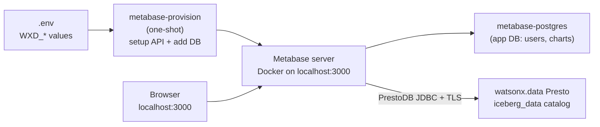

# Metabase: Explore & Chart the Lakehouse in a Local Docker UI

!!! info "What Metabase does"
    Metabase is a **business-intelligence (BI) tool** — a point-and-click way to browse tables, write SQL, and build charts and dashboards. Unlike [OpenMetadata](openmetadata.md) (which reads dbt's JSON files *offline* to draw lineage), Metabase connects **live to the Presto engine** in watsonx.data and queries the real data. Point it at the `iceberg_data` catalog and you can see every medallion schema — `dbt_demo_*`, `spark_demo_*`, and `dbt_demo` — and chart Gold tables without leaving the browser at `localhost:3000`.

This stack is **self-provisioning**: a one-shot container creates the admin login and wires up the Presto connection for you on first boot, using the same `.env` values the rest of the demo uses. No setup wizard, no manual SSL fiddling.

## Architecture



The same `WXD_*` values that drive dbt and Spark drive Metabase — nothing is duplicated. The watsonx.data CA (`certs/watsonxdata-ca.pem`) is read straight from the repo at boot and trusted by the JVM; it is never copied.

## Prerequisites

- **Docker Desktop 4.x or later** running (the whale icon must be green).
- A completed `.env` file — `cp .env.example .env` and fill in your `WXD_*` values (same file used by [dbt](dbt-demo.md) and [Spark](spark-demo.md)).
- Network access to your watsonx.data Presto host (the same reachability dbt needs).

---

## Step 1: Start Metabase

```bash
docker compose -f docker-compose-metabase.yml up -d
```

This starts three containers:

| Container | Role |
| --- | --- |
| `metabase` | The Metabase web server (port **3000**). |
| `metabase-postgres` | Metabase's own application database (your users, saved questions, dashboards). |
| `metabase-provision` | One-shot: creates the admin user and the Presto data source, then exits. |

!!! warning "First start pulls images and takes a few minutes"
    Metabase needs to migrate its app database and become healthy before the provisioner runs. The provisioner waits and retries automatically.

Watch the provisioner do its work:

```bash
docker compose -f docker-compose-metabase.yml logs -f metabase-provision
```

You're ready when you see something like:

```text
[provision] admin user created: admin@admin.com
[provision] data source 'watsonx.data (Presto)' (id=2) connected to catalog 'iceberg_data'.
[provision] done — open http://localhost:3000
```

---

## Step 2: Log In

Open [http://localhost:3000](http://localhost:3000) and sign in with the credentials from `.env`:

| Field | Default | `.env` key |
| --- | --- | --- |
| Email | `admin@admin.com` | `MB_SETUP_EMAIL` |
| Password | `admin12345` | `MB_SETUP_PASSWORD` |

!!! note "Why not `admin / admin` like Airflow?"
    Metabase rejects trivially-common passwords through its setup API, so the literal `admin/admin` is not accepted. The defaults above are the closest compliant equivalent — change them in `.env` before first boot to set your own.

---

## Step 3: Browse `iceberg_data`

From the top nav choose **Browse data → watsonx.data (Presto)**. Metabase syncs the catalog and lists every schema under `iceberg_data`. Open any Gold table (for example a `dbt_demo_gold` or `spark_demo_gold` table) to preview rows, then use **Summarize** and **Visualization** to build a chart with no SQL.

Prefer SQL? Hit **+ New → SQL query**, pick the watsonx.data database, and run Presto SQL directly — the same engine the [SQL comparison demo](sql-demo.md) uses.

!!! tip "Pin Metabase to one schema"
    By default Metabase browses every schema in the catalog. To focus the demo on a single namespace, set `WXD_METABASE_SCHEMA=dbt_demo` in `.env` before first boot.

---

## How the connection works

Metabase's built-in **Presto** driver uses the PrestoDB JDBC driver, which matches watsonx.data's Presto engine. Two watsonx.data specifics are handled automatically by `metabase/provision.py`:

- **Instance routing.** watsonx.data routes requests by the `LhInstanceId` HTTP header. The provisioner passes it through the driver's `customHeaders` option (`customHeaders=LhInstanceId:<WXD_INSTANCE_ID>`).
- **TLS.** The PrestoDB JDBC driver has no "skip verification" switch, so `metabase/entrypoint.sh` imports the **full** `certs/watsonxdata-ca.pem` chain (leaf + intermediates + the ingress-operator root, which is the real trust anchor) into a clone of the JVM truststore at boot — public CAs keep working and the watsonx.data chain is trusted.

---

## Reset / Tear down

```bash
# Stop, keep your charts and users:
docker compose -f docker-compose-metabase.yml down

# Stop and wipe everything (forces a fresh re-provision next start):
docker compose -f docker-compose-metabase.yml down -v
```

Re-running `up -d` is safe — the provisioner detects an already-configured Metabase and no-ops.

---

## Troubleshooting

| Symptom | Likely cause & fix |
| --- | --- |
| Provisioner logs `failed to add Presto data source` | Check `WXD_HOST`, `WXD_USER`, `WXD_API_KEY` in `.env`. The user must be `ibmlhapikey_<user>` and the password the API key. |
| Tables list is empty | The connection synced but the catalog/schema is wrong — confirm `WXD_CATALOG=iceberg_data` and that the medallion tables exist (run the dbt or Spark demo first). |
| TLS / certificate errors in `metabase` logs | Confirm `certs/watsonxdata-ca.pem` exists and `WXD_SSL_VERIFY` points at it. |
| Login rejects your password | Metabase's password rules — pick a longer, less common `MB_SETUP_PASSWORD` and re-provision (`down -v` then `up -d`). |
| Port 3000 already in use | Edit the `ports:` mapping in `docker-compose-metabase.yml` (e.g. `3001:3000`). |
