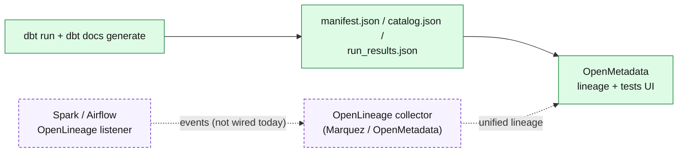

# OpenLineage: The Open Standard for Data Lineage

!!! info "What is OpenLineage? (no jargon)"
    OpenLineage is a **common language for recording where data came from and what transformed it**. Today every tool — dbt, Spark, Airflow, a BI dashboard — has its own private idea of "lineage." OpenLineage agrees on one shared vocabulary so every tool can contribute to *one* lineage picture: this job read those tables, ran this transformation, and produced that table. Think of it as a shared notebook every pipeline tool writes into, so you never have to stitch the story together by hand.

## What OpenLineage is (the technical version)

OpenLineage is an **open specification** plus a set of integrations. As a pipeline runs, an OpenLineage *integration* emits **events** describing each **run** of a **job** and the input/output **datasets** it touched (with optional schema and column-level facets). Those events are sent to a **collector** — commonly [Marquez](https://marquezproject.io/) (the reference implementation) or [OpenMetadata](openmetadata.md), both of which can consume OpenLineage events. Ready-made integrations exist for **Spark** (a listener jar on the Spark session), **Airflow** (a built-in listener that emits an event per task), and **dbt** (`dbt-ol`, which wraps a dbt run). The payoff is consistent, automatically-collected lineage across tools that were never designed to talk to each other.

---

## How lineage works in THIS demo today

!!! abstract "Honest status: OpenLineage is not wired in this repo"
    This repo does **not** currently emit OpenLineage events — there is no OpenLineage listener on Spark, no `dbt-ol` wrapper, and no Marquez collector. OpenLineage is included here as the **concept and standard** you would reach for to unify lineage across tools. Lineage in this demo is captured a different (and perfectly valid) way: from **dbt's build artifacts**, ingested into OpenMetadata.

What actually produces the lineage graph you see in the [OpenMetadata page](openmetadata.md):

1. dbt runs against Presto and `dbt docs generate` writes three JSON artifacts — `manifest.json` (the full model/`ref()` graph), `catalog.json` (column names + types), and `run_results.json` (which tests passed).
2. Those artifacts are prepared and pushed into OpenMetadata by the repo's helper scripts (`scripts/prepare_openmetadata_dbt_artifacts.py`, `scripts/upload_dbt_artifacts.py`) and the ingestion run (`openmetadata/ingestion/run-ingestion.sh`).
3. OpenMetadata reads `manifest.json` to draw the **model and column lineage** — `raw CSV → bronze → silver_sales_enriched → gold_daily_sales` — entirely offline, with no live database connection. The full column-by-column trace is documented on the [Architecture & Lineage page](lineage.md).

The solid path is what runs in this repo today. The dashed path is how OpenLineage **would** plug in.

### How OpenLineage would be added

To capture lineage as live OpenLineage events instead of (or alongside) dbt artifacts, you would:

- **Spark:** add the OpenLineage Spark listener jar to `spark/load_medallion_demo.py`'s session config (`spark.extraListeners=io.openlineage.spark.agent.OpenLineageSparkListener`) pointing at a collector URL — every read/write becomes a lineage event.
- **Airflow:** enable the OpenLineage provider so each task in `dbt_medallion_hourly` / `spark_medallion_hourly` (see the [Airflow page](airflow.md)) emits run events automatically.
- **dbt:** wrap runs with `dbt-ol run` to emit events from the dbt model graph.
- **Collector:** stand up Marquez (or point the events at OpenMetadata) to view the merged graph.

That upgrade would give you lineage across **all three engines at once**, including Spark — which dbt artifacts alone cannot capture, because dbt only knows about the dbt models.

!!! note "📸 Screenshot: the lineage graph"
    Capture the OpenMetadata **Lineage** tab for `gold_daily_sales` showing the `raw → bronze → silver → gold` chain (this is the lineage this repo produces today), then save it to `docs/assets/images/screenshots/lineage-graph.png` and replace this note with the image.

---

See the [OpenMetadata page](openmetadata.md) for the working lineage UI and the [Architecture & Lineage page](lineage.md) for the full column-by-column trace.
