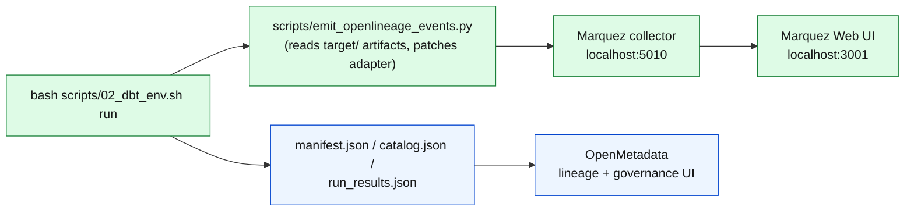
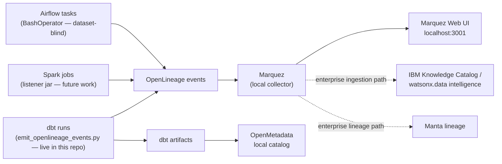

# OpenLineage: The Open Standard for Data Lineage

!!! info "What is OpenLineage? (no jargon)"
    OpenLineage is a **common language for recording where data came from and what transformed it**. Today every tool — dbt, Spark, Airflow, a BI dashboard — has its own private idea of "lineage." OpenLineage agrees on one shared vocabulary so every tool can contribute to *one* lineage picture: this job read those tables, ran this transformation, and produced that table. Think of it as a shared notebook every pipeline tool writes into, so you never have to stitch the story together by hand.

## What OpenLineage is (the technical version)

OpenLineage is an **open specification** plus a set of integrations. As a pipeline runs, an OpenLineage *integration* emits **events** describing each **run** of a **job** and the input/output **datasets** it touched (with optional schema and column-level facets). Those events are sent to a **collector** — commonly [Marquez](https://marquezproject.io/) (the reference implementation) or [OpenMetadata](openmetadata.md), both of which can consume OpenLineage events. Ready-made integrations exist for **Spark** (a listener jar on the Spark session), **Airflow** (a built-in listener that emits an event per task), and **dbt** (`openlineage-dbt`, which reads dbt's compiled artifacts). The payoff is consistent, automatically-collected lineage across tools that were never designed to talk to each other.

OpenLineage is **not** a catalog by itself. It is the event format. You still need something to receive, store, search, and display those events. That receiver might be Marquez, OpenMetadata, or an enterprise governance platform that supports a compatible ingestion path.

| Concept | Meaning |
| --- | --- |
| Job | The thing that runs, for example a dbt model build, Spark application, or Airflow task. |
| Run | One execution of that job, with timestamps and status. |
| Dataset | An input or output table/file/topic touched by the run. |
| Facet | Extra structured metadata: schema, column lineage, data quality, SQL text, parent run, processing engine, and more. |
| Collector | The service that receives OpenLineage events and persists or forwards them. |

---

## How lineage works in THIS demo today

!!! success "dbt OpenLineage is live in this repo"
    This repo **does** emit OpenLineage events from dbt. When `OPENLINEAGE_URL` is set in `.env`, the `scripts/02_dbt_env.sh` wrapper automatically calls `scripts/emit_openlineage_events.py` after every successful `dbt run/seed/test/build/snapshot`. That script reads the compiled dbt artifacts in `target/` and streams per-model START + COMPLETE events to the Marquez collector. The lineage graph is then immediately browsable at `http://localhost:3001`.

    The artifact-based path (dbt JSON → OpenMetadata) continues to work in parallel — OpenLineage events and dbt artifacts are complementary, not mutually exclusive.

Two paths produce lineage in this repo:

1. **Live OpenLineage events** — `scripts/emit_openlineage_events.py` reads `target/manifest.json` + `target/run_results.json` after dbt finishes and emits per-run events to Marquez. Marquez stores the graph and renders it in its web UI instantly, with no post-processing step. This captures *runtime* lineage: which models actually ran, which were skipped, and what their run status was.

2. **dbt artifact ingestion (existing)** — `dbt docs generate` writes `manifest.json` / `catalog.json` / `run_results.json`, which are prepared by `scripts/07a_prepare_openmetadata_dbt_artifacts.py` and ingested into OpenMetadata. This path gives you column-level lineage, glossary terms, and test results — richer governance metadata that Marquez does not store.


```mermaid
flowchart LR
  classDef have fill:#defbe6,stroke:#198038,color:#161616;
  classDef parallel fill:#edf5ff,stroke:#0043ce,color:#161616;

  dbt["bash scripts/02_dbt_env.sh run"]:::have
  emitter["scripts/emit_openlineage_events.py\n(reads target/ artifacts, patches adapter)"]:::have
  marquez["Marquez collector\nlocalhost:5010"]:::have
  ui["Marquez Web UI\nlocalhost:3001"]:::have
  art["manifest.json / catalog.json /\nrun_results.json"]:::parallel
  om["OpenMetadata\nlineage + governance UI"]:::parallel

  dbt --> emitter --> marquez --> ui
  dbt --> art --> om
```

The **green path** (Marquez) runs automatically after every dbt command when `OPENLINEAGE_URL` is present. The **blue path** (OpenMetadata) runs when you execute the artifact ingestion scripts. Both can run at the same time.

---

## Quickstart: Start Marquez and see live lineage

### 1. Start the Marquez stack

```bash
docker compose up -d marquez-db marquez-api marquez-web
```

Wait ~30–45 seconds for `marquez-api` to initialize (JVM start-up). Check readiness:

```bash
curl -sf http://localhost:5010/api/v1/namespaces | python3 -m json.tool
```

You should see a JSON list of namespaces (empty initially).

### 2. Enable OpenLineage in your `.env`

Add these two lines (uncomment them if they are already there):

```bash
OPENLINEAGE_URL=http://localhost:5010
OPENLINEAGE_NAMESPACE=dbt_demo
```

### 3. Run dbt

```bash
bash scripts/02_dbt_env.sh run
```

After dbt finishes, the wrapper calls `scripts/emit_openlineage_events.py`. You will see output like:

```text
[dbt_env] OPENLINEAGE_URL=http://localhost:5010 — lineage events will be emitted after run
...
[dbt_env] emitting OpenLineage events to http://localhost:5010
[INFO] openlineage.emit - Patched Adapter enum: WATSONX_PRESTO added
[INFO] openlineage.emit - Patched DbtArtifactProcessor: extract_adapter_type + extract_namespace
[INFO] openlineage.emit - Resolved namespace: trino://<your-host>:443
```

### 4. Open the Marquez UI

Open **`http://localhost:3001`** in your browser. Select the `dbt_demo` namespace in the top-left dropdown. You will see:

- **Jobs** — one entry per dbt model (e.g. `dbt-run-watsonxdata_medallion_demo.bronze_orders`)
- **Datasets** — one entry per input or output table touched
- **Lineage graph** — click any job or dataset for an interactive upstream/downstream graph

!!! tip "Namespace not showing?"
    Marquez creates the namespace automatically on the first event. If you do not see `dbt_demo`, refresh the page or wait a few seconds and try again.

---

## The `watsonx_presto` adapter patch

!!! warning "Why `dbt-ol` is not used directly"
    The `openlineage-dbt` package ships a CLI wrapper called `dbt-ol` that calls `dbt` and emits events simultaneously. It works for all adapters listed in its internal `Adapter` enum — but `watsonx_presto` is **not** on that list. Calling `dbt-ol` directly raises `NotImplementedError` in two places inside `DbtArtifactProcessor`:

    1. `extract_adapter_type` — unknown adapter type
    2. `extract_namespace` — no namespace constructor for the type

`scripts/emit_openlineage_events.py` solves this by monkey-patching the library at runtime before calling `consume_local_artifacts`. Three patches are applied in order:

| Patch | What it does |
|---|---|
| **Enum extension** | Adds `WATSONX_PRESTO = "watsonx_presto"` to the `Adapter` enum so the library can parse the profile type without crashing. |
| **`extract_adapter_type`** | Wraps the original method with a `try/except`; on `NotImplementedError`, sets `self.adapter_type = Adapter.TRINO` (Presto/Trino family — semantically correct). |
| **`extract_namespace`** | Pre-checks whether `adapter_type._value_ == "watsonx_presto"` and, if so, returns `trino://<host>:<port>` from the profile's `host` and `port` fields — the URI format Marquez uses to identify the Presto cluster. All other adapters are handled by the original method. |

The `watsonx_presto` profile already has both `host` and `port` fields (port `443` for the TLS endpoint), so the Trino URI format works without any profile changes.

After patching, `consume_local_artifacts(args=["send-events"])` is called — this is the same code path `dbt-ol` uses internally, but it reads the already-built `target/` artifacts instead of re-running dbt. The result is 28 events emitted per full medallion run (one START + one COMPLETE per model, across bronze + silver + gold + seeds).

!!! note "Column-lineage parse warning is harmless"
    The `time_spine_daily` model uses `UNNEST(sequence(...))` which the OpenLineage SQL parser does not understand. You will see:
    ```
    WARNING: Failed to parse column lineage for model time_spine_daily
    ```
    This is non-fatal — the job and dataset nodes are still emitted correctly; only the column-level facet for that one model is absent in Marquez.

---

## OpenMetadata vs OpenLineage

OpenMetadata and OpenLineage complement each other:

| Tool | What it is | What it gives you |
| --- | --- | --- |
| OpenMetadata | Catalog, governance model, and UI. | Searchable tables, columns, tags, glossary terms, owners, tests, and lineage views. |
| OpenLineage | Open runtime lineage event standard. | A common way for dbt, Spark, Airflow, and other tools to report what they read and wrote while jobs execute. |
| Marquez | Reference OpenLineage collector. | Receives and stores OpenLineage events; provides a visual lineage graph for jobs and datasets. |

In this repo, **Marquez** is the live runtime lineage view and **OpenMetadata** is the governance catalog. They are not redundant: Marquez captures what ran and when; OpenMetadata captures column-level schema, glossary enrichment, and test history.

### What is NOT yet wired

!!! note "Evaluated and deliberately skipped: OpenMetadata's own OpenLineage connector, wired via Airflow"
    OpenMetadata ships its own OpenLineage *pipeline* connector (a Kafka consumer that turns
    incoming OpenLineage events into Pipeline entities and lineage edges — distinct from the
    generic OpenLineage spec above). Given this repo already has a working [Airflow](airflow.md)
    instance running `dbt_medallion_hourly` / `spark_medallion_hourly`, wiring Airflow's
    OpenLineage provider to emit into that connector looked like an easy way to close this page's
    gap. It was evaluated by reading the installed connector source directly and rejected:

    Both DAGs are built almost entirely of `BashOperator` tasks (calling `scripts/02_dbt_env.sh` /
    a Spark submit curl). Airflow's own OpenLineage provider is explicit that `BashOperator`
    "does not extract datasets" — it can report the job ran and for how long, but not what tables
    it read or wrote. OpenMetadata's connector needs exactly that dataset information to build a
    lineage edge; without it, all this wiring would produce is Airflow DAG runs showing up as
    Pipeline entities with run history — which OpenMetadata's plain, already-simpler native
    Airflow REST connector already gives you, with no Kafka network bridging across three
    separate Docker Compose stacks required. So: real infrastructure work, for a payoff that
    duplicates something simpler and delivers no new table lineage. Not done, on purpose.

    The two routes that do give real dataset lineage are `emit_openlineage_events.py` (now done) and the
    `OpenLineageSparkListener` jar (future work — requires the Spark session config change
    described below).

### Extending to Spark

To also capture Spark lineage events, add the OpenLineage listener to `spark/load_medallion_demo.py`:

```python
.config("spark.extraListeners", "io.openlineage.spark.agent.OpenLineageSparkListener")
.config("spark.openlineage.transport.url", os.environ["OPENLINEAGE_URL"])
.config("spark.openlineage.namespace", os.environ.get("OPENLINEAGE_NAMESPACE", "spark_demo"))
```

Every Spark read/write will then emit events to the same Marquez collector, merging the dbt and Spark lineage graphs into one view.

---

## Enterprise Pattern: IBM Governance and Manta

OpenLineage is especially useful in larger IBM governance landscapes because it gives every execution engine a common lineage envelope before metadata is sent to a catalog or lineage product. For example, a production architecture could collect events from this demo's dbt, Spark, and Airflow paths and then feed the normalized metadata into IBM Knowledge Catalog / watsonx.data intelligence or a Manta lineage deployment, using whatever connector, API, export/import, or bridge is supported by that environment.


```mermaid
flowchart LR
  dbt["dbt runs\n(emit_openlineage_events.py — live in this repo)"] --> ol["OpenLineage events"]
  spark["Spark jobs\n(listener jar — future work)"] --> ol
  airflow["Airflow tasks\n(BashOperator — dataset-blind)"] --> ol
  ol --> marquez["Marquez\n(local collector)"]
  marquez --> ui["Marquez Web UI\nlocalhost:3001"]
  marquez -. "enterprise ingestion path" .-> ikc["IBM Knowledge Catalog /\nwatsonx.data intelligence"]
  marquez -. "enterprise lineage path" .-> manta["Manta lineage"]
  dbt --> art["dbt artifacts"]
  art --> om["OpenMetadata\nlocal catalog"]
```

The local workshop uses Marquez (live lineage) and OpenMetadata (governance catalog) together. In a client production estate, OpenLineage can become the shared event format that helps dbt, Spark, Airflow, IBM catalog services, and lineage tools speak the same lineage language.

### Marquez lineage graph — Spark medallion pipeline

The screenshot below shows the Marquez Web UI after a full Spark medallion run in the
`watsonxdata-spark` namespace on OpenShift. Each purple node is a **DATASET** (bronze,
silver, or gold table), each teal gear node is a **JOB** (one Spark write operation), and
the teal arrows show the dataset flow from `spark_demo_bronze_*` → `spark_demo_silver_*`
→ `spark_demo_gold_*`. Column-level schema is visible in each dataset card.


/// caption
Marquez `watsonxdata-spark` namespace — bronze → silver → gold lineage graph after a Spark medallion run. Mode: **Table Level**, Depth: **2**. Purple nodes = datasets with schema; teal gear nodes = Spark write jobs.
///

The same view is available for dbt runs in the `dbt_demo` namespace at
**`http://localhost:3001`** (local Docker Compose) or the OCP Web UI — same graph
structure, one node per dbt model instead of per Spark job.

---

See the [OpenMetadata page](openmetadata.md) for the governance catalog,
the [Architecture & Lineage page](lineage.md) for the full column-by-column trace,
and the [Marquez on OpenShift guide](openlineage-marquez-ocp.md) for the production
OCP deployment.
