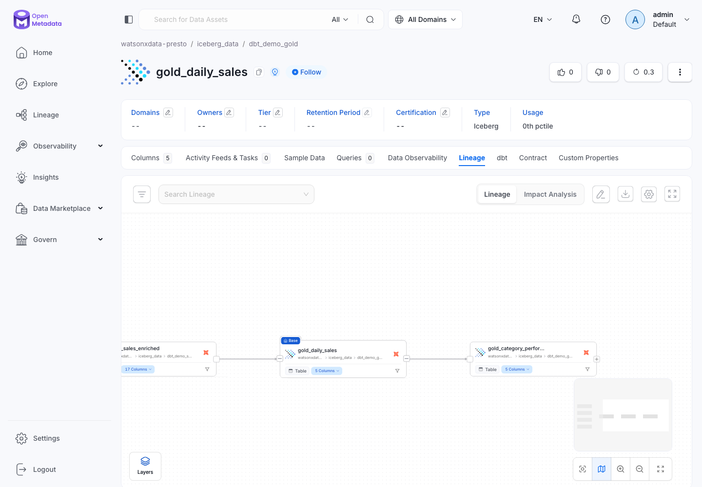
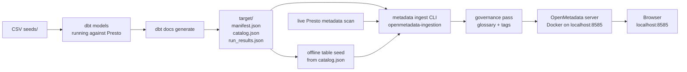

# OpenMetadata: dbt Lineage in a Local Docker UI

!!! info "What OpenMetadata does"
    OpenMetadata is a **metadata catalog** — think of it as a glossary and a map of your data all in one place. It answers three questions at a glance: **where** did each table come from (the lineage graph), **what** does each column mean (descriptions you wrote in `schema.yml`), and **whether** the data quality tests passed last time dbt ran. In this demo, OpenMetadata first tries a live Presto metadata scan so the catalog reflects the real watsonx.data tables. If that live connection fails, it falls back to the staged dbt artifacts and still builds the same catalog entities and lineage offline.

!!! warning "OpenMetadata is OPTIONAL in this demo"
    The medallion pipeline runs fine without it. The [dbt](dbt-demo.md) and [Spark](spark-demo.md) paths build every gold table on their own. OpenMetadata is here only to *visualise the lineage* of what dbt already built. Skip it if you only want the pipeline; run it if you want to show where each number came from. For a live point-and-click BI view of the same gold tables, see [Metabase](metabase.md) instead — the two are complementary (Metabase queries the data; OpenMetadata maps where it came from).



## What OpenMetadata Is

OpenMetadata is the catalog layer for this workshop. It answers catalog and governance questions that the warehouse itself does not answer well:

| Question | Where it appears |
| --- | --- |
| Which tables and columns exist? | Explore → Databases → `watsonxdata-presto`. |
| What does this field mean? | Column descriptions imported from dbt `schema.yml`. |
| Which layer is this table in? | `MedallionLayer.Raw`, `Bronze`, `Silver`, or `Gold` tags. |
| Is this a customer, product, order, PII, or financial field? | `DemoDataDomain` tags and glossary terms. |
| Which upstream tables feed this gold mart? | Lineage tab. |
| Did the dbt tests pass? | Data Quality tab from `run_results.json`. |

OpenMetadata is separate from the data engine. Presto still queries the Iceberg tables; OpenMetadata records the meaning, relationships, and governance context around those tables.

!!! tip "OpenMetadata versus OpenLineage"
    OpenMetadata is the catalog and UI. OpenLineage is an event standard that tools can emit while jobs run. This repo uses OpenMetadata directly from dbt artifacts today; [OpenLineage](openlineage.md) explains how the same demo could later emit runtime lineage events from dbt, Spark, and Airflow into OpenMetadata or an enterprise catalog/lineage platform.

## Architecture



The preferred path uses a live Presto metadata scan to create the table entities, then dbt artifacts attach lineage, descriptions, and test results. If Presto is unavailable, the offline fallback creates the same table entities from `catalog.json`, then the same dbt lineage and governance pass run.

## Prerequisites

- **Docker Desktop 4.x or later** installed and running (the whale icon must be green).
- The project virtual environment activated: `source .venv/bin/activate`
- dbt models already built — complete at least through **Step 5 (Build Models)** in the [dbt Demo Path](dbt-demo.md).

---

## Step 1: Start OpenMetadata

OpenMetadata needs three services running together: a **MySQL** database that stores all the catalog metadata, an **Elasticsearch** index that powers search, and the **OpenMetadata web server** itself. The official Docker Compose file bundles all three so you start them with a single command.

```bash
mkdir -p openmetadata
curl -fsSL \
  "https://github.com/open-metadata/OpenMetadata/releases/download/1.13.0-release/docker-compose.yml" \
  -o openmetadata/docker-compose.yml

docker compose -f openmetadata/docker-compose.yml up --detach
```

!!! tip "All-in-one entry point"
    OpenMetadata is also `include`d in the repo-root `docker-compose.yml`, so it now runs under the **same** Compose project as Metabase and Airflow (`ibmas-watsonxdata-dbt`). From the repo root, `docker compose up -d` starts all three stacks together and `docker compose down -v` stops them. The `-f openmetadata/docker-compose.yml` command above still works for running OpenMetadata standalone — but if you start it that way, use `scripts/reset_demo.sh --docker` to tear it down cleanly.

After the containers start, wait for the web server to become ready. This command polls every 20 seconds and prints a confirmation when the API responds:

```bash
until curl -sf http://localhost:8585/api/v1/system/version; do
  echo "waiting for OpenMetadata..."
  sleep 20
done
```

!!! warning "First start downloads about 3 GB and takes 5–10 minutes"
    Docker needs to pull the MySQL, Elasticsearch, and OpenMetadata images the first time. Subsequent starts are fast because the images are cached locally.

---

## Step 2: Generate dbt Artifacts

The three JSON files below are everything OpenMetadata needs. Run `dbt docs generate` to produce all three in one go:

| File | What it contains |
| --- | --- |
| `manifest.json` | The full dbt project graph — every model, source, test, and dependency. This is the file that drives the lineage diagram. |
| `catalog.json` | Column names and data types pulled from the live Presto warehouse schema. Gives OpenMetadata the column-level detail it shows in the table view. |
| `run_results.json` | Which tests passed and which failed on the last dbt run. This is what populates the Data Quality tab. |

```bash
bash scripts/dbt_env.sh docs generate --no-compile
```

Then copy the files to the directory the ingestion config expects:

```bash
cp target/manifest.json \
   target/catalog.json \
   target/run_results.json \
   openmetadata/dbt-artifacts/
```

!!! tip "One-step lineage refresh"
    The two commands above (generate + stage) are bundled in a dedicated
    lineage-only script. When the medallion tables already exist and you just
    want fresh lineage, run:

    ```bash
    scripts/generate_lineage_docs.sh
    ```

    It runs **only** `dbt docs generate` (no seed/run/test) and stages
    `manifest.json`, `catalog.json`, and `run_results.json` into
    `openmetadata/dbt-artifacts/`. For a full rebuild first, use
    `python scripts/prepare_openmetadata_dbt_artifacts.py` instead.

!!! note "If `catalog.json` is missing"
    `catalog.json` requires a live Presto connection because it queries the warehouse for column metadata. If Presto is unavailable, run `dbt docs generate` later and repeat the copy step. OpenMetadata can still show model lineage from `manifest.json` alone — it just shows fewer column details.

---

## Step 3: Run the Ingestion Script

The ingestion script runs three passes: discover the real tables from Presto, fall back to offline dbt metadata if that fails, then attach dbt lineage and governance metadata.

```bash
source .venv/bin/activate
bash openmetadata/ingestion/run-ingestion.sh
```

The script does the following automatically:

1. Installs `openmetadata-ingestion[dbt,presto]==1.13.0.0` into the virtual environment.
2. Fetches a short-lived JWT token from the local OpenMetadata API.
3. Renders `openmetadata/ingestion/metadata-ingestion.yaml` and tries a live Presto metadata scan.
4. If the live scan fails or `WXD_OM_SKIP_LIVE=1` is set, runs `scripts/seed_openmetadata_tables.py` to create the table entities from staged `catalog.json`.
5. Runs dbt ingestion from `openmetadata/ingestion/dbt-ingestion.yaml` to attach dbt models, lineage edges, descriptions, and test results.
6. Runs `scripts/apply_openmetadata_governance.py` to apply glossary terms, classifications, fallback descriptions, and the online/offline ingestion-mode tag.

See [OpenMetadata Glossary & Classification](openmetadata-governance.md) for the glossary terms, classifications, and auto-classification rules.

---

## Step 4: Explore in the OpenMetadata UI

Open **[http://localhost:8585](http://localhost:8585)** in a browser and log in with:

- **Email:** `admin@open-metadata.org`
- **Password:** `admin`

!!! note "Email, not username"
    OpenMetadata uses email addresses as identifiers. The login form asks for an email, not a plain username — make sure to type the full address `admin@open-metadata.org`.

Follow these steps to reach the lineage graph:

1. Click **Explore** in the left sidebar, then choose **Databases**.
2. Find **watsonxdata-presto** and click into it, then open **iceberg_data**.
3. Navigate to **dbt_demo_gold** → **gold_daily_sales**.
4. Click the **Lineage** tab. The graph shows: raw CSVs → bronze tables → `silver_sales_enriched` → `gold_daily_sales`.
5. Click any node in the graph to jump to that model's detail page.
6. Click a **column name** inside a model card to see the description you wrote in `schema.yml` — this is documentation-as-code made visible.
7. Click the **Data Quality** tab to see which dbt tests passed (shown in green) or failed (shown in red) from the last run.
8. Open the **Tags** and **Glossary Terms** sections on a table or column to see the auto-applied medallion layer, domain, ingestion-mode, and business glossary labels.

!!! tip "See the full medallion chain at once"
    In the Lineage tab, click **Expand All** to see the complete Bronze → Silver → Gold chain with every intermediate model visible on screen at the same time.


!!! note "Optional screenshot: dbt model with tests"
    Open a model such as `silver_orders` and use the **Data Quality** tab to show passed dbt tests.

---

## Step 5: Stop OpenMetadata

When you are done with the demo, stop the containers:

```bash
docker compose -f openmetadata/docker-compose.yml down
```

To do a full reset and remove all stored metadata (useful before re-running the ingestion from scratch):

```bash
docker compose -f openmetadata/docker-compose.yml down -v
```

The `-v` flag removes the Docker volumes that hold the MySQL database and Elasticsearch index. After this, the next `up` will start with a completely empty catalog.

---

## Configuration Reference

??? note "openmetadata/ingestion/dbt-ingestion.yaml"

    ```yaml
    source:
      type: dbt
      serviceName: watsonxdata-presto
      serviceConnection:
        config:
          type: Presto
          hostPort: ibm-lh-lakehouse-presto651-presto-svc.apps.watson.ibmas-zocp-techcluster.org:443
          catalog: iceberg_data
          username: ibmlhadmin
      sourceConfig:
        config:
          type: DBT
          dbtConfigSource:
            dbtConfigType: local
            dbtCatalogFilePath: /Users/aseelert/GitHub/ibmas-watsonxdata-dbt/openmetadata/dbt-artifacts/catalog.json
            dbtManifestFilePath: /Users/aseelert/GitHub/ibmas-watsonxdata-dbt/openmetadata/dbt-artifacts/manifest.json
            dbtRunResultsFilePath: /Users/aseelert/GitHub/ibmas-watsonxdata-dbt/openmetadata/dbt-artifacts/run_results.json
    sink:
      type: metadata-rest
      config: {}
    workflowConfig:
      openMetadataServerConfig:
        hostPort: http://localhost:8585/api
        authProvider: openmetadata
        securityConfig:
          jwtToken: __JWT_TOKEN__
    ```

    | Section | Key | What it does |
    | --- | --- | --- |
    | `source` | `type: dbt` | Tells the ingestion CLI to use the dbt connector — not a direct database connector. |
    | `source` | `serviceName` | The name of the database service OpenMetadata groups these models under. Must match what the run script creates via the REST API. |
    | `serviceConnection` | `type: Presto` | Associates dbt models with a Presto database service so lineage links to real warehouse tables. |
    | `dbtConfigSource` | `dbtConfigType: local` | Reads artifact files from the local filesystem instead of S3, GCS, or Azure Blob. |
    | `dbtConfigSource` | `dbt*FilePath` | Absolute paths to the three JSON files copied from `target/`. |
    | `workflowConfig` | `hostPort` | The OpenMetadata API endpoint — matches the Docker Compose default port. |
    | `workflowConfig` | `jwtToken` | A short-lived token fetched at runtime by `run-ingestion.sh` — the placeholder `__JWT_TOKEN__` is replaced by `sed` before the file is used. |

??? note "openmetadata/ingestion/metadata-ingestion.yaml"

    This is the live Presto metadata pass. It discovers the actual watsonx.data tables before dbt lineage is attached.

    ```yaml
    source:
      type: presto
      serviceName: watsonxdata-presto
      serviceConnection:
        config:
          type: Presto
          hostPort: __WXD_HOST__:__WXD_PORT__
          catalog: __WXD_CATALOG__
          username: __WXD_USER__
          password: __WXD_API_KEY__
          connectionArguments:
            protocol: https
            requests_kwargs:
              verify: __WXD_CA_PEM__
      sourceConfig:
        config:
          type: DatabaseMetadata
          markDeletedTables: false
          includeTables: true
          includeViews: true
          schemaFilterPattern:
            includes:
              - "^dbt_demo_raw$"
              - "^dbt_demo_bronze$"
              - "^dbt_demo_silver$"
              - "^dbt_demo_gold$"
    ```

    Set `WXD_OM_SKIP_LIVE=1` when you want to force the offline dbt-artifact path.

---

## Troubleshooting

!!! warning "Common issues"

    **OpenMetadata not ready after 10 minutes**

    Check whether the server container is still starting or has crashed:

    ```bash
    docker compose -f openmetadata/docker-compose.yml logs openmetadata-server | tail -30
    ```

    Look for `INFO: Started server process` near the bottom. If you see Java stack traces, wait another two minutes and check again — the JVM startup is the slowest part.

    ---

    **Package version mismatch during ingestion**

    The `run-ingestion.sh` script tries the pinned version `1.13.0.0` first. If that fails (for example because the package index no longer carries that exact build), install without a version pin:

    ```bash
    pip install "openmetadata-ingestion[dbt]"
    ```

    Then rerun the ingestion script.

    ---

    **401 Unauthorized during ingestion**

    OpenMetadata issues short-lived JWT tokens. If you stopped and restarted the Docker containers, the old token is no longer valid. Simply rerun the script — it fetches a fresh token each time:

    ```bash
    bash openmetadata/ingestion/run-ingestion.sh
    ```

    ---

    **`catalog.json` is missing or empty**

    `catalog.json` is only produced by `dbt docs generate`, not by `dbt run` or `dbt test`. If you only ran `dbt run`, the file will not exist. Fix:

    ```bash
    bash scripts/dbt_env.sh docs generate --no-compile
    cp target/catalog.json openmetadata/dbt-artifacts/
    bash openmetadata/ingestion/run-ingestion.sh
    ```

---

## Lightweight alternative: Presto built-in metadata tables

OpenMetadata requires Docker and is best for showing a full lineage UI. If you only need to demonstrate **Iceberg's audit trail** without any extra infrastructure, Presto exposes metadata tables directly — no additional services needed.

Run these queries in the watsonx.data SQL editor or via `python scripts/query_gold.py`:

```sql
-- Full snapshot history: every dbt run creates a new snapshot
SELECT committed_at, snapshot_id, operation, summary
FROM iceberg_data.dbt_demo_silver."silver_orders$snapshots"
ORDER BY committed_at DESC;

-- Active history: which snapshot is the current read pointer
SELECT * FROM iceberg_data.dbt_demo_silver."silver_orders$history"
ORDER BY made_current_at DESC;

-- Partition layout: how rows are distributed across month buckets
SELECT order_date_month, row_count, file_count
FROM iceberg_data.dbt_demo_silver."silver_orders$partitions"
ORDER BY order_date_month;

-- Full DDL: exact CREATE TABLE including format and partition spec
SHOW CREATE TABLE iceberg_data.dbt_demo_silver.silver_orders;
```

These are available on **any Iceberg table** in the catalog — bronze, silver, gold — with no setup beyond the tables already existing. See the [SQL Demo](sql-demo.md#iceberg-table-history) page for a full walkthrough with time travel.

---

## What Students Learn from This Demo

!!! info "Key learning outcomes"

    - **Data lineage visibility.** The lineage graph makes it obvious that a number in a gold mart did not appear from nowhere — it traces back through silver transformations all the way to a raw CSV file. This is the kind of audit trail that real governance teams require before trusting a metric.

    - **dbt as documentation-as-code.** The column descriptions in `schema.yml` are not a separate wiki page that goes out of date. They are version-controlled alongside the SQL and appear automatically in the catalog UI. When the SQL changes, the documentation changes in the same commit.

    - **Metadata governance concepts.** OpenMetadata separates the question "what does this column mean?" (the catalog) from the question "where is the data physically stored?" (the Iceberg tables in watsonx.data). Understanding that separation is a foundational concept for data engineering roles.

    - **Storage versus catalog.** The actual data lives as Parquet files in watsonx.data, managed by the Iceberg table format. OpenMetadata tracks the *meaning* of that data — names, descriptions, lineage, and test results — but stores none of the data rows itself. These are two different layers of a modern data platform, and both are necessary for a production system.
