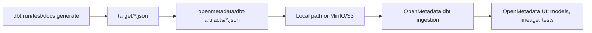

# OpenMetadata dbt UI

OpenMetadata can show dbt models, lineage, descriptions, tags, and test results in its UI. It does this by reading dbt Core artifact files.

The OpenMetadata dbt artifact guide says dbt Core users need to generate and expose these files:

| Artifact | Generated by | Why OpenMetadata needs it |
| --- | --- | --- |
| `manifest.json` | `dbt run`, `dbt compile`, `dbt build` | Model definitions, dependencies, tests, sources, lineage. |
| `catalog.json` | `dbt docs generate` | Column names, column types, and docs metadata. |
| `run_results.json` | `dbt run`, `dbt test`, `dbt build` | Test and execution results. |

Source: [OpenMetadata dbt Artifact Configuration Guide](https://docs.open-metadata.org/v1.13.x/connectors/database/dbt/storage-configuration-overview).

## What This Adds To The Demo



In plain words:

1. dbt builds and tests the lakehouse models.
2. dbt writes metadata files into `target/`.
3. The helper script copies the important files into `openmetadata/dbt-artifacts/`.
4. OpenMetadata reads those files and decorates the database tables with dbt context.

## Step 1: Generate dbt Artifacts

Run this from the repository root:

```bash
cd /Users/aseelert/GitHub/ibmas-watsonxdata-dbt
source .venv/bin/activate
python scripts/prepare_openmetadata_dbt_artifacts.py
```

This runs:

```bash
scripts/dbt_env.sh seed --full-refresh
scripts/dbt_env.sh run
scripts/dbt_env.sh test
scripts/dbt_env.sh docs generate
```

Then it stages:

```text
openmetadata/dbt-artifacts/manifest.json
openmetadata/dbt-artifacts/catalog.json
openmetadata/dbt-artifacts/run_results.json
```

These files are local generated artifacts and are ignored by Git.

## Step 2A: Use Local Filesystem

Use this when OpenMetadata can read files from the same machine or a shared mounted volume.

In OpenMetadata UI:

1. Go to **Settings → Services → Database Services**.
2. Open the database service that represents your watsonx.data / Presto connection.
3. Go to **Ingestion**.
4. Add a **dbt** ingestion workflow.
5. Choose **Local** as the dbt configuration source.

Use absolute paths:

```text
Manifest File Path: /Users/aseelert/GitHub/ibmas-watsonxdata-dbt/openmetadata/dbt-artifacts/manifest.json
Catalog File Path: /Users/aseelert/GitHub/ibmas-watsonxdata-dbt/openmetadata/dbt-artifacts/catalog.json
Run Results File Path: /Users/aseelert/GitHub/ibmas-watsonxdata-dbt/openmetadata/dbt-artifacts/run_results.json
```

!!! warning "Local means OpenMetadata must see the same filesystem"
    Local file paths work only if the OpenMetadata ingestion runner can access those exact paths. If OpenMetadata runs in Kubernetes or another server, use S3/MinIO or a shared volume instead.

## Step 2B: Upload To MinIO/S3

Use this when OpenMetadata should read artifacts from object storage.

First generate the artifacts:

```bash
python scripts/prepare_openmetadata_dbt_artifacts.py
```

Then upload them:

```bash
python scripts/upload_dbt_artifacts.py
```

Default target:

```text
s3://iceberg-bucket/openmetadata/dbt-artifacts/lakehouse_demo/manifest.json
s3://iceberg-bucket/openmetadata/dbt-artifacts/lakehouse_demo/catalog.json
s3://iceberg-bucket/openmetadata/dbt-artifacts/lakehouse_demo/run_results.json
```

!!! note "If `catalog.json` is missing"
    `catalog.json` comes from `dbt docs generate`, which queries the database for column metadata. If the Presto engine is temporarily unavailable or returns an authentication/server error, the helper can still stage and upload `manifest.json` and `run_results.json`. OpenMetadata can use the manifest for model and lineage context, but rerun the artifact prep when Presto is healthy to get the richer column catalog.

Environment variables:

```bash
WXD_DBT_ARTIFACT_DIR=openmetadata/dbt-artifacts
WXD_DBT_ARTIFACT_BUCKET=iceberg-bucket
WXD_DBT_ARTIFACT_PREFIX=openmetadata/dbt-artifacts/lakehouse_demo
```

In OpenMetadata UI, choose the S3 storage option and use:

```text
Manifest: s3://iceberg-bucket/openmetadata/dbt-artifacts/lakehouse_demo/manifest.json
Catalog: s3://iceberg-bucket/openmetadata/dbt-artifacts/lakehouse_demo/catalog.json
Run Results: s3://iceberg-bucket/openmetadata/dbt-artifacts/lakehouse_demo/run_results.json
```

For MinIO-backed storage, OpenMetadata also needs the S3 endpoint, region, access key, and secret key. Use the same values as:

```bash
WXD_OBJECT_STORE_ENDPOINT
WXD_OBJECT_STORE_REGION
WXD_OBJECT_STORE_ACCESS_KEY
WXD_OBJECT_STORE_SECRET_KEY
```

## Step 3: What You Should See

After OpenMetadata ingests the database service and dbt artifacts, the UI should show dbt context for the watsonx.data tables:

- dbt model names
- model SQL / compiled SQL
- lineage between raw, bronze, silver, and gold
- dbt tags
- dbt tests and recent run results
- column metadata from `catalog.json`

If only `manifest.json` is available, start with model and lineage ingestion first, then add `catalog.json` later.

## Step 4: Keep It Fresh

Whenever dbt models change, rerun:

```bash
python scripts/prepare_openmetadata_dbt_artifacts.py
python scripts/upload_dbt_artifacts.py
```

Then rerun or schedule the OpenMetadata dbt ingestion workflow.

## Quick Verification

Check the generated artifacts locally:

```bash
ls -lh openmetadata/dbt-artifacts/
python -m json.tool openmetadata/dbt-artifacts/manifest.json >/dev/null
python -m json.tool openmetadata/dbt-artifacts/catalog.json >/dev/null
python -m json.tool openmetadata/dbt-artifacts/run_results.json >/dev/null
```

Check basic model count:

```bash
python - <<'PY'
import json
from pathlib import Path
manifest = json.loads(Path("openmetadata/dbt-artifacts/manifest.json").read_text())
models = [k for k in manifest["nodes"] if k.startswith("model.")]
print(f"dbt models in manifest: {len(models)}")
for model in models:
    print(" -", model)
PY
```
