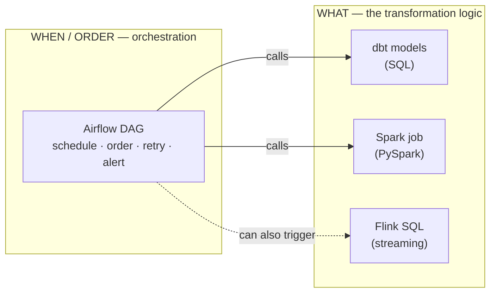
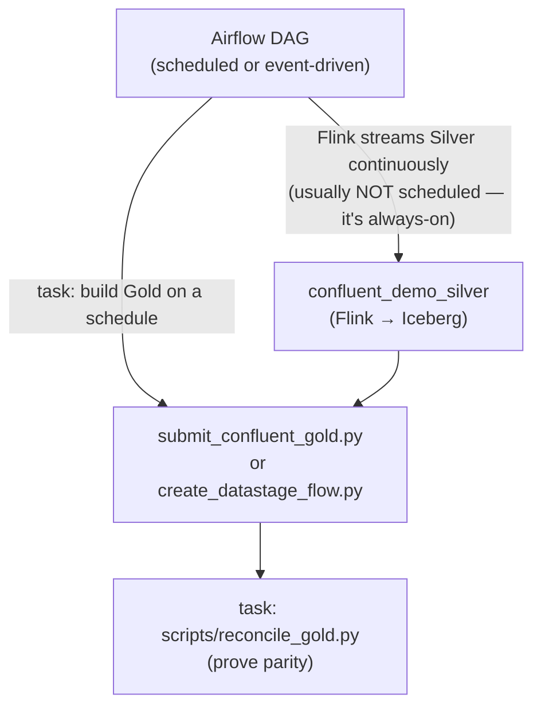

# dbt vs DAG — What Orchestrates What

!!! abstract "The one idea to take away"
    **dbt (and Spark, and Flink) define *what* the transformation is. Airflow defines *when* it
    runs and *in what order*.** They are not competitors and you do not choose between them — an
    Airflow **DAG** *wraps and schedules* your existing dbt/Spark/Confluent work. Think:
    **dbt = the recipe, Airflow = the kitchen timer and the chef who presses "go."**

This page clears up the most common confusion before you open the hands-on
[Airflow page](airflow.md).

---

## Two different jobs

| Question | Answered by | In this repo |
|---|---|---|
| *What* transformation happens? (the SQL/Python logic) | **dbt / Spark / Flink** | `models/*.sql`, `spark/load_medallion_demo.py`, `confluent/flink/sql/*` |
| *When* does it run, in what order, what if it fails? | **Airflow (a DAG)** | `airflow/dags/dag_dbt_medallion.py`, `dag_spark_medallion.py` |

A **DAG** (Directed Acyclic Graph) is just "a list of tasks plus their dependencies" — do A, then
B and C in parallel, then D. Airflow is the engine that runs DAGs on a schedule, retries failures,
and shows you a picture of what ran.



!!! info "Are they parallel or separate?"
    **Separate roles, working together.** You can run dbt entirely on its own (that is exactly the
    [dbt page](dbt-demo.md) — you type the commands by hand). Airflow does not replace any of that;
    it just runs **the same commands** for you on a schedule. Remove Airflow and your pipelines
    still work; you just lose automatic scheduling, ordering, retries, and the visual run history.

---

## Can I reuse my existing dbt project in a DAG? (Yes)

You do **not** rebuild your pipeline for Airflow. The DAG in this repo runs your **existing** dbt
project verbatim — it shells out to the very same commands you run manually:

```text
dag_dbt_medallion.py  (DAG: dbt_medallion_hourly)
  bootstrap_schemas        → scripts/bootstrap_watsonxdata.py
  RAW    : dbt seed  --select raw_<x>     → dbt_demo_raw
  BRONZE : dbt run   --select bronze_<x>  → dbt_demo_bronze
  SILVER : dbt run   --select silver_<x>  → dbt_demo_silver
  GOLD   : dbt run   --select gold_<x>    → dbt_demo_gold
  dbt_test                                 (schema + data tests)
  query_gold                               → scripts/query_gold.py
```

The task dependencies are a **1:1 copy of the dbt `ref()` graph**, so Airflow runs models in true
lineage order and parallelises independent branches — but the SQL, the profile, and the
credentials all come from your existing project (`models/`, `profiles/profiles.yml`, `.env`).
Nothing is duplicated.

!!! tip "Production pattern: astronomer-cosmos"
    This demo uses one explicit `BashOperator` per table so the medallion is obvious in the Airflow
    graph (a teaching choice). In production, **astronomer-cosmos** reads your dbt `manifest.json`
    and generates the Airflow tasks automatically — same idea, zero hand-maintenance. See
    `airflow/README.md`.

---

## Can Airflow orchestrate other things — like Confluent's Silver → Gold?

**Yes.** Airflow is general-purpose: a task is just "run this command / call this API." Anything you
can run from a shell or a Python function, a DAG can schedule. The two DAGs shipped here are dbt and
Spark, but the same pattern extends cleanly to the Confluent path:



A practical Confluent orchestration looks like this:

- **Silver** is the **streaming** layer — Flink runs *continuously*, so you typically do **not**
  schedule it; you start it once and it keeps consuming. (Airflow could start/stop it, but that is
  the exception.)
- **Gold** is a periodic roll-up — a perfect Airflow task. A DAG can run, on a schedule, the same
  command the [Confluent page](confluent-demo.md) uses:
  `python confluent/scripts/submit_confluent_gold.py` (Spark engine) **or**
  `python confluent/scripts/create_datastage_flow.py` (DataStage engine), followed by
  `python scripts/reconcile_gold.py` to confirm all three paths still match.

!!! note "So which engine schedules the gold build?"
    Open source: **Airflow** triggers the Spark or DataStage gold job. Enterprise: **DataStage has
    its own scheduler** too (in IBM Software Hub), and it remains Airflow-compatible — you can drive
    DataStage flows from Airflow or schedule them natively. Pick one place to own the schedule so
    two systems don't both fire the same job.

---

## What else is Airflow good for?

Once you have a scheduler, you use it for everything operational, not just the medallion:

- **Refreshes** — rebuild gold marts hourly/nightly; run `dbt source freshness`.
- **Data quality gates** — run `dbt test` and stop the pipeline (and alert) if a test fails.
- **Cross-system glue** — ingest with cpdctl, then transform with dbt, then publish to BI, in one
  ordered DAG.
- **Backfills** — re-run a date range after fixing logic.
- **Housekeeping** — Iceberg snapshot expiry, compaction, cleanup jobs.

---

## Where the enterprise tools fit

Airflow schedules and retries, but it tells you little about *data health* across many pipelines.
That gap is what **IBM Databand (Data Observability)** fills — it **monitors Apache Airflow**
(dedicated integration) plus DataStage and StreamSets from one place, adding learned-baseline
**anomaly detection** and **SLA/quality alerting** on top of the scheduling Airflow already does.

| Need | Open source | Enterprise |
|---|---|---|
| Schedule + order + retry | **Airflow** | Airflow and/or DataStage scheduler |
| "Did my DAG finish, and is the data *right*?" | Airflow logs + dbt tests | **Databand** observability over Airflow/DataStage/StreamSets |

See [watsonx.data Integration](enterprise/integration.md) for the Databand details, and the honest
open-source-vs-enterprise verdict in the [summary](enterprise/summary.md).

---

## Next step

- Run the scheduler hands-on: [Airflow — Schedule the Pipeline](airflow.md).
- See the engines it orchestrates: [dbt](dbt-demo.md), [Spark](spark-demo.md),
  [Confluent](confluent-demo.md).
- Compare open-source vs enterprise observability: [watsonx.data Integration](enterprise/integration.md).
