<section class="hero">
  Customer Presentation
  <h1>The Open Lakehouse, on one deck</h1>
  

    A visual walkthrough of the whole workshop — the open lakehouse, the Bronze → Silver → Gold
    medallion, the interchangeable engines (dbt · Spark · Confluent · cpdctl · DataStage), and the
    enterprise add-ons (watsonx.data Intelligence & Integration, editions, native acceleration).
    Each slide links to the page where you can go deeper. Click any slide to zoom.
  

</section>

!!! tip "Take it with you"
    - 📊 **Editable deck (PPTX)** — [`presentations/wxd-customer-deck.pptx`](presentations/wxd-customer-deck.pptx)
    - 🎙️ **Podcast** — [`presentations/watsonxdata-medallion-podcast.m4a`](presentations/watsonxdata-medallion-podcast.m4a)
    - 🧠 **Mind map** — [`presentations/wxd-mindmap.json`](presentations/wxd-mindmap.json) · 🃏 **Flashcards** — [`presentations/wxd-flashcards.html`](presentations/wxd-flashcards.html)

    All slides were generated with Google NotebookLM, grounded on this workshop's docs and verified 2026 product research.

---

## Opening — the proposition

<figure markdown="span">
  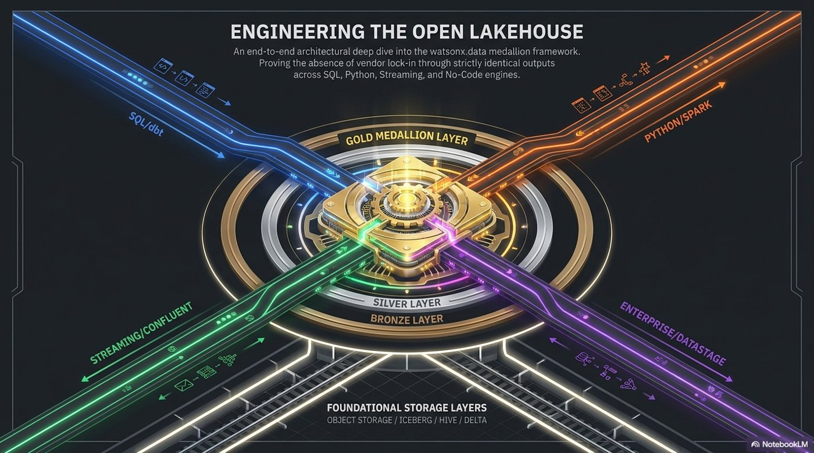{ loading=lazy }
  <figcaption>Engineering the open lakehouse: one architecture, proven across SQL, Python, streaming, and no-code engines. → <a href="../">Welcome</a></figcaption>
</figure>

<figure markdown="span">
  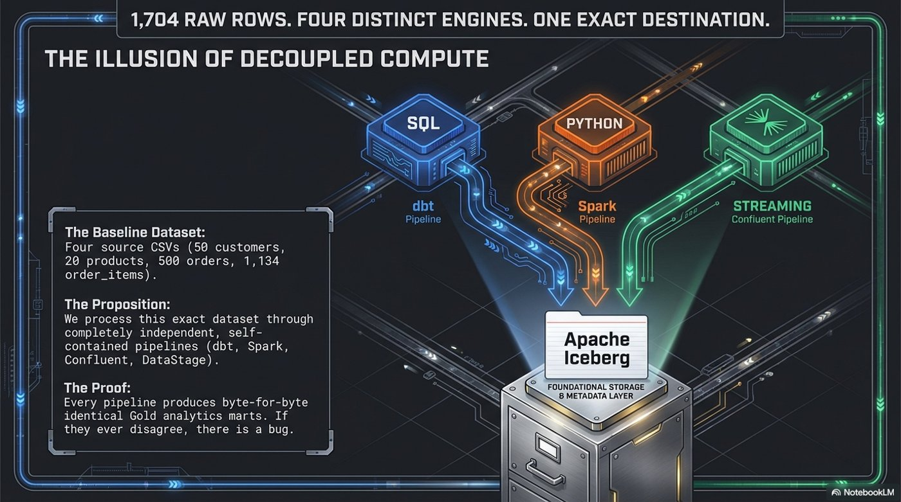{ loading=lazy }
  <figcaption>1,704 raw rows, four distinct engines, one exact destination — every pipeline must produce byte-for-byte identical Gold. → <a href="../lineage/">Architecture</a></figcaption>
</figure>

## The open lakehouse foundation

<figure markdown="span">
  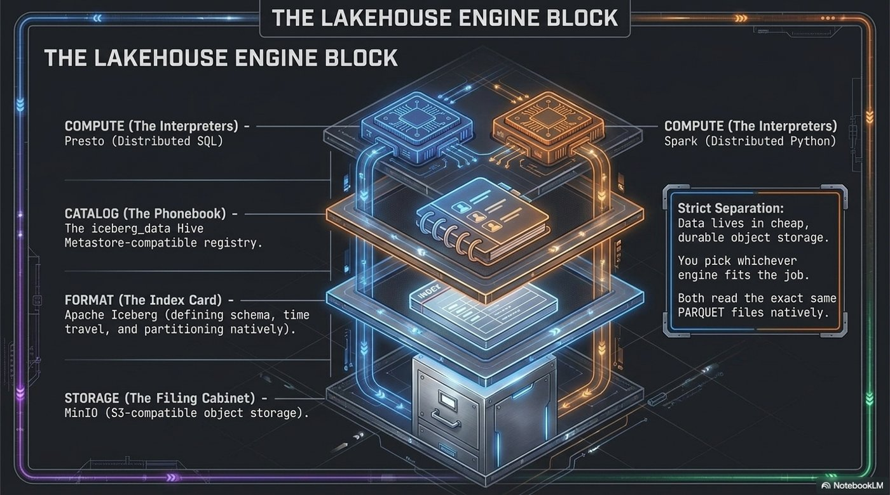{ loading=lazy }
  <figcaption>The building blocks: Presto/Spark compute, the <code>iceberg_data</code> catalog, Apache Iceberg format, MinIO storage — separated so you pick the engine per job. → <a href="../lineage/">Architecture &amp; Data Flow</a></figcaption>
</figure>

<figure markdown="span">
  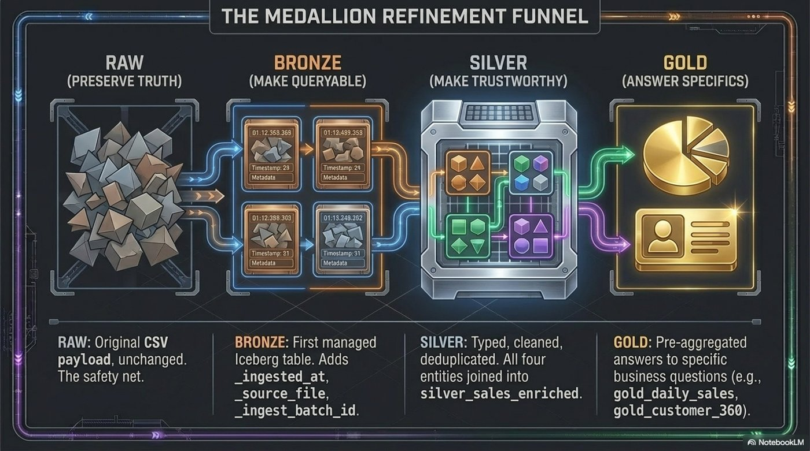{ loading=lazy }
  <figcaption>The medallion funnel: Raw (preserve truth) → Bronze (make queryable) → Silver (make trustworthy) → Gold (answer specifics). → <a href="../lineage/">Architecture &amp; Data Flow</a></figcaption>
</figure>

## The interchangeable paths

<figure markdown="span">
  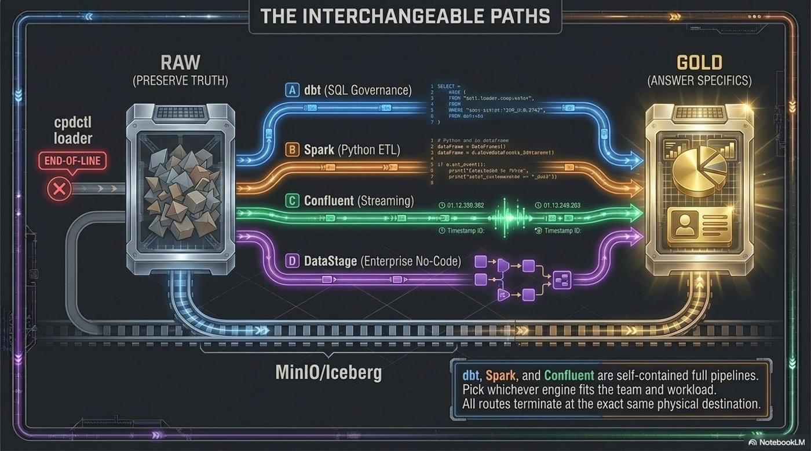{ loading=lazy }
  <figcaption>dbt, Spark, and Confluent are self-contained full pipelines; cpdctl is an ingest-only loader. Pick whichever fits the team and workload. → <a href="../choosing/">When to Use Which</a></figcaption>
</figure>

<figure markdown="span">
  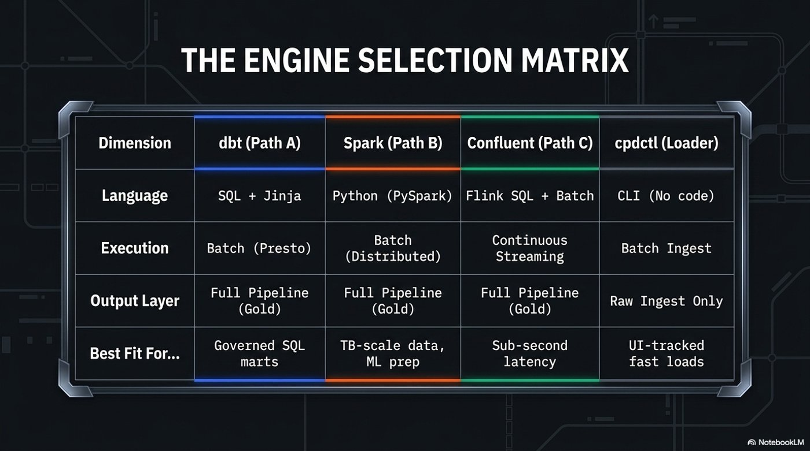{ loading=lazy }
  <figcaption>The engine selection matrix: language, execution, output layer, and best fit for dbt vs Spark vs Confluent vs cpdctl. → <a href="../choosing/">When to Use Which</a></figcaption>
</figure>

### Path A — dbt (SQL governance)

<figure markdown="span">
  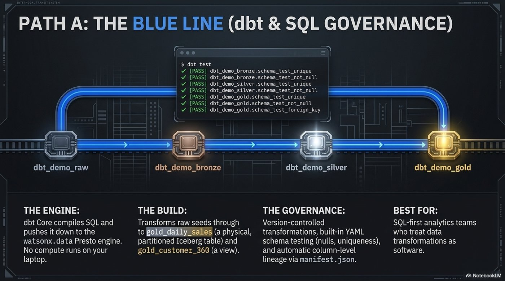{ loading=lazy }
  <figcaption>dbt compiles SQL and pushes it down to Presto; built-in tests and column-level lineage via <code>manifest.json</code>. → <a href="../dbt-demo/">Path A · dbt</a></figcaption>
</figure>

### Path B — Spark (Python ETL)

<figure markdown="span">
  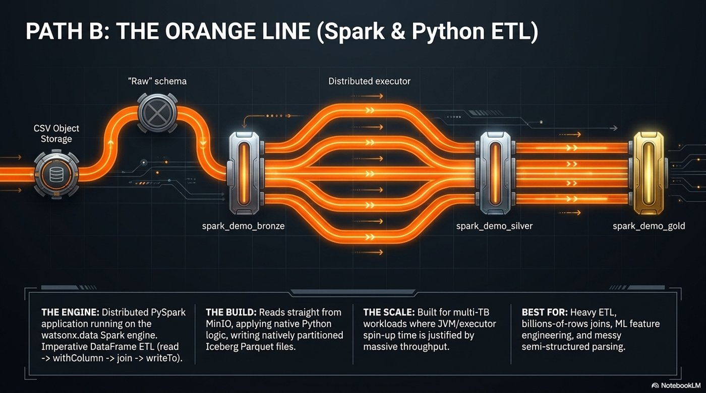{ loading=lazy }
  <figcaption>Distributed PySpark on the watsonx.data Spark engine — for heavy ETL, billions-of-rows joins, and ML feature prep. → <a href="../spark-demo/">Path B · Spark</a></figcaption>
</figure>

### Path C — Confluent (streaming)

<figure markdown="span">
  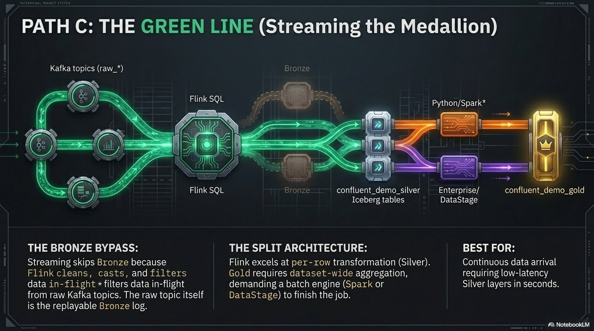{ loading=lazy }
  <figcaption>Kafka → Flink SQL → Iceberg Silver, then Spark or DataStage for Gold — continuous, low-latency data arrival. → <a href="../confluent-demo/">Path C · Confluent</a></figcaption>
</figure>

### The cpdctl loader

<figure markdown="span">
  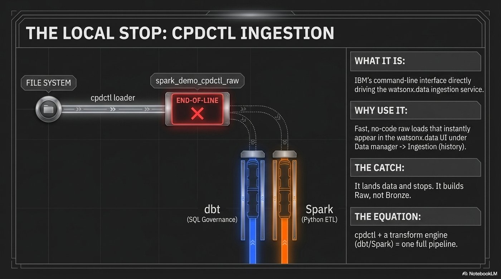{ loading=lazy }
  <figcaption>cpdctl lands raw data and stops — it builds Raw, not Bronze. cpdctl + a transform engine (dbt/Spark) = one full pipeline. → <a href="../ingestion/">Ingestion Paths</a></figcaption>
</figure>

### Path D — DataStage (no-code)

<figure markdown="span">
  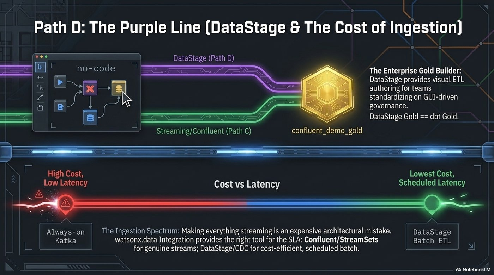{ loading=lazy }
  <figcaption>DataStage is the no-code enterprise Gold builder — visual ETL authoring for teams standardizing on a GUI. → <a href="../datastage-demo/">Path D · DataStage</a></figcaption>
</figure>

## Proof — identical Gold

<figure markdown="span">
  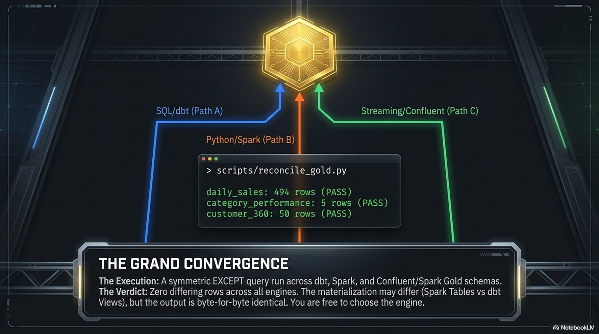{ loading=lazy }
  <figcaption>A symmetric <code>EXCEPT</code> query across dbt, Spark, and Confluent Gold returns zero differing rows — the engines are interchangeable. → <a href="../sql-demo/">SQL Comparison</a></figcaption>
</figure>

## Performance & native acceleration

<figure markdown="span">
  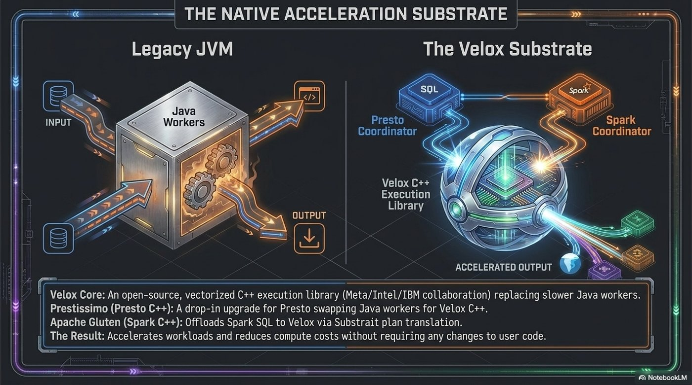{ loading=lazy }
  <figcaption>One C++ substrate (Velox): Prestissimo (Presto C++) and Apache Gluten (Spark C++) accelerate workloads with no code changes. → <a href="../enterprise/performance-editions/">Performance &amp; Editions</a></figcaption>
</figure>

<figure markdown="span">
  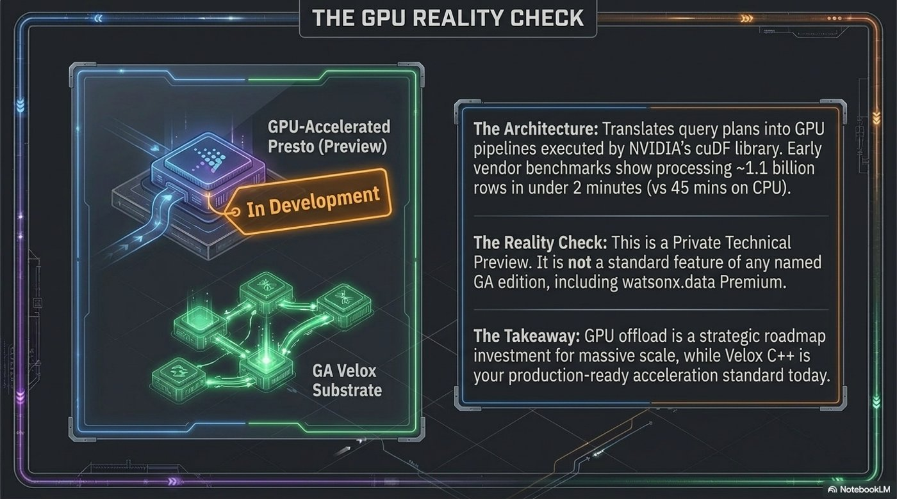{ loading=lazy }
  <figcaption>GPU-accelerated Presto C++ (NVIDIA cuDF) is a <strong>private technical preview — not GA, not a Premium SKU</strong>. Velox C++ is the production standard today. → <a href="../enterprise/performance-editions/">Performance &amp; Editions</a></figcaption>
</figure>

<figure markdown="span">
  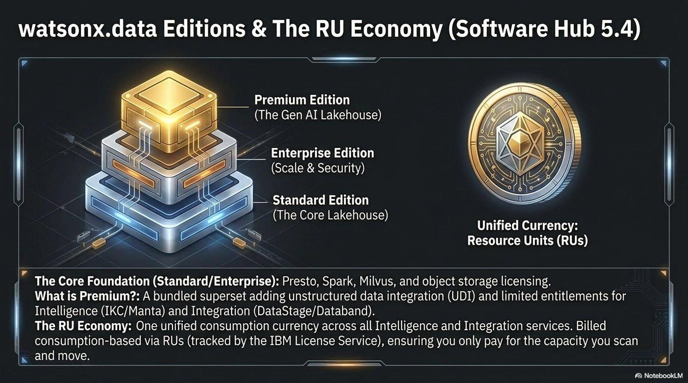{ loading=lazy }
  <figcaption>Editions (Standard / Enterprise / Premium) and the Resource Unit (RU) economy on Software Hub 5.4. Premium adds the gen-AI lakehouse + bundled Intelligence & Integration. → <a href="../enterprise/performance-editions/">Performance &amp; Editions</a></figcaption>
</figure>

## Beyond open source — the enterprise stack

<figure markdown="span">
  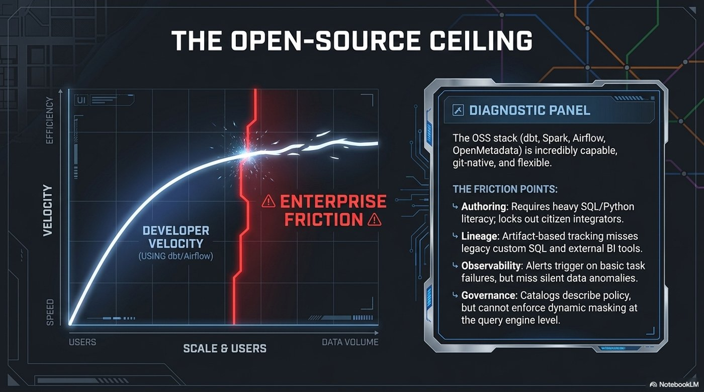{ loading=lazy }
  <figcaption>The open-source stack is genuinely capable; the enterprise add-ons buy governance, lineage, observability, and no-code ETL you would otherwise hand-build. → <a href="../enterprise/overview/">Enterprise overview</a></figcaption>
</figure>

<figure markdown="span">
  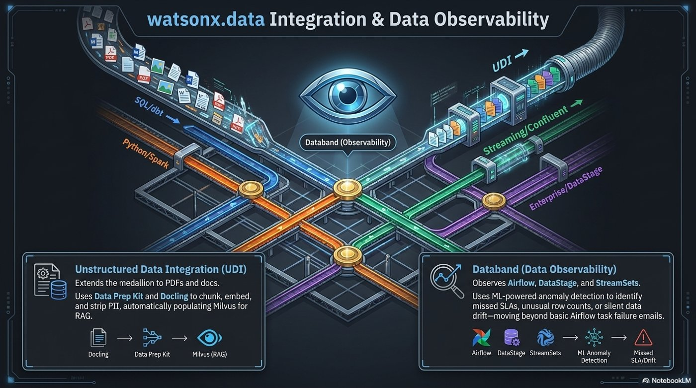{ loading=lazy }
  <figcaption>watsonx.data Integration: DataStage, StreamSets, Data Replication (CDC), UDI (unstructured → vectors), and Databand observability (it even watches Airflow). → <a href="../enterprise/integration/">Integration</a></figcaption>
</figure>

<figure markdown="span">
  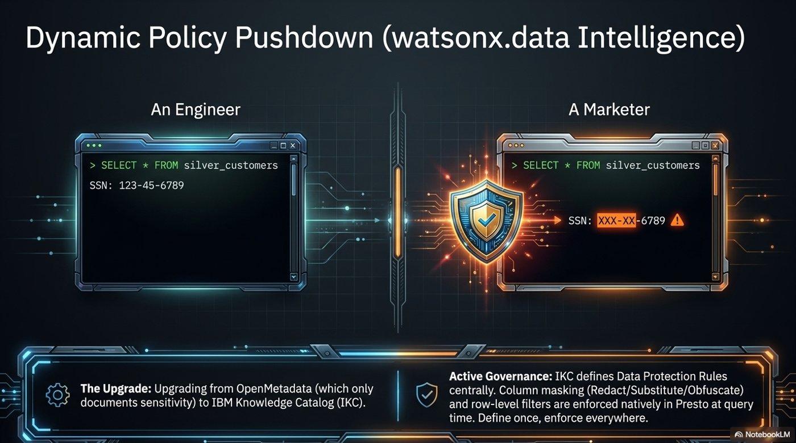{ loading=lazy }
  <figcaption>watsonx.data Intelligence: data-protection rules (column masking, row filters) enforced natively in Presto query results — define once, enforce everywhere. → <a href="../enterprise/intelligence/">Intelligence</a></figcaption>
</figure>

<figure markdown="span">
  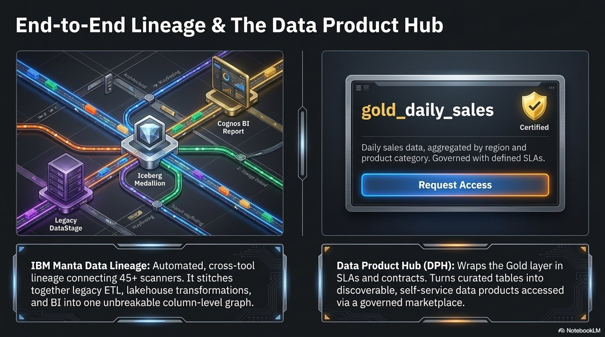{ loading=lazy }
  <figcaption>Manta stitches 45+ scanners into one column-level lineage graph; the Data Product Hub turns curated Gold into governed, discoverable products. <em>Note: Manta reads Kafka schemas, not Flink job logic.</em> → <a href="../enterprise/lineage-e2e/">End-to-End Lineage</a></figcaption>
</figure>

<figure markdown="span">
  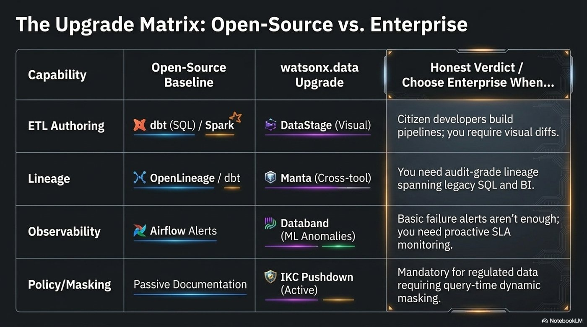{ loading=lazy }
  <figcaption>The honest upgrade matrix: ETL authoring, lineage, observability, and policy/masking — and exactly when the enterprise upgrade is worth it. → <a href="../enterprise/summary/">Summary</a></figcaption>
</figure>

## Close

<figure markdown="span">
  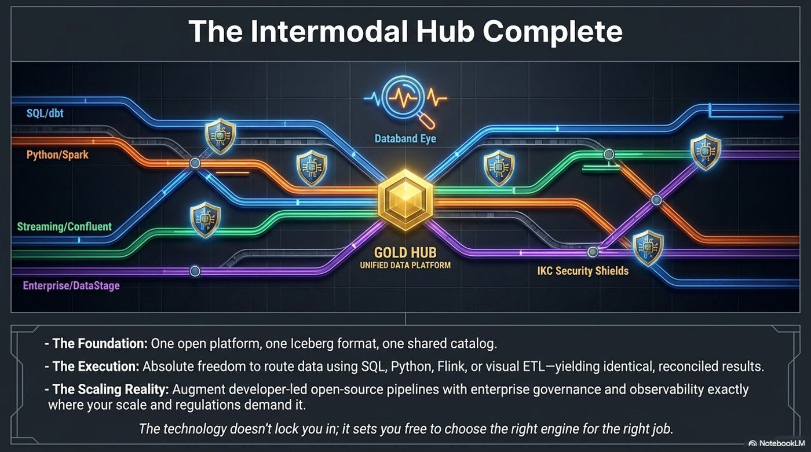{ loading=lazy }
  <figcaption>One open platform, one Iceberg format, one shared catalog — the technology doesn't lock you in; it sets you free to choose the right engine for the job.</figcaption>
</figure>
