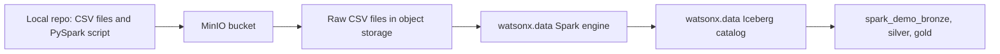

# Spark Demo Path

!!! abstract "What is Spark, in plain words?"
    **Apache Spark** is an engine for processing data across **many computers at the same time**. When a job is too big or too heavy for one machine, Spark splits the work into pieces, hands them to a cluster of workers, and combines the results.

    A useful picture: if dbt is **one careful cook** writing SQL recipes, Spark is a **whole kitchen brigade** — more setup, but it can handle a mountain of ingredients at once. You write the job once (here, a small **PySpark** script in Python), and Spark runs it at scale.

    Spark is the right tool when the work is larger than simple SQL: many files, very big data, complex processing, or machine-learning feature preparation.

In this demo, the Spark path shows the **same medallion idea** (raw → bronze → silver → gold) but built by a distributed job instead of SQL models. It writes to its own `spark_demo_*` schemas so you can compare it against the dbt results without one overwriting the other.



!!! important "Why there is no spark_demo_raw schema"
    Spark can read CSV files directly from object storage. In this demo, the raw Spark landing layer is the uploaded CSV folder `s3a://iceberg-bucket/spark_demo/raw`, not a separate `spark_demo_raw` table schema. Spark starts writing managed Iceberg tables at bronze.

## What Spark Builds

!!! info "How Spark writes Parquet+Iceberg tables"
    Think of an Iceberg table like a folder in a filing cabinet. Spark does three things every time it saves data:

    **1. It uses the Iceberg writer API**
    Instead of a plain file save, Spark calls a special Iceberg command so watsonx.data tracks the table in its catalog (like adding a new file to the cabinet index).

    **2. It sets the file format to Parquet**
    Parquet is a compressed, column-friendly file format — like a ZIP file that is also super fast to search. We tell Spark to use it explicitly:

    ```python
    (
        df.writeTo("iceberg_data.spark_demo_silver.spark_silver_orders")
          .using("iceberg")
          .tableProperty("write.format.default", "parquet")
          .partitionedBy("order_date")
          .createOrReplace()
    )
    ```

    **3. It splits data into date folders (partitioning)**
    `.partitionedBy("order_date")` tells Iceberg to create one sub-folder on MinIO for each date, for example:

    ```
    s3a://iceberg-bucket/.../spark_silver_orders/order_date=2024-01-15/
    s3a://iceberg-bucket/.../spark_silver_orders/order_date=2024-01-16/
    ```

    When Presto later queries `WHERE order_date = '2024-01-15'`, it only opens that one folder and skips all others — like going straight to the right drawer in the filing cabinet instead of searching every single file.

    **Which tables are partitioned?**

    | Spark table | Partition column |
    | --- | --- |
    | `spark_silver_orders` | `order_date` |
    | `spark_silver_sales_enriched` | `order_date` |
    | `spark_gold_daily_sales` | `order_date` |

| Layer | Schema | Objects |
| --- | --- | --- |
| Bronze | `spark_demo_bronze` | `bronze_customers`, `bronze_products`, `bronze_orders`, `bronze_order_items` |
| Silver | `spark_demo_silver` | `spark_silver_customers`, `spark_silver_products`, `spark_silver_orders`, `spark_silver_order_items`, `spark_silver_sales_enriched` |
| Gold | `spark_demo_gold` | `spark_gold_daily_sales`, `spark_gold_category_performance`, `spark_gold_customer_360` |

## Step 1: Confirm Settings

These are the important `.env` values:

```bash
WXD_SPARK_CATALOG=iceberg_data
WXD_SPARK_SCHEMA=spark_demo
WXD_SPARK_ASSET_BUCKET=iceberg-bucket
WXD_SPARK_ASSET_PREFIX=spark_demo
WXD_SPARK_APPLICATION=s3a://iceberg-bucket/spark_demo/app/load_medallion_demo.py
WXD_SPARK_INPUT_BASE=s3a://iceberg-bucket/spark_demo/raw
```

Dry run should be `true` when you only want to inspect the payload:

```bash
WXD_SPARK_DRY_RUN=true
```

Set it to `false` when you want to submit for real:

```bash
WXD_SPARK_DRY_RUN=false
```

## Step 2: Upload Spark Assets

```bash
cd /Users/aseelert/GitHub/ibmas-watsonxdata-dbt
source .venv/bin/activate
python scripts/upload_spark_assets.py
```

This uploads:

```text
s3a://iceberg-bucket/spark_demo/app/load_medallion_demo.py
s3a://iceberg-bucket/spark_demo/raw/raw_customers.csv
s3a://iceberg-bucket/spark_demo/raw/raw_products.csv
s3a://iceberg-bucket/spark_demo/raw/raw_orders.csv
s3a://iceberg-bucket/spark_demo/raw/raw_order_items.csv
```

## Step 3: If MinIO Is Internal

If MinIO has no external route, use OpenShift port-forwarding:

```bash
oc login https://api.watson.ibmas-zocp-techcluster.org:6443
oc -n cpd-instance port-forward svc/ibm-lh-lakehouse-minio-svc 19000:9000
```

In another terminal:

```bash
cd /Users/aseelert/GitHub/ibmas-watsonxdata-dbt
source .venv/bin/activate
export WXD_OBJECT_STORE_ENDPOINT=http://127.0.0.1:19000
python scripts/upload_spark_assets.py
```

The upload script can also start the port-forward automatically when `WXD_OBJECT_STORE_AUTO_PORT_FORWARD=true`.

## Step 4: Submit Spark Application

Dry run first:

```bash
python scripts/submit_spark_application.py
```

Submit for real:

```bash
export WXD_SPARK_DRY_RUN=false
python scripts/submit_spark_application.py
```

The script can derive Spark REST auth from:

```bash
WXD_CPD_USERNAME=<software-hub-user>
WXD_API_KEY=<software-hub-api-key>
```

## Step 5: Check Status

Use the application id returned by the submit command:

```bash
python scripts/spark_application_status.py <application-id>
```

Final success looks like:

```text
state: FINISHED
return_code: 0
```

## Step 6: Compare With dbt

After Spark finishes, use the [SQL Demo](sql-demo.md) page to compare:

- `gold_daily_sales` with `spark_gold_daily_sales`
- `gold_customer_360` with `spark_gold_customer_360`

!!! example "Simple explanation"
    Spark is the bigger-engine path. It reads files from object storage, runs a distributed job, and writes Iceberg tables. In this demo it creates the same business gold outputs as dbt, but with Spark-prefixed table names.
