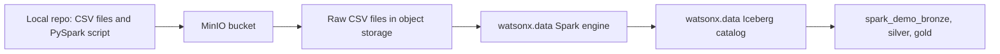

# Spark Demo Path

The Spark path shows the same medallion idea with a distributed job.

Spark is useful when the work is larger than simple SQL models: many files, big data, complex ETL logic, or machine-learning-style feature preparation.



!!! important "Why there is no spark_demo_raw schema"
    Spark can read CSV files directly from object storage. In this demo, the raw Spark landing layer is the uploaded CSV folder `s3a://iceberg-bucket/spark_demo/raw`, not a separate `spark_demo_raw` table schema. Spark starts writing managed Iceberg tables at bronze.

## What Spark Builds

| Layer | Schema | Objects |
| --- | --- | --- |
| Bronze | `spark_demo_bronze` | `bronze_customers`, `bronze_products`, `bronze_orders`, `bronze_order_items` |
| Silver | `spark_demo_silver` | `spark_silver_customers`, `spark_silver_products`, `spark_silver_orders`, `spark_silver_order_items` |
| Gold | `spark_demo_gold` | `spark_gold_daily_sales`, `spark_gold_customer_360` |

## Step 1: Confirm Settings

These are the important `.env` values:

```bash
WXD_SPARK_CATALOG=iceberg_data
WXD_SPARK_SCHEMA=spark_demo
WXD_SPARK_ASSET_BUCKET=iceberg-bucket
WXD_SPARK_ASSET_PREFIX=spark_demo
WXD_SPARK_APPLICATION=s3a://iceberg-bucket/spark_demo/app/load_medallion_demo.py
WXD_SPARK_INPUT_BASE=s3a://iceberg-bucket/spark_demo/raw
```

Dry run should be `true` when you only want to inspect the payload:

```bash
WXD_SPARK_DRY_RUN=true
```

Set it to `false` when you want to submit for real:

```bash
WXD_SPARK_DRY_RUN=false
```

## Step 2: Upload Spark Assets

```bash
cd /Users/aseelert/GitHub/ibmas-watsonxdata-dbt
source .venv/bin/activate
python scripts/upload_spark_assets.py
```

This uploads:

```text
s3a://iceberg-bucket/spark_demo/app/load_medallion_demo.py
s3a://iceberg-bucket/spark_demo/raw/raw_customers.csv
s3a://iceberg-bucket/spark_demo/raw/raw_products.csv
s3a://iceberg-bucket/spark_demo/raw/raw_orders.csv
s3a://iceberg-bucket/spark_demo/raw/raw_order_items.csv
```

## Step 3: If MinIO Is Internal

If MinIO has no external route, use OpenShift port-forwarding:

```bash
oc login https://api.watson.ibmas-zocp-techcluster.org:6443
oc -n cpd-instance port-forward svc/ibm-lh-lakehouse-minio-svc 19000:9000
```

In another terminal:

```bash
cd /Users/aseelert/GitHub/ibmas-watsonxdata-dbt
source .venv/bin/activate
export WXD_OBJECT_STORE_ENDPOINT=http://127.0.0.1:19000
python scripts/upload_spark_assets.py
```

The upload script can also start the port-forward automatically when `WXD_OBJECT_STORE_AUTO_PORT_FORWARD=true`.

## Step 4: Submit Spark Application

Dry run first:

```bash
python scripts/submit_spark_application.py
```

Submit for real:

```bash
export WXD_SPARK_DRY_RUN=false
python scripts/submit_spark_application.py
```

The script can derive Spark REST auth from:

```bash
WXD_CPD_USERNAME=<software-hub-user>
WXD_API_KEY=<software-hub-api-key>
```

## Step 5: Check Status

Use the application id returned by the submit command:

```bash
python scripts/spark_application_status.py <application-id>
```

Final success looks like:

```text
state: FINISHED
return_code: 0
```

## Step 6: Compare With dbt

After Spark finishes, use the [SQL Demo](sql-demo.md) page to compare:

- `gold_daily_sales` with `spark_gold_daily_sales`
- `gold_customer_360` with `spark_gold_customer_360`

!!! example "Simple explanation"
    Spark is the bigger-engine path. It reads files from object storage, runs a distributed job, and writes Iceberg tables. In this demo it creates the same business gold outputs as dbt, but with Spark-prefixed table names.
