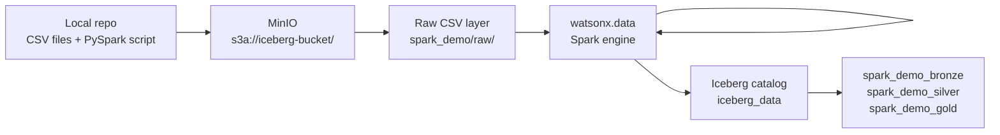

# Path B — Spark: Python ETL

!!! abstract "What you will do in this path"
    **In one breath:** Spark is a distributed Python (PySpark) engine. Here a single PySpark script reads the raw CSVs from object storage and transforms them through the same **Bronze → Silver → Gold** medallion as Path A — except the work runs as parallel Python on the watsonx.data **Spark engine** and the tables land in `spark_demo_*` schemas instead of `dbt_demo_*`. Spark is a full peer to dbt: both ingest *and* transform the same data, so you can build both and compare the Gold outputs side by side.

    - Upload the PySpark script and four raw CSV files to MinIO object storage
    - Submit the PySpark job to the watsonx.data Spark engine
    - Watch the job progress from RUNNING to FINISHED
    - Query the Spark gold tables through Presto SQL

    !!! warning "What this path requires"
        Unlike the dbt path (which needs only a Presto connection), this path needs a provisioned **Spark engine** in watsonx.data plus an asset upload step (script + CSVs pushed to MinIO) before the job can run.

    !!! success "Verified live — Spark gold == dbt gold, row for row"
        This path was executed end-to-end from a clean state: the Spark job reached **FINISHED in ~5 minutes**, and the three Spark gold marts were then compared against the dbt gold marts with a symmetric `EXCEPT` (both directions) — **zero differing rows** in all three. Both engines produced the same 494 daily-sales rows, 5 category rows, and 50 customers, with an identical **net revenue of 87,509.85** and matching `avg_revenue_per_unit` (236.57). Same source data, two engines, identical Gold — which is the whole point of running both paths.

    Estimated time: ~15 minutes.

---

## Why Spark for this?

!!! info "The short version"
    Spark runs Python code (PySpark) across multiple workers in parallel. This demo uses a single PySpark script that reads raw CSV files from MinIO, transforms them through bronze, silver, and gold layers, and writes Iceberg tables back to watsonx.data.

    Spark is the right choice when data is large, complex, or needs Python libraries beyond plain SQL — think joins across billions of rows, ML feature engineering, or custom parsing logic.

    **Compared to dbt:** dbt needs SQL and a Presto connection; Spark can handle anything Python can.



!!! note "Why there is no spark_demo_raw schema"
    Spark reads CSV files directly from object storage. The raw landing zone in this demo is the uploaded folder `s3a://iceberg-bucket/spark_demo/raw/` — not a managed Iceberg schema. Spark only starts writing managed Iceberg tables at the bronze layer.

---

## What Spark Builds in This Demo

!!! info "How Spark writes Parquet + Iceberg tables"
    Every time Spark saves a layer, it does three things:

    **1. It uses the Iceberg writer API.**
    Instead of writing raw files, Spark calls the Iceberg command so watsonx.data registers the table in its catalog. Think of it as filing a new document into an indexed cabinet rather than leaving it on a desk.

    **2. It sets the file format to Parquet.**
    Parquet is a compressed, column-oriented format — like a ZIP file that is also optimised for fast column lookups. We set it explicitly so the table is always Parquet, never ORC or CSV.

    **3. It partitions by month.**
    `.partitionedBy(F.months("order_date"))` tells Iceberg to apply the `month(order_date)` transform and create one sub-folder per month on MinIO (`order_date_month=2026-01`, `order_date_month=2026-02`, ...). When Presto later queries `WHERE order_date = DATE '2026-01-15'`, it reads only the `order_date_month=2026-01` folder and skips all others — like going straight to the right drawer in a filing cabinet.

    ```python
    (
        df.writeTo("iceberg_data.spark_demo_silver.spark_silver_orders")
          .using("iceberg")
          .tableProperty("write.format.default", "parquet")
          .partitionedBy(F.months("order_date"))
          .createOrReplace()
    )
    ```

    The resulting folder layout on MinIO looks like this:

    ```text
    s3a://iceberg-bucket/.../spark_silver_orders/order_date_month=2026-01/
    s3a://iceberg-bucket/.../spark_silver_orders/order_date_month=2026-02/
    s3a://iceberg-bucket/.../spark_silver_orders/order_date_month=2026-03/
    ...
    ```

**Which tables are partitioned?**

| Spark table | Schema | Partition transform |
|---|---|---|
| `spark_silver_orders` | `spark_demo_silver` | `month(order_date)` |
| `spark_silver_sales_enriched` | `spark_demo_silver` | `month(order_date)` |
| `spark_gold_daily_sales` | `spark_demo_gold` | `month(order_date)` |

**All objects the Spark path creates:**

| Layer | Schema | Tables |
|---|---|---|
| Bronze | `spark_demo_bronze` | `bronze_customers`, `bronze_products`, `bronze_orders`, `bronze_order_items` |
| Silver | `spark_demo_silver` | `spark_silver_customers`, `spark_silver_products`, `spark_silver_orders`, `spark_silver_order_items`, `spark_silver_sales_enriched` |
| Gold | `spark_demo_gold` | `spark_gold_daily_sales`, `spark_gold_category_performance`, `spark_gold_customer_360` |

---

## Step 1: Confirm Environment Settings

Your project stores connection details in a `.env` file. These are the variables that drive the Spark path.

| Variable | Example value | What it means |
|---|---|---|
| `WXD_SPARK_CATALOG` | `iceberg_data` | The Iceberg catalog registered in watsonx.data |
| `WXD_SPARK_SCHEMA` | `spark_demo` | Base schema prefix for all Spark layers |
| `WXD_SPARK_ASSET_BUCKET` | `iceberg-bucket` | MinIO bucket where assets are uploaded |
| `WXD_SPARK_ASSET_PREFIX` | `spark_demo` | Folder prefix inside the bucket |
| `WXD_SPARK_APPLICATION` | `s3a://iceberg-bucket/spark_demo/app/load_medallion_demo.py` | Full S3 path to the PySpark script after upload |
| `WXD_SPARK_INPUT_BASE` | `s3a://iceberg-bucket/spark_demo/raw` | Base S3 path where the raw CSV files live |
| `WXD_CPD_USERNAME` | `<your-username>` | IBM Software Hub (CPD) user for Spark REST auth |
| `WXD_API_KEY` | `<your-api-key>` | IBM Software Hub API key for Spark REST auth |

!!! tip "Dry run flag"
    `WXD_SPARK_DRY_RUN=true` prints the full Spark job payload without submitting anything. Use it to verify your config before spending time on a real run. Set it to `false` when you are ready to submit.

---

## Step 2: Upload Spark Assets to MinIO

Before the Spark engine can run the job, both the PySpark script and the CSV source files must be in MinIO. This single command uploads everything.

!!! info "Requires `oc`"
    The uploader reads the MinIO credentials from the `ibm-lh-minio-secret` OpenShift secret and
    (when needed) opens the port-forward, so you must be logged in with `oc` first. Install it via
    [Setup → Step 8](setup.md#step-8-install-command-line-tools-oc-cpdctl) and run `oc login`.

```bash
cd /Users/aseelert/GitHub/ibmas-watsonxdata-dbt
source .venv/bin/activate
python scripts/upload_spark_assets.py
```

The script uploads five objects to the expected S3 paths:

```text
s3a://iceberg-bucket/spark_demo/app/load_medallion_demo.py
s3a://iceberg-bucket/spark_demo/raw/raw_customers.csv
s3a://iceberg-bucket/spark_demo/raw/raw_products.csv
s3a://iceberg-bucket/spark_demo/raw/raw_orders.csv
s3a://iceberg-bucket/spark_demo/raw/raw_order_items.csv
```

!!! tip "Safe to re-run — objects are overwritten and verified"
    Each object is uploaded with overwrite-by-key semantics, so re-running the script always
    replaces the previous app/CSVs in MinIO (the Spark engine then picks up the fresh
    `load_medallion_demo.py` on the next submit). The script prints `overwrote …` or `created …`
    for each object and verifies the uploaded byte count matches your local file:

    ```text
    Uploading 5 files for Spark demo (existing objects are overwritten)
    overwrote s3://iceberg-bucket/spark_demo/app/load_medallion_demo.py  (11209 bytes, verified)
    overwrote s3://iceberg-bucket/spark_demo/raw/raw_orders.csv  (23717 bytes, verified)
    ...
    ```

!!! note "If MinIO has no external route"
    In some OpenShift deployments, MinIO is not exposed outside the cluster. In that case, open a port-forward in a separate terminal before running the upload:

    ```bash
    oc login https://api.watson.ibmas-zocp-techcluster.org:6443
    oc -n cpd-instance port-forward svc/ibm-lh-lakehouse-minio-svc 19000:9000
    ```

    Then, in your working terminal, override the endpoint before uploading:

    ```bash
    source .venv/bin/activate
    export WXD_OBJECT_STORE_ENDPOINT=http://127.0.0.1:19000
    python scripts/upload_spark_assets.py
    ```

    The upload script also supports automatic port-forwarding when `WXD_OBJECT_STORE_AUTO_PORT_FORWARD=true` is set in `.env`.

---

## Step 3: Dry Run First

A dry run assembles the complete Spark job payload and prints it to the terminal — it does not submit anything to the cluster. This is the fastest way to catch config errors before committing to a real job run.

```bash
WXD_SPARK_DRY_RUN=true python scripts/submit_spark_application.py
```

!!! tip "What to look for in the dry-run output"
    Check that `application_details.application` points to `s3a://iceberg-bucket/spark_demo/app/load_medallion_demo.py` and that the `arguments` array lists your S3 input paths correctly. If anything looks wrong, fix the `.env` values and re-run the dry run.

---

## Step 4: Submit the Spark Job

Once the dry run looks correct, submit the job to the watsonx.data Spark engine by setting `WXD_SPARK_DRY_RUN=false`.

```bash
WXD_SPARK_DRY_RUN=false python scripts/submit_spark_application.py
```

The script authenticates to the Spark REST API using the credentials from your `.env`:

```bash
WXD_CPD_USERNAME=<software-hub-user>
WXD_API_KEY=<software-hub-api-key>
```

!!! info "Capturing the application ID"
    The submit command prints an application ID when it succeeds, for example:

    ```text
    Application submitted: spark-abc123def456
    ```

    Copy this ID — you need it in the next step to check status.

---

## Step 5: Check Job Status

Pass the application ID from the previous step to the status script. You can run this command repeatedly; it returns the current state each time.

```bash
python scripts/spark_application_status.py <application-id>
```

!!! example "What each state means"

    | State | What it means | What to do |
    |---|---|---|
    | `RUNNING` | The job is actively processing data on the Spark workers | Wait and re-check in 30–60 seconds |
    | `FINISHED` with `return_code: 0` | All medallion layers were written successfully | Proceed to Step 6 |
    | `FAILED` | The job encountered an error | Check the Spark application logs under Infrastructure manager → Spark → Applications in the watsonx.data UI |

    A successful completion looks like this:

    ```text
    state: FINISHED
    return_code: 0
    ```

!!! warning "Jobs can take 3–5 minutes on first run"
    The first submission takes longer because the Spark engine must pull the PySpark runtime image. Subsequent runs on the same cluster are faster.

---

## Step 6: Query the Spark Gold Tables

Once the job finishes, the gold tables are immediately queryable through the Presto endpoint. Connect to Presto and run these queries.

!!! example "Row count check across all gold objects"

    ```sql
    SELECT COUNT(*) AS row_count, 'spark_gold_daily_sales' AS table_name
    FROM iceberg_data.spark_demo_gold.spark_gold_daily_sales
    UNION ALL
    SELECT COUNT(*), 'spark_gold_category_performance'
    FROM iceberg_data.spark_demo_gold.spark_gold_category_performance
    UNION ALL
    SELECT COUNT(*), 'spark_gold_customer_360'
    FROM iceberg_data.spark_demo_gold.spark_gold_customer_360;
    ```

!!! example "Daily revenue from the Spark gold layer"

    ```sql
    SELECT
        order_date,
        category,
        order_count,
        units_sold,
        net_revenue
    FROM iceberg_data.spark_demo_gold.spark_gold_daily_sales
    ORDER BY order_date DESC
    LIMIT 10;
    ```

!!! example "Category performance — Spark vs dbt side by side"

    ```sql
    -- Spark path
    SELECT category, total_revenue, total_orders
    FROM iceberg_data.spark_demo_gold.spark_gold_category_performance
    ORDER BY total_revenue DESC;

    -- dbt path (run separately to compare)
    SELECT category, total_revenue, total_orders
    FROM iceberg_data.dbt_demo_gold.gold_category_performance
    ORDER BY total_revenue DESC;
    ```

!!! tip "Partition pruning in action"
    Add a `WHERE order_date BETWEEN DATE '2026-03-01' AND DATE '2026-03-31'` filter to the `spark_gold_daily_sales` query. Presto reads only the March 2026 partition folder instead of scanning the whole table — you can observe the reduced data scanned in the query stats.

---

## What to Do Next

You have completed the Spark path. The `spark_demo_gold` tables now live alongside the `dbt_demo_gold` tables (from Path A — dbt) in the same Iceberg catalog.

- **Try cpdctl ingestion** — [Ingestion Paths: dbt · Spark · cpdctl](ingestion.md) walks through the cpdctl native ingestion method, which creates UI-tracked load history in the watsonx.data Data manager.
- **Compare the two full pipelines** — [SQL Demo](sql-demo.md) has queries that run against dbt gold and Spark gold in the same session so you can verify those two outputs match, plus queries to inspect the cpdctl RAW ingest tables. Note that cpdctl has no gold layer of its own — it would need a dbt or Spark transform before it could be compared to gold.

!!! note "cpdctl is an ingestion loader, not a full medallion path"
    Unlike dbt and Spark — which are two interchangeable, self-contained full pipelines that each ingest *and* transform CSVs through Bronze → Silver → Gold — cpdctl is an ingestion loader. It lands raw CSV in `spark_demo_cpdctl_raw` and stops at raw; to build bronze/silver/gold on top you run dbt or Spark over that data.
