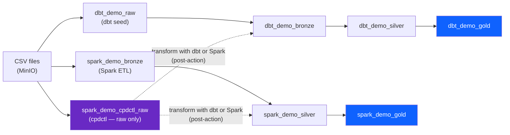

# SQL — Compare dbt vs Spark Gold (+ inspect cpdctl raw)

!!! abstract "What this page does"
    dbt and Spark are two full pipelines that build gold layers (`dbt_demo_gold`,
    `spark_demo_gold`); cpdctl is an ingest-only loader that lands raw tables in
    `spark_demo_cpdctl_raw`. This page compares the **dbt and Spark gold outputs side by side** and
    shows how to **inspect the cpdctl raw tables**. Use the watsonx.data SQL editor or any Presto
    client.

---

## Where to run these queries

Every query on this page runs against the **Presto engine** in the watsonx.data UI.

**Option 1 — watsonx.data SQL editor (browser)**

Open the watsonx.data console, navigate to **SQL editor**, and set the catalog to `iceberg_data`.
Paste any query from this page and click **Run**.

**Option 2 — Python script (gold tables only)**

The repo includes a convenience script that connects to Presto and queries the gold marts.

```bash
python scripts/query_gold.py
```

!!! info "Catalog to use"
    All schemas in this demo live in the `iceberg_data` catalog. Always select `iceberg_data`
    before running queries. The Presto endpoint is
    `ibm-lh-lakehouse-presto651-presto-svc.apps.watson.ibmas-zocp-techcluster.org:443`.

!!! note "Why there is no spark_demo_raw schema"
    The `dbt_demo_raw` tables exist because dbt seed loads CSV files into queryable Presto
    tables. Spark reads the same CSV files directly from MinIO object storage, so there is no
    `spark_demo_raw` schema — the Spark path starts at bronze.

---

## Schema map — all three paths at a glance

dbt and Spark build multi-layer schema hierarchies (raw/bronze/silver/gold and bronze/silver/gold). cpdctl lands a single raw schema (`spark_demo_cpdctl_raw`) with no hierarchy until a dbt or Spark transform is applied.

| Source CSV | Row count | dbt schema | Spark schema | cpdctl schema |
|---|---|---|---|---|
| `raw_customers.csv` | 50 | `dbt_demo_raw.raw_customers` | `spark_demo_bronze.bronze_customers` | `spark_demo_cpdctl_raw.customers` |
| `raw_products.csv` | 20 | `dbt_demo_raw.raw_products` | `spark_demo_bronze.bronze_products` | `spark_demo_cpdctl_raw.products` |
| `raw_orders.csv` | 500 | `dbt_demo_raw.raw_orders` | `spark_demo_bronze.bronze_orders` | `spark_demo_cpdctl_raw.orders` |
| `raw_order_items.csv` | 1,134 | `dbt_demo_raw.raw_order_items` | `spark_demo_bronze.bronze_order_items` | `spark_demo_cpdctl_raw.order_items` |



---

## Explore each path

### Path A — dbt

dbt builds a full four-layer medallion: raw → bronze → silver → gold. Each layer adds
governance metadata, clean column types, and finally aggregated business metrics.

**Discover what schemas and tables exist:**

```sql
SHOW SCHEMAS FROM iceberg_data LIKE 'dbt_demo%';

SHOW TABLES FROM iceberg_data.dbt_demo_raw;
SHOW TABLES FROM iceberg_data.dbt_demo_bronze;
SHOW TABLES FROM iceberg_data.dbt_demo_silver;
SHOW TABLES FROM iceberg_data.dbt_demo_gold;
```

**Raw layer — the original CSV data loaded as-is by `dbt seed`:**

```sql
SELECT *
FROM iceberg_data.dbt_demo_raw.raw_orders
ORDER BY order_id;
```

**Bronze layer — same rows, plus four dbt audit columns added by the bronze model:**

```sql
SELECT
  order_id,
  customer_id,
  order_ts,
  status,
  payment_method,
  _ingested_at,
  _ingested_by,
  _source_file,
  _ingest_batch_id
FROM iceberg_data.dbt_demo_bronze.bronze_orders
ORDER BY order_id;
```

!!! tip "What the underscore columns are"
    `_ingested_at`, `_ingested_by`, `_source_file`, and `_ingest_batch_id` are metadata columns
    that dbt adds in the bronze model. They record when the row arrived, which process wrote it,
    and which batch it belongs to — this is the core of data governance lineage.

**Silver layer — cleaned column types, `order_date` extracted as a proper date partition key:**

```sql
SELECT
  order_id,
  customer_id,
  order_ts,
  order_date,
  status,
  payment_method,
  transformed_at
FROM iceberg_data.dbt_demo_silver.silver_orders
ORDER BY order_id;
```

**Gold layer — aggregated business marts ready for dashboards and analytics:**

`gold_daily_sales` is a **TABLE** (materialized, partitioned by `month(order_date)`; partition column `order_date_month`).
`gold_customer_360` and `gold_category_performance` are **VIEWs** (computed on read).

```sql
SELECT *
FROM iceberg_data.dbt_demo_gold.gold_daily_sales
ORDER BY order_date, category;

SELECT *
FROM iceberg_data.dbt_demo_gold.gold_customer_360
ORDER BY lifetime_value DESC, customer_id;
```

---

### Path B — Spark

The Spark path uses a Python ETL script to produce bronze, silver, and gold layers in separate
`spark_demo_*` schemas. The column names and aggregation logic mirror the dbt gold marts so
the two paths can be compared directly.

**Discover what schemas and tables exist:**

```sql
SHOW SCHEMAS FROM iceberg_data LIKE 'spark_demo%';

SHOW TABLES FROM iceberg_data.spark_demo_bronze;
SHOW TABLES FROM iceberg_data.spark_demo_silver;
SHOW TABLES FROM iceberg_data.spark_demo_gold;
```

**Bronze layer — raw ingestion into Spark-managed Iceberg tables:**

```sql
SELECT *
FROM iceberg_data.spark_demo_bronze.bronze_orders
ORDER BY order_id;
```

**Silver layer — cleaned and enriched by the Spark ETL:**

```sql
SELECT *
FROM iceberg_data.spark_demo_silver.spark_silver_orders
ORDER BY order_id;
```

**Gold layer — aggregated marts matching the dbt gold schema:**

```sql
SELECT *
FROM iceberg_data.spark_demo_gold.spark_gold_daily_sales
ORDER BY order_date, category;

SELECT *
FROM iceberg_data.spark_demo_gold.spark_gold_customer_360
ORDER BY lifetime_value DESC, customer_id;
```

---

### Path C — cpdctl

cpdctl ingestion loads CSV files directly into Iceberg tables under `spark_demo_cpdctl_raw`
with no transformation — this is the platform's native ingestion service. Runs appear in the
watsonx.data console under **Data manager → Ingestion**.

**Discover what tables exist:**

```sql
SHOW TABLES FROM iceberg_data.spark_demo_cpdctl_raw;
```

**Row counts — verify all four tables loaded correctly:**

```sql
SELECT 'customers'   AS tbl, COUNT(*) AS rows FROM iceberg_data.spark_demo_cpdctl_raw.customers
UNION ALL SELECT 'products',    COUNT(*) FROM iceberg_data.spark_demo_cpdctl_raw.products
UNION ALL SELECT 'orders',      COUNT(*) FROM iceberg_data.spark_demo_cpdctl_raw.orders
UNION ALL SELECT 'order_items', COUNT(*) FROM iceberg_data.spark_demo_cpdctl_raw.order_items;
```

**Inspect the raw customer rows:**

```sql
SELECT *
FROM iceberg_data.spark_demo_cpdctl_raw.customers
ORDER BY customer_id;
```

!!! note "cpdctl has no gold layer"
    The cpdctl path loads raw CSV data as-is and stops there. It demonstrates the platform's
    built-in ingestion audit trail, not a full medallion pipeline. You *can* query the raw cpdctl
    tables directly with an ad-hoc join (below), but to build a **real, governed** Silver/Gold on
    cpdctl-ingested data you run dbt or Spark transformations against `spark_demo_cpdctl_raw` as a
    post-action — cpdctl provides the raw ingest, dbt/Spark provide the transform. See
    [What cpdctl does NOT do — and how to finish the job](ingestion.md#what-cpdctl-does-not-do-and-how-to-finish-the-job).

**Ad-hoc gold-equivalent query over cpdctl tables:**

This is a one-off ad-hoc query for inspection — it reproduces the daily sales metric directly from
the raw cpdctl tables, without a governed pipeline. (For a real pipeline, run dbt or Spark over
`spark_demo_cpdctl_raw` as shown in the link above.)

```sql
SELECT
  CAST(o.order_ts AS DATE)            AS order_date,
  p.category                          AS category,
  COUNT(DISTINCT o.order_id)          AS order_count,
  SUM(oi.quantity)                    AS units_sold,
  SUM(oi.quantity * p.unit_price)     AS net_revenue
FROM iceberg_data.spark_demo_cpdctl_raw.orders      o
JOIN iceberg_data.spark_demo_cpdctl_raw.order_items oi ON o.order_id   = oi.order_id
JOIN iceberg_data.spark_demo_cpdctl_raw.products    p  ON oi.product_id = p.product_id
WHERE o.status = 'completed'
GROUP BY CAST(o.order_ts AS DATE), p.category
ORDER BY order_date, category;
```

---

## Side-by-side comparison — the money shot

This is the core demo moment: two completely independent pipelines (dbt and Spark) reading the
same source data through different engines and code — and producing identical business answers.

!!! info "Why only dbt and Spark here?"
    cpdctl is excluded from this gold-vs-gold comparison because it has **no gold layer** — it is an
    ingest loader, not a medallion. Only the two full pipelines (dbt, Spark) produce comparable gold
    marts. To bring cpdctl data into this comparison, first transform it with dbt or Spark (see the
    [post-action section](ingestion.md#what-cpdctl-does-not-do-and-how-to-finish-the-job)).

### Daily sales — dbt vs Spark

Run this single UNION ALL query to see both paths in one result set. Identical rows confirm
the pipelines agree.

```sql
SELECT
  'dbt'         AS path,
  order_date,
  category,
  order_count,
  units_sold,
  net_revenue
FROM iceberg_data.dbt_demo_gold.gold_daily_sales

UNION ALL

SELECT
  'spark'       AS path,
  order_date,
  category,
  order_count,
  units_sold,
  net_revenue
FROM iceberg_data.spark_demo_gold.spark_gold_daily_sales

ORDER BY order_date, category, path;
```

!!! tip "What to look for"
    For every `(order_date, category)` combination you should see exactly two rows — one with
    `path = 'dbt'` and one with `path = 'spark'`. The `order_count`, `units_sold`, and
    `net_revenue` values must match. If they do not match, the silver-layer filter logic differs
    between the two pipelines.

**Verify mathematically — check for any row where the two paths disagree:**

```sql
WITH dbt_gold AS (
  SELECT order_date, category, order_count, units_sold, net_revenue
  FROM iceberg_data.dbt_demo_gold.gold_daily_sales
),
spark_gold AS (
  SELECT order_date, category, order_count, units_sold, net_revenue
  FROM iceberg_data.spark_demo_gold.spark_gold_daily_sales
)
SELECT
  d.order_date,
  d.category,
  d.order_count        AS dbt_orders,
  s.order_count        AS spark_orders,
  d.net_revenue        AS dbt_revenue,
  s.net_revenue        AS spark_revenue,
  d.net_revenue - s.net_revenue AS delta
FROM dbt_gold   d
JOIN spark_gold s ON d.order_date = s.order_date AND d.category = s.category
WHERE d.order_count != s.order_count
   OR d.net_revenue != s.net_revenue
ORDER BY ABS(d.net_revenue - s.net_revenue) DESC;
```

!!! example "Expected result"
    Zero rows returned — both pipelines produce identical aggregations from the same source data.

---

### Customer 360 — dbt vs Spark

```sql
SELECT
  'dbt'         AS path,
  customer_id,
  completed_orders,
  returned_orders,
  pending_orders,
  cancelled_orders,
  lifetime_value
FROM iceberg_data.dbt_demo_gold.gold_customer_360

UNION ALL

SELECT
  'spark'       AS path,
  customer_id,
  completed_orders,
  returned_orders,
  pending_orders,
  cancelled_orders,
  lifetime_value
FROM iceberg_data.spark_demo_gold.spark_gold_customer_360

ORDER BY customer_id, path;
```

---

### Three-way row count — all paths, all layers

Use this query at any time to get a quick health check across every schema in the demo.

```sql
SELECT 'dbt raw'           AS path_layer, 'raw_orders'        AS tbl, COUNT(*) AS rows FROM iceberg_data.dbt_demo_raw.raw_orders
UNION ALL SELECT 'dbt bronze', 'bronze_orders',     COUNT(*) FROM iceberg_data.dbt_demo_bronze.bronze_orders
UNION ALL SELECT 'dbt silver', 'silver_orders',     COUNT(*) FROM iceberg_data.dbt_demo_silver.silver_orders
UNION ALL SELECT 'dbt gold',   'gold_daily_sales',  COUNT(*) FROM iceberg_data.dbt_demo_gold.gold_daily_sales
UNION ALL SELECT 'spark bz',   'bronze_orders',      COUNT(*) FROM iceberg_data.spark_demo_bronze.bronze_orders
UNION ALL SELECT 'spark sv',   'spark_silver_orders', COUNT(*) FROM iceberg_data.spark_demo_silver.spark_silver_orders
UNION ALL SELECT 'spark gold', 'spark_gold_daily_sales', COUNT(*) FROM iceberg_data.spark_demo_gold.spark_gold_daily_sales
UNION ALL SELECT 'cpdctl',     'orders',            COUNT(*) FROM iceberg_data.spark_demo_cpdctl_raw.orders
ORDER BY path_layer, tbl;
```

---

## Iceberg time travel

Iceberg records every write as a new snapshot. Time travel lets you query any historical version
of a table using either a snapshot ID or a timestamp — without restoring a backup.

!!! tip "How to get a snapshot ID"
    Run the snapshot query in the next section first. Copy a `snapshot_id` value, then paste it
    into the query below.

**Query by snapshot ID:**

```sql
SELECT *
FROM iceberg_data.dbt_demo_silver.silver_orders
FOR VERSION AS OF <snapshot_id>
ORDER BY order_id;
```

**Query by timestamp** — use any timestamp after a `committed_at` value from the snapshots table:

```sql
SELECT *
FROM iceberg_data.dbt_demo_silver.silver_orders
FOR TIMESTAMP AS OF TIMESTAMP '2026-06-12 12:46:47 UTC'
ORDER BY order_id;
```

!!! warning "Replace the placeholder values"
    `<snapshot_id>` must be replaced with an actual integer from the snapshots query.
    The timestamp example above is illustrative — use a real `committed_at` value from your
    instance.

---

## Iceberg table history

Iceberg maintains a full audit log of every change to a table. These metadata queries work on
any Iceberg table in the catalog.

**Snapshot history — every write operation recorded:**

```sql
SELECT
  committed_at,
  snapshot_id,
  operation,
  summary
FROM iceberg_data.dbt_demo_silver."silver_orders$snapshots"
ORDER BY committed_at DESC;
```

**Change history — which snapshot is currently active:**

```sql
SELECT *
FROM iceberg_data.dbt_demo_silver."silver_orders$history"
ORDER BY made_current_at DESC;
```

**Partition layout — how data is distributed across `month(order_date)` partitions:**

```sql
SELECT order_date_month, row_count, file_count, total_size
FROM iceberg_data.dbt_demo_silver."silver_orders$partitions"
ORDER BY order_date_month;
```

Expected output (month values are months since Unix epoch; 672 = 2026-01):

```
 order_date_month | row_count | file_count | total_size
------------------+-----------+------------+------------
              672 |        85 |          1 |       3607
              673 |        84 |          1 |       3545
              674 |       109 |          1 |       3963
              675 |        86 |          1 |       3576
              676 |        97 |          1 |       3759
              677 |        39 |          1 |       2485
```

**Full DDL — see exactly how the table was created, including file format and partition spec:**

```sql
SHOW CREATE TABLE iceberg_data.dbt_demo_silver.silver_orders;
```

!!! info "Why Iceberg metadata matters for demos"
    These metadata tables are what separate a lakehouse from a plain data lake. You can show an
    audience exactly when data changed, run point-in-time queries, and inspect partition pruning
    — all without touching the underlying PARQUET files in MinIO.

---

## What to do next

The full SQL script used in this page is also available as a standalone file at
`docs/watsonxdata_sql_demo.sql` for use with any Presto client.

After comparing the dbt and Spark gold layers (and inspecting the cpdctl raw tables), see the
lineage graph that traces each row from source CSV to gold mart:

[Lineage UI (OpenMetadata)](openmetadata.md){ .md-button }
