# SQL Reference — Bronze → Silver → Gold, Side by Side

!!! abstract "What this page is"
    A pure code reference — no walkthrough, no setup steps. Just the **real SQL from this
    project's dbt models**, laid out left to right so you can see exactly what changes at each
    medallion layer: Bronze lands the raw columns as-is, Silver casts types and cleans/joins,
    Gold aggregates into business-ready tables and views. Every query here is copy-pasted
    straight from `models/bronze/`, `models/silver/`, and `models/gold/` — nothing is simplified
    or invented for this page.

---

## Orders: raw → cleaned → aggregated

<div class="sql-grid-3" markdown>

<div markdown>

### :material-numeric-1-circle: Bronze
*`models/bronze/bronze_orders.sql`*

Raw columns, untouched. Only ingestion metadata is added — no casting, no cleaning yet.

```sql
select
  order_id,
  customer_id,
  order_ts,
  status,
  payment_method,
  current_timestamp as _ingested_at,
  'dbt seed'         as _ingested_by,
  'raw_orders.csv'   as _source_file
from {{ ref('raw_orders') }}
```

</div>

<div markdown>

### :material-numeric-2-circle: Silver
*`models/silver/silver_orders.sql`*

Types are cast, text is trimmed/lower-cased, bad rows are dropped.

```sql
{{ config(properties={
    "format": "'PARQUET'",
    "partitioning": "ARRAY['month(order_date)']"
}) }}

select
  cast(order_id as integer)    as order_id,
  cast(customer_id as integer) as customer_id,
  cast(order_ts as timestamp)  as order_ts,
  cast(cast(order_ts as timestamp)
       as date)                as order_date,
  lower(trim(status))          as status,
  lower(trim(payment_method))  as payment_method,
  current_timestamp            as transformed_at
from {{ ref('bronze_orders') }}
where order_id is not null
```

</div>

<div markdown>

### :material-numeric-3-circle: Gold
*`models/gold/gold_daily_sales.sql`*

A physical **table**, aggregated straight off the enriched silver fact.

```sql
select
  order_date,
  category,
  count(distinct order_id) as order_count,
  sum(quantity)            as units_sold,
  cast(sum(net_amount)
       as decimal(14,2))   as net_revenue
from {{ ref('silver_sales_enriched') }}
where status = 'completed'
group by 1, 2
```

</div>

</div>

!!! tip "What actually changed, column by column"
    | Column | Bronze type | Silver type | What happened |
    |---|---|---|---|
    | `order_id` | untyped (raw) | `integer` | explicit `cast(... as integer)` |
    | `order_ts` | untyped (raw) | `timestamp` | explicit `cast(... as timestamp)`, then re-cast to `date` for `order_date` |
    | `status` | untyped (raw), mixed case/whitespace | `varchar`, normalized | `lower(trim(...))` so `" Completed"` and `"completed"` become identical |
    | `payment_method` | untyped (raw) | `varchar`, normalized | same `lower(trim(...))` treatment |
    | *(new in Gold)* `order_count`, `units_sold`, `net_revenue` | — | `bigint` / `decimal(14,2)` | created by `count(distinct ...)` / `sum(...)`, they don't exist before Gold |

---

## Silver's second job: enrichment (joining, not just cleaning)

Cleaning one table isn't the whole story — Silver also **joins** the four cleaned entities into one
row-per-order-line fact that Gold reads from. This is the "enriched" step:

<div class="grid" markdown>

<div markdown>

### :material-set-merge: Silver — the join
*`models/silver/silver_sales_enriched.sql`*

Four already-cleaned Silver tables are joined into one analytics-ready fact — this is what
"enriched" means: not just clean, but carrying context from other tables (customer country,
product category) plus computed columns (`gross_amount`, `net_amount`).

```sql
select
  oi.order_item_id,
  oi.order_id,
  o.order_date,
  o.status,
  c.country                 as customer_country,
  p.product_name,
  p.category,
  oi.quantity,
  p.unit_price,
  oi.discount_pct,
  cast(oi.quantity * p.unit_price
       as decimal(14,2))    as gross_amount,
  cast(oi.quantity * p.unit_price
       * (1 - oi.discount_pct)
       as decimal(14,2))    as net_amount
from {{ ref('silver_order_items') }} oi
join {{ ref('silver_orders') }}    o
  on oi.order_id = o.order_id
join {{ ref('silver_products') }}  p
  on oi.product_id = p.product_id
join {{ ref('silver_customers') }} c
  on o.customer_id = c.customer_id
```

</div>

<div markdown>

### :material-view-grid: Gold — a pre-aggregated view
*`models/gold/gold_category_performance.sql`*

Gold isn't always a fresh aggregation from scratch — this one is a **view** that rolls up the
already-aggregated `gold_daily_sales` **table** above. Cheap to query, always up to date, no
extra storage.

```sql
{{ config(materialized='view') }}

select
  category,
  sum(order_count)         as total_orders,
  sum(units_sold)          as total_units,
  cast(sum(net_revenue)
       as decimal(14,2))   as total_revenue,
  cast(sum(net_revenue) /
       nullif(sum(units_sold), 0)
       as decimal(14,2))   as avg_revenue_per_unit
from {{ ref('gold_daily_sales') }}
group by 1
```

</div>

</div>

!!! question "So is Gold a table with SUM, or a pre-aggregated view? — Both."
    `gold_daily_sales` is a physical **table** built with `sum()`/`group by` directly off the
    Silver fact. `gold_category_performance` is a **view** — it does *not* re-scan Silver, it
    further summarizes the table above it. That's the whole point of layering Gold marts: cheap
    views can sit on top of expensive tables without redoing the heavy aggregation.

---

## The full chain in one picture

```mermaid
flowchart LR
    raw["raw_orders\n(CSV seed)"] --> bz["bronze_orders\nraw copy + metadata"]
    bz --> sv["silver_orders\ncast + trim + filter"]
    sv --> en["silver_sales_enriched\nJOIN 4 silver tables"]
    en --> gd["gold_daily_sales\nTABLE — SUM/GROUP BY"]
    gd --> gv["gold_category_performance\nVIEW — rolls up the table"]

    style bz fill:#fff3e0,stroke:#b46d3c,color:#161616
    style sv fill:#edf5ff,stroke:#0f62fe,color:#161616
    style en fill:#edf5ff,stroke:#0f62fe,color:#161616
    style gd fill:#fcf4d6,stroke:#b28600,color:#161616
    style gv fill:#fcf4d6,stroke:#b28600,color:#161616
```



See also: [When to Use Which](choosing.md) for the engine comparison, and
[SQL — Compare dbt vs Spark vs Confluent Gold](sql-demo.md) to see these same numbers
reproduced by all three engines.
