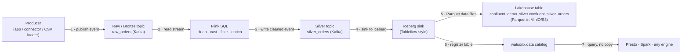
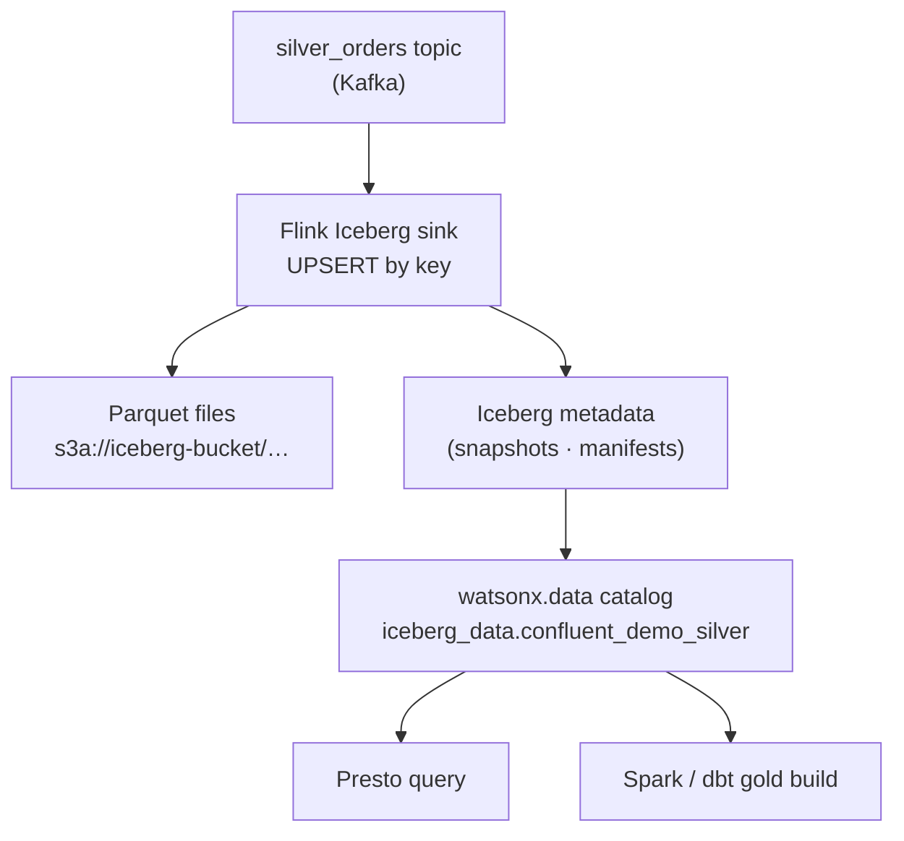

# Streaming Medallion Explained

!!! abstract "The one idea to take away"
    A streaming medallion is the **same Bronze → Silver → Gold idea, but the data never stops
    moving.** Instead of running a batch job on a schedule, a **producer** pushes each row onto a
    Kafka **topic** the moment it happens; **Flink** reads that topic, cleans and enriches each
    message with SQL, and writes the result to a *new* topic; a **sink** then lands those rows as
    an **Iceberg table** in the lakehouse — where Presto, Spark, or any engine can query it. No
    nightly wait, no copies.

This page is the *simple* mental model. For the deep, component-by-component version see
[Confluent — How It Works](confluent-internals.md), and to actually run it see
[Confluent — Streaming](confluent-demo.md).

---

## The flow, one message at a time



Read it left to right:

1. **Producer → raw topic.** Something that creates data — an application, a Kafka Connect source,
   or in this demo a [CSV-to-Kafka loader](confluent-demo.md) — publishes each record onto a
   **raw** (Bronze) topic. The topic is an append-only, replayable log: the events sit there in
   order and can be re-read at any time.
2. **Flink reads the raw topic** and applies streaming **SQL** to clean and shape each message
   (see the example below).
3. **Flink → silver topic.** The cleaned result is written to a **new** topic — this is your
   **Silver** stream. At this point Silver is still *in Kafka*, flowing.
4. **Sink to Iceberg.** A sink job (the same idea as **Confluent Tableflow**) continuously takes
   the silver topic and writes it as an **Iceberg table**.
5. **Data files land in object storage** (Parquet in the MinIO/S3 bucket).
6. **The table is registered in the catalog** — this is the step that turns "a folder of Parquet"
   into "a table any engine can find." (See [Table Formats](table-formats.md) for why that
   registration matters.)
7. **Anyone queries it.** Presto, Spark, or a BI tool reads the Iceberg table directly from the
   lakehouse — **no compute had to run at the lakehouse to *store* the data**; the streaming layer
   already did that. The lakehouse just holds it and serves reads.

!!! tip "Why 'Bronze is a topic' is powerful"
    In the batch world, Bronze is a static table you overwrite. Here Bronze is a **replayable Kafka
    topic**: if you find a bug in your Silver logic, you fix the Flink SQL and *replay the raw
    topic from the beginning* — no need to re-ingest from the source system.

---

## The "clean and enrich" step — real Flink SQL from this demo

Stage 1 of the pipeline turns a messy `raw_orders` topic into a tidy `silver_orders` topic. This is
the actual SQL from [`confluent/flink/sql/silver_jobs.sql`](confluent-internals.md) (it mirrors the
dbt model `models/silver/silver_orders.sql` exactly, so all paths agree):

```sql
-- raw_orders (Kafka)  →  silver_orders (Kafka)
INSERT INTO kafka_silver_orders
SELECT
  order_id,
  customer_id,
  CAST(CAST(order_ts AS TIMESTAMP(6)) AS STRING),                 -- typed timestamp
  CAST(CAST(CAST(order_ts AS TIMESTAMP(6)) AS DATE) AS STRING),   -- derived order_date
  LOWER(TRIM(status)),                                            -- normalise "Completed " → "completed"
  LOWER(TRIM(payment_method)),
  CAST(CURRENT_TIMESTAMP AS STRING)                               -- transformed_at stamp
FROM src_orders
WHERE order_id IS NOT NULL;                                       -- drop junk rows
```

That single streaming `INSERT … SELECT` runs **forever**: every new order that lands on
`raw_orders` is cleaned and pushed to `silver_orders` within seconds. The same file then has a
**join** job that combines the silver streams (orders + items + customers + products) into a
`confluent_silver_sales_enriched` stream — the streaming equivalent of a dbt silver join model.

!!! info "Schema Registry = the streaming version of dbt tests"
    The raw and silver topics use **Avro governed by the Confluent Schema Registry**. The registry
    is the *contract*: a producer that tries to send a message that does not match the agreed schema
    is rejected at the door. That is the streaming analogue of a `not_null` / type test in dbt —
    bad data is stopped before it ever reaches Silver.

---

## The Iceberg sink — where streaming meets the lakehouse

The silver topic is still just Kafka. The **sink** is what makes it a queryable table:

```sql
-- silver_orders (Kafka)  →  Iceberg table in watsonx.data
INSERT INTO local_iceberg.confluent_demo_silver.confluent_silver_orders
SELECT * FROM kafka_silver_orders;
```

Behind that one statement, the sink:

- writes **Parquet data files** into the `iceberg-bucket` object store,
- keeps the table **idempotent** with `PRIMARY KEY` + `write.upsert.enabled` (a re-run upserts by
  key instead of appending duplicates), and
- updates the **Iceberg metadata / catalog** so the table is discoverable.



!!! note "Decoupled storage and compute — the lakehouse payoff"
    Notice that **the streaming engine wrote the data**, not the lakehouse. watsonx.data does not
    need to run a job to *store* these rows — Flink already produced the Parquet and registered the
    table. The lakehouse's compute (Presto/Spark) is only spent when someone **queries** or
    **builds Gold** on top. Storage and compute are independent: that is the core lakehouse idea,
    and streaming makes it especially visible.

---

## Where Gold comes from (and who builds it)

In this demo, **Flink writes Silver**, and a **second engine builds Gold** on top of the silver
Iceberg tables — chosen by one environment variable:

| `CONFLUENT_GOLD_ENGINE` | Builds Gold with… | Story |
|---|---|---|
| `spark` (default) | a watsonx.data **Spark** job | code-first, reuses the Spark engine |
| `datastage` | an IBM **DataStage** flow | enterprise no-code visual ETL — see [DataStage](datastage-demo.md) |

Either way the result is the **same** `confluent_demo_gold` marts, with the **same numbers** as the
dbt and Spark paths — proven by `scripts/reconcile_gold.py`. Gold can be built by a streaming job
too, but a periodic Spark/DataStage roll-up is the common, cost-efficient pattern: not every
aggregate needs to update every second.

---

## Batch vs streaming — the same medallion, two clocks

| | Batch medallion (dbt / Spark) | Streaming medallion (Kafka + Flink) |
|---|---|---|
| When it runs | On a schedule (hourly/nightly) | Continuously, per event |
| Bronze is… | A table you overwrite | A **replayable topic** |
| Latency | Minutes to hours | **Seconds** |
| Reprocess a bug | Re-run the batch | **Replay** the raw topic |
| Cost shape | Spiky (job runs, then idle) | Always-on (the stream never sleeps) |
| Best when | Most data; not latency-sensitive | Data must be fresh *now* |

!!! warning "Streaming is not free"
    An always-on streaming pipeline consumes resources around the clock, where a nightly batch job
    is idle most of the day. **Use streaming where freshness genuinely matters**, and batch for the
    rest — see the cost/latency discussion in [When to Use Which](choosing.md) and, for the
    enterprise tools, [watsonx.data Integration](enterprise/integration.md).

---

## Next step

- Run it end to end: [Confluent — Streaming (Kafka → Flink → Iceberg)](confluent-demo.md).
- Go deep on the components: [Confluent — How It Works](confluent-internals.md).
- See why Iceberg makes the sink possible: [Table Formats](table-formats.md).
- Choose the Gold engine: [DataStage no-code gold](datastage-demo.md).
