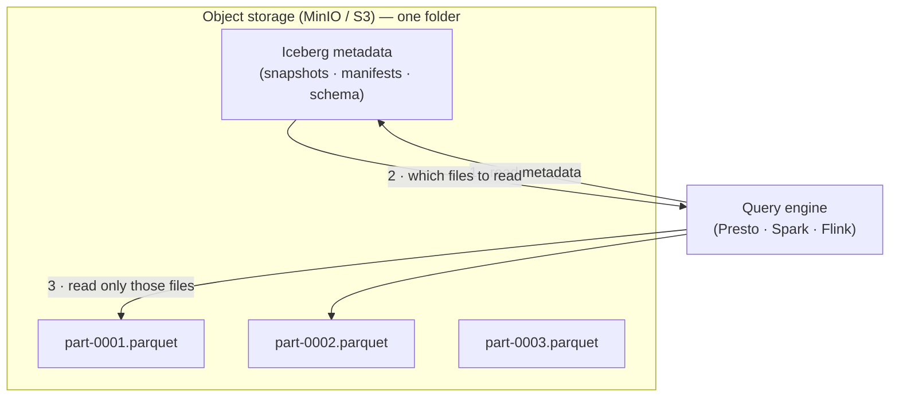
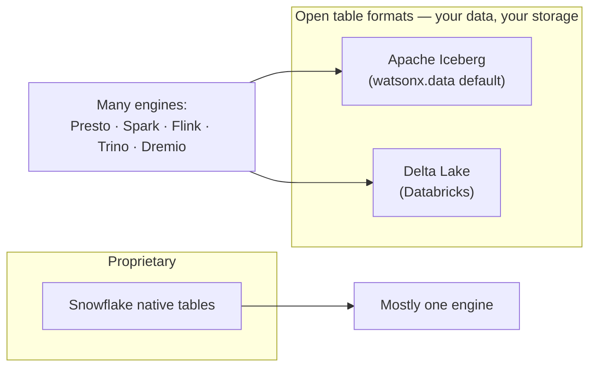
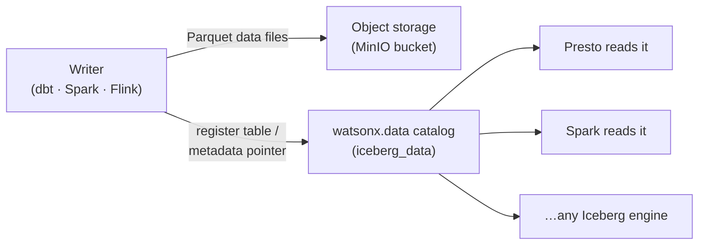

# Table Formats — Iceberg vs Parquet vs Delta

!!! abstract "The one idea to take away"
    **Parquet is a file format. Iceberg and Delta are *table* formats.** A table format is a
    thin layer of metadata that sits on top of a folder full of Parquet files and turns it back
    into something that behaves like a database table — with safe updates, history, and schema
    evolution. This whole workshop writes **Iceberg tables made of Parquet files**, the open
    format watsonx.data is built on. Delta Lake (Databricks) and proprietary formats (Snowflake)
    solve the same problem a different way.

---

## First: file vs table format

A single Parquet file is just a smart, compressed, columnar way to store rows on disk. It is
excellent at *storing* data, but it knows nothing about the other files next to it. If you have a
thousand Parquet files in a folder, "the table" is just a convention in your head — there is no
safe way to add a file, delete rows, change a column type, or ask "what did this look like
yesterday?"

A **table format** fixes that. It keeps a small set of **metadata files** that list exactly which
data files belong to the table *right now*, what the schema is, and how the table has changed over
time. Query engines read that metadata first, then read only the data files they need.

> **Parquet = the pages of the book. Iceberg = the table of contents and the index.** Without the
> index you still have all the words, but you cannot look anything up safely.

---

## Why Parquet (and not CSV or ORC)

| Property | CSV | **Parquet** | ORC |
|---|---|---|---|
| Layout | Row-by-row text | **Columnar, binary** | Columnar, binary |
| Compression | None (huge) | **Excellent** | Excellent |
| Reads one column cheaply? | No — reads everything | **Yes** | Yes |
| Schema/types stored in file? | No | **Yes** | Yes |
| Used by this demo | Source files only | **Every table** | Never |

This project standardises on **Parquet, never ORC** — every Iceberg table is written with
`format = 'PARQUET'`. Parquet is the most widely supported columnar format across Presto, Spark,
Flink, pandas, and BI tools, so the same files are readable by every engine in the workshop.

!!! note "Where this is enforced"
    The dbt models set `properties={"format": "'PARQUET'", ...}` and the Spark/Flink jobs write
    Parquet too. See [Architecture & Data Flow](lineage.md) for the column-by-column picture.

---

## What a table format adds on top of Parquet

Both Iceberg and Delta give your folder-of-Parquet these database superpowers:

| Capability | Plain Parquet folder | With a table format (Iceberg / Delta) |
|---|---|---|
| **ACID transactions** | No — a half-written file corrupts the table | Yes — readers only ever see a complete snapshot |
| **Safe `UPDATE` / `DELETE` / `MERGE`** | No — Parquet is write-once | Yes |
| **Time travel** (query an old version) | No | Yes — every snapshot is kept |
| **Schema evolution** (add/rename/drop a column) | Risky, manual | Yes — tracked in metadata |
| **Partition management** | Folder-name convention only | Declared and enforced; can change over time |
| **Concurrent writers** | Race conditions | Coordinated via the metadata/commit |

You see this directly in the workshop: the [SQL comparison](sql-demo.md) page queries Iceberg
**snapshots** and **history** (`"silver_orders$snapshots"`), and the dbt path includes an
[Iceberg time-travel demo](dbt-demo.md). None of that is possible on raw Parquet.

---

## Iceberg vs Delta vs proprietary — the honest comparison

The three table formats below solve the same problem. The big practical difference is **how open
and how portable** they are.

| | **Apache Iceberg** | **Delta Lake** | **Proprietary** (Snowflake native) |
|---|---|---|---|
| Governance | Apache Software Foundation | Linux Foundation (led by Databricks) | Single vendor |
| Underlying files | Parquet | Parquet | Vendor-managed (opaque) |
| Engine support | Broad & vendor-neutral — Presto, Spark, Flink, Trino, Dremio, Snowflake, BigQuery, watsonx.data | Strongest on Databricks/Spark; other engines via connectors | Mostly the vendor's own engine |
| "Open" reads | Any Iceberg-aware engine, no single owner | Open spec; historically Spark-centric | Limited / via export |
| Time travel | Yes (snapshots) | Yes (transaction log) | Yes |
| Streaming sink | Yes (e.g. Flink → Iceberg, the [Confluent path](confluent-demo.md)) | Yes (Structured Streaming) | Vendor-specific |
| Lock-in risk | **Low** — data stays as open Parquet + open metadata | Low-to-moderate — open spec, but ecosystem gravity toward Databricks | **High** — data lives inside the platform |

!!! tip "Why this demo uses Iceberg"
    watsonx.data is built around **open Iceberg on your own object storage (MinIO/S3)**. The same
    `iceberg_data` tables are written by dbt, Spark, *and* Flink, and read back by Presto — three
    engines, one open format, no copies. That multi-engine interoperability is exactly the
    [parity story](sql-demo.md) the whole workshop demonstrates, and it is the strongest argument
    for an open table format over a proprietary one.

!!! info "Be fair: Delta is a fine format"
    If your organisation lives in Databricks, Delta Lake is mature and excellent. The point here is
    not "Iceberg beats Delta" on features — they are close — but that **open, engine-neutral**
    storage keeps you free to choose engines later. watsonx.data, Snowflake, and others have all
    moved to support Iceberg for precisely that reason.

---

## How "a folder becomes a table" in watsonx.data

This is the bit that makes streaming click later. When Flink (or Spark, or dbt) writes data, two
things happen: **data files** land in object storage, and the **catalog** records the table's
metadata pointer. After that, *any* engine that asks the catalog "where is
`iceberg_data.dbt_demo_gold.gold_daily_sales`?" gets the metadata, reads the Parquet, and returns
rows — **no copy, no re-load.**

That "register the table in the catalog so any engine can read it" step is exactly what the
[Streaming Medallion](streaming-medallion.md) page shows for the Flink → Iceberg sink.

---

## Next step

- See the streaming version of this idea: [Streaming Medallion Explained](streaming-medallion.md).
- See the full column-by-column architecture: [Architecture & Data Flow](lineage.md).
- Pick an engine to build with: [When to Use Which](choosing.md).
