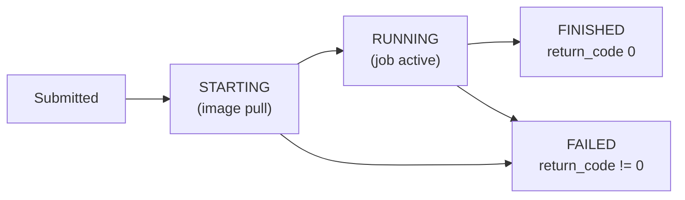

# Troubleshooting

!!! note "How to read this page"
    Find the path you were running when the error happened, then look up the error message.
    Setup issues that appear before any path are in the first section. Path-specific errors follow
    in separate sections. If your error message does not appear here, check the General Presto section
    at the bottom — many failures trace back to a cluster or TLS issue that cuts across all paths.

---

## Common Setup Issues

These errors appear during the initial environment setup, before you run any ingestion path.
Resolve them first — every path depends on a working environment.

---

### Python not found or wrong version

Python commands fail with `command not found` or the wrong version number is printed.

The workshop requires exactly Python 3.11. The `dbt-watsonx-presto` adapter has only been tested
against 3.11; using 3.12 or 3.10 often produces silent dependency conflicts.

**Verify which Python you have:**

```bash
python3.11 --version
```

Expected output:

```text
Python 3.11.x
```

If the command returns `command not found`, install Python 3.11 from
[python.org](https://www.python.org/downloads/) before continuing.

**Always use the virtual environment interpreter directly when activating fails:**

```bash
.venv/bin/python scripts/prepare_watsonx_env.py
```

!!! tip "Activate before running scripts"
    Open every new terminal with `source .venv/bin/activate`. The `(.venv)` prefix in your prompt
    confirms the environment is active. If the prefix is absent, scripts will pick up the system
    Python instead, which will likely be the wrong version or missing packages.

---

### `.env` missing or empty

Scripts exit immediately with errors such as `KeyError: 'WXD_API_KEY'` or
`WXD_API_KEY is not set`.

The `.env` file holds your API key and the connection values written by
`prepare_watsonx_env.py`. Without it nothing can authenticate.

**Create it from the template:**

```bash
cp .env.example .env
```

**Set your Software Hub API key:**

```bash
# Open .env in any editor and fill in this line:
WXD_API_KEY=<your-software-hub-api-key>
```

Then re-run the environment preparation so all other values are filled in automatically:

```bash
python scripts/prepare_watsonx_env.py
```

!!! warning "Never commit `.env`"
    `.env` is in `.gitignore` and must stay there. It contains your real API key. Verify with
    `git status` — `.env` must never appear as a file to commit.

---

### `certs/watsonxdata-ca.pem` not found

Any command that talks to Presto or the cluster API exits with an SSL error such as:

```text
ssl.SSLError: [SSL: CERTIFICATE_VERIFY_FAILED] certificate verify failed
```

or:

```text
WXD_SSL_VERIFY path does not exist: certs/watsonxdata-ca.pem
```

The certificate file is not committed to the repository — it is written to disk by the
environment preparation script from the connection JSON.

**Regenerate the file:**

```bash
python scripts/prepare_watsonx_env.py --overwrite
```

**Confirm it exists:**

```bash
ls certs/watsonxdata-ca.pem
```

If `watsonx_data/instance_details.json` is missing or empty, the script cannot extract the
certificate. See "Connection JSON not found" below.

---

### Connection JSON not found

`prepare_watsonx_env.py` exits with:

```text
FileNotFoundError: watsonx_data/instance_details.json not found
```

The connection JSON is a file you export from the watsonx.data console. It contains the
Presto endpoint address, your instance ID, and the SSL certificate chain.

**Export it from the watsonx.data console:**

1. Open the watsonx.data console in your browser.
2. Go to **Infrastructure manager** and click your Presto engine (`presto651`).
3. Click **Download connection details**.
4. Save the file as `watsonx_data/instance_details.json` inside the repository root.

If your administrator gave you a pre-exported file, copy it there directly:

```bash
cp /path/to/presto-connection.json watsonx_data/instance_details.json
```

Then re-run setup step 5:

```bash
python scripts/prepare_watsonx_env.py
```

!!! info "One JSON per environment"
    If the administrator rotates the certificate or the cluster changes, request a fresh JSON
    and run `prepare_watsonx_env.py --overwrite` to apply the new values.

---

## Path A — dbt Errors

These errors occur while running the dbt path: `dbt_env.sh seed`, `dbt_env.sh run`,
`dbt_env.sh test`, or `query_gold.py`.

---

### RemoteDisconnected / ConnectionAbortedError

dbt exits with a message similar to:

```text
RemoteDisconnected('Remote end closed connection without response')
```

or:

```text
http.client.RemoteDisconnected: Remote end closed connection without response
```

Presto has a hard limit on concurrent open connections. When dbt runs too many threads in
parallel, the cluster drops some of them mid-query.

**Reduce thread count and retry:**

```bash
bash scripts/dbt_env.sh run --threads 1
```

!!! tip "Use `--select` to avoid re-running completed models"
    If the error happened part-way through, use `--select` to restart only from the failed model
    rather than re-running the whole pipeline:

    ```bash
    bash scripts/dbt_env.sh run --threads 1 --select silver_sales_enriched+
    ```

    The `+` suffix tells dbt to also run all downstream dependencies.

---

### 500 Authentication Error / authenticator not loaded

dbt exits with an error similar to:

```text
500 Authentication Error
```

or the Presto Python client prints:

```text
PrestoAuthenticationException: authenticator not loaded
```

The bearer token that dbt uses to authenticate against Presto has expired. Tokens are
short-lived; you need to refresh them at the start of every session.

**Refresh the token:**

```bash
python scripts/prepare_watsonx_env.py --overwrite
```

Then retry the dbt command that failed. The `--overwrite` flag forces the script to fetch a
new token even if `.env` already has values.

!!! note "Token lifetime"
    IBM Software Hub tokens typically expire after a few hours. If you started the workshop in
    the morning and return after lunch, run `prepare_watsonx_env.py --overwrite` before
    continuing.

---

### NOT_SUPPORTED: Materialized views are not supported

dbt exits with:

```text
PrestoQueryError: NOT_SUPPORTED: Materialized views are not supported for Iceberg
```

This is expected behavior, not a bug. The gold layer in this demo uses two **SQL views** —
`gold_category_performance` and `gold_customer_360`. These are stored query definitions, not
materialized caches. The `dbt-watsonx-presto` adapter maps dbt `materialized='view'` to a
Presto `CREATE VIEW` statement, which is fully supported.

If you see this error, a model config has accidentally set `materialized='materialized_view'`.
Check the model file and correct it:

```sql
{{ config(
    materialized='view'   -- correct: plain SQL view
) }}
```

| dbt materialization | What Presto creates | Supported? | Notes |
|---------------------|---------------------|------------|-------|
| `table` | `CREATE TABLE AS SELECT` | Yes | Used for `gold_daily_sales` |
| `view` | `CREATE VIEW` | Yes | Used for `gold_category_performance`, `gold_customer_360` |
| `materialized_view` | `CREATE MATERIALIZED VIEW` | **No** | Not supported by Iceberg connector |
| `incremental` | `INSERT INTO ... SELECT` | Partial | Requires careful config; not used in this demo |

---

### dbt run hangs / no output for several minutes

dbt starts, prints a few model names, then appears to freeze with no further output.

The Presto cluster is under load. When too many queries are queued simultaneously, new ones
wait. This is most common when multiple workshop participants run the full pipeline at the
same time.

**Build one layer at a time with a reduced thread count:**

```bash
bash scripts/dbt_env.sh run --threads 1 --select tag:bronze
bash scripts/dbt_env.sh run --threads 1 --select tag:silver
bash scripts/dbt_env.sh run --threads 1 --select tag:gold
```

This reduces the number of simultaneous Presto connections from however many models are in
the graph down to one at a time. The run takes longer but is less likely to contend with
other workshop participants.

!!! warning "Ctrl-C and dbt cleanup"
    If you press Ctrl-C during a dbt run, the interrupted model may be in a partially written
    state. Add `--full-refresh` when you retry a `run` to force dbt to drop and recreate the
    table from scratch rather than appending to a partial result.

---

## Path B — Spark Errors

These errors occur while running the Spark path: `upload_spark_assets.py`,
`submit_spark_application.py`, or `spark_application_status.py`.

---

### Upload fails / connection refused on MinIO

`upload_spark_assets.py` exits with:

```text
ConnectionRefusedError: [Errno 111] Connection refused
```

or:

```text
botocore.exceptions.EndpointConnectionError: Could not connect to the endpoint URL
```

In some OpenShift deployments MinIO is not reachable from outside the cluster. The upload
script needs a port-forward to reach it.

**Open a port-forward in a separate terminal and keep it running:**

```bash
oc login https://api.watson.ibmas-zocp-techcluster.org:6443
oc -n cpd-instance port-forward svc/ibm-lh-lakehouse-minio-svc 19000:9000
```

**In your working terminal, override the endpoint before uploading:**

```bash
source .venv/bin/activate
export WXD_OBJECT_STORE_ENDPOINT=http://127.0.0.1:19000
python scripts/upload_spark_assets.py
```

!!! tip "Automatic port-forwarding"
    Set `WXD_OBJECT_STORE_AUTO_PORT_FORWARD=true` in `.env` to have the upload script open the
    port-forward for you. This requires `oc` to be installed and you to be already logged in.

!!! warning "Keep the port-forward terminal open"
    The moment you close the terminal running the `oc port-forward` command, the tunnel closes
    and uploads fail with `Connection refused`. Open a dedicated terminal for the port-forward
    and leave it running for the entire Spark demo.

---

### Spark job stays in `STARTING` for more than five minutes

The status script returns `STARTING` on every poll, never progressing to `RUNNING`:

```text
state: STARTING
```

The Spark engine needs to pull the PySpark runtime container image. On first submission this
can take three to five minutes. If it takes longer, the image pull may have stalled or the
engine may be misconfigured.

**Check the Spark engine logs in the watsonx.data console:**

1. Open the watsonx.data console.
2. Go to **Infrastructure manager → Spark engine `spark656` → Applications**.
3. Find your application ID and click it.
4. Look at the **Events** or **Logs** tab for image pull errors or resource quota messages.

**From the terminal, check the engine's current application list:**

```bash
python scripts/spark_application_status.py <application-id>
```



!!! note "There is no 'approved' state for Spark applications"
    Spark application states are `accepted`, `running`, `finished`, `failed`, and `stopped`.
    The word "approved" belongs to other watsonx.data workflows (like cpdctl ingestion jobs),
    not to Spark submissions.

---

### `FINISHED` with `return_code != 0`

The status script returns:

```text
state: FINISHED
return_code: 1
```

The Spark job launched and ran, but the PySpark script itself threw an unhandled exception
and exited with a non-zero code. The Spark framework marks it as finished (not failed) but
records the non-zero exit.

**Find the driver logs in the watsonx.data console:**

1. Go to **Infrastructure manager → Spark engine `spark656` → Applications**.
2. Click your application by ID.
3. Open the **Driver logs** or **Spark UI** link.
4. Search the logs for `Exception` or `Error` to find the root cause.

Common causes and fixes:

| Symptom in logs | Likely cause | Fix |
|---|---|---|
| `Path does not exist: s3a://iceberg-bucket/spark_demo/raw/` | CSV files not uploaded | Re-run `python scripts/upload_spark_assets.py` |
| `Schema iceberg_data.spark_demo_bronze not found` | Schema bootstrap skipped | Run `python scripts/bootstrap_watsonxdata.py` first |
| `NoCredentialsError` / `Access Denied` | Wrong MinIO credentials in Spark config | Verify `WXD_OBJECT_STORE_ACCESS_KEY` and `WXD_OBJECT_STORE_SECRET_KEY` in `.env` |
| `OutOfMemoryError` | Spark worker has insufficient memory | Check cluster resource usage in the console and retry when other jobs are done |

---

### Spark job not appearing in watsonx.data Ingestion history

You submitted the Spark demo job but cannot find it under
**Data manager → Ingestion → History**.

This is by design. The demo Spark job is a **PySpark application** submitted through the
Spark applications API. The Ingestion history only shows jobs created by the platform's
built-in ingestion service — jobs that begin with `ingestion-<id>`.

| Where you look | What it shows | Does the Spark demo job appear? |
|---|---|---|
| **Data manager → Ingestion → History** | Jobs created by the native ingestion service (names like `ingestion-<id>`) | **No** — by design |
| **Infrastructure manager → Spark engine `spark656` → Applications** | Every application submitted to the Spark engine | **Yes** — look here |

Find the job under **Infrastructure manager → Spark → Applications**, or check its status
from the terminal:

```bash
python scripts/spark_application_status.py <application-id>
```

!!! info "If you want a job that appears in Ingestion history, use Path C"
    The cpdctl native ingestion path (Path C) submits jobs through the ingestion service so
    they appear under Data manager → Ingestion. See [ingestion.md](ingestion.md).

---

## Path C — cpdctl Errors

These errors occur while running the cpdctl native ingestion path.

---

### I002 Invalid input provided — `--storage-name` on a registered bucket

`cpdctl` returns:

```text
Error: I002 Invalid input provided: --storage-name is not valid for registered storage
```

`iceberg-bucket` is already registered in the watsonx.data catalog, so the ingestion service
auto-detects the bucket from the `s3://iceberg-bucket/…` path. Passing `--storage-name` in
addition to the path triggers the unregistered-storage code path, which rejects the request.

**Fix: omit `--storage-name` entirely when the bucket is registered.**

If your script sets `WXD_INGEST_STORAGE_NAME` in `.env`, clear it:

```bash
# In .env — remove or comment out this line:
# WXD_INGEST_STORAGE_NAME=iceberg-bucket
```

| Bucket situation | Use `--storage-name`? | Example |
|---|---|---|
| Bucket is registered in watsonx.data catalog | **No** — omit the flag | `iceberg-bucket` in this workshop |
| Bucket is external / not registered | **Yes** — required | A personal S3 bucket not added to the catalog |

---

### `cpdctl: command not found`

Any `cpdctl` command returns:

```text
cpdctl: command not found
```

The binary is not on your `PATH`. Either it was not installed yet, or it was extracted to a
directory that your shell does not check.

**Install the binary and add it to PATH:**

```bash
# macOS Apple Silicon
curl -fsSL -o cpdctl.tar.gz \
  https://github.com/IBM/cpdctl/releases/download/v1.8.233/cpdctl_darwin_arm64.tar.gz
tar -xzf cpdctl.tar.gz -C ~/.local/bin && chmod +x ~/.local/bin/cpdctl
```

If `~/.local/bin` is not on your `PATH`, add it:

```bash
export PATH="$HOME/.local/bin:$PATH"
```

Then verify:

```bash
cpdctl version
```

!!! tip "Make the PATH change permanent"
    Add the `export PATH` line to `~/.zshrc` (macOS) or `~/.bashrc` (Linux) so cpdctl is
    available in every new terminal.

| Platform | Architecture | Filename to download |
|---|---|---|
| macOS | Apple Silicon (M1/M2/M3) | `cpdctl_darwin_arm64.tar.gz` |
| macOS | Intel | `cpdctl_darwin_amd64.tar.gz` |
| Linux | x86-64 | `cpdctl_linux_amd64.tar.gz` |
| Linux | ARM64 | `cpdctl_linux_arm64.tar.gz` |
| Windows | x86-64 | `cpdctl_windows_amd64.zip` |

Full release list: [github.com/IBM/cpdctl/releases](https://github.com/IBM/cpdctl/releases)

---

### 401 Unauthorized when running cpdctl commands

`cpdctl` returns:

```text
Error: 401 Unauthorized
```

or:

```text
FAILED: The user credentials are invalid or the token has expired.
```

The profile stored in `cpdctl` does not have a valid API key, or the key has expired or been
rotated. Re-creating the profile from the current `.env` values fixes this.

**Re-run the profile setup command:**

```bash
set -a; source .env; set +a

cpdctl config profile set wxd-demo \
  --url "https://${WXD_CPD_HOST}" \
  --username "${WXD_CPD_USERNAME}" \
  --apikey "${WXD_API_KEY}" \
  --env "WATSONX_DATA_INSTANCE_ID=${WXD_INSTANCE_ID}"
```

Then confirm the profile is active:

```bash
cpdctl config profile get wxd-demo
```

!!! warning "Check `SSL_CERT_FILE` after profile setup"
    After reopening a terminal, re-export the CA certificate path before running cpdctl:

    ```bash
    export SSL_CERT_FILE="$PWD/certs/watsonxdata-ca.pem"
    ```

    Without this, cpdctl may return a TLS error that looks like a 401 but is actually a
    certificate rejection at the transport layer.

---

## OpenMetadata Errors

These errors occur during the OpenMetadata lineage demo at `localhost:8585`.

---

### OpenMetadata not ready after 10 minutes

The `curl` health poll keeps printing:

```text
waiting for OpenMetadata...
```

and never prints a version response.

Docker is still pulling images or the JVM inside the OpenMetadata container is still
starting. The first pull downloads approximately 3 GB.

**Check the server container logs:**

```bash
docker compose -f openmetadata/docker-compose.yml logs openmetadata-server | tail -30
```

Look for `INFO: Started server process` near the bottom. If you see Java stack traces, wait
two more minutes and check again — JVM cold start is the slowest part.

**Check that Docker has enough memory:**

OpenMetadata needs at least 6 GB of RAM allocated to Docker Desktop. Open Docker Desktop
Settings → Resources and confirm the Memory slider is set to 6 GB or higher.

!!! note "Subsequent starts are fast"
    Once images are pulled and cached locally, the containers start in under a minute.
    The long wait only happens the first time.

---

### 401 Unauthorized during ingestion

The ingestion script exits with:

```text
ERROR - 401 Unauthorized: JWT token is invalid or expired
```

OpenMetadata issues short-lived JWT tokens. If the Docker containers were stopped and
restarted since the script last ran, the old token in the YAML config is no longer valid.

**Rerun the ingestion script — it fetches a fresh token automatically:**

```bash
bash openmetadata/ingestion/run-ingestion.sh
```

The script calls the OpenMetadata API to get a new token, substitutes it into the YAML
config, and runs `metadata ingest` with the fresh credentials.

---

### `catalog.json` missing or not found

The ingestion script exits with:

```text
ERROR - catalog.json not found at openmetadata/dbt-artifacts/catalog.json
```

or OpenMetadata shows models without column details.

`catalog.json` is only produced by `dbt docs generate`, not by `dbt run` or `dbt test`.
It requires a live Presto connection because it queries the warehouse for column metadata.

**Generate the artifacts and copy them:**

```bash
bash scripts/dbt_env.sh docs generate --no-compile
cp target/manifest.json target/catalog.json target/run_results.json \
   openmetadata/dbt-artifacts/
```

**If Presto is temporarily unavailable**, you can still show lineage from `manifest.json`
alone by skipping the catalog step:

```bash
python scripts/prepare_openmetadata_dbt_artifacts.py --skip-dbt
python scripts/upload_dbt_artifacts.py
```

Then rerun the full artifact generation when Presto recovers:

```bash
python scripts/prepare_openmetadata_dbt_artifacts.py
python scripts/upload_dbt_artifacts.py
```

!!! info "`manifest.json` vs `catalog.json`"
    `manifest.json` is all that is needed for the lineage graph. `catalog.json` adds column
    names and data types to the model detail view. If `catalog.json` is missing, lineage still
    works — you just see fewer column details in the table pages.

---

### Package version mismatch during ingestion

The ingestion script fails with a pip error such as:

```text
ERROR: No matching distribution found for openmetadata-ingestion[dbt]==1.13.0.0
```

The pinned version `1.13.0.0` is no longer available from the package index. Install without
a version pin and rerun:

```bash
pip install "openmetadata-ingestion[dbt]"
bash openmetadata/ingestion/run-ingestion.sh
```

---

## General Presto / watsonx.data Errors

These errors can appear in any path because all paths ultimately talk to the Presto cluster
or the watsonx.data API.

---

### 503 Service Unavailable

Any script that connects to Presto returns:

```text
503 Service Unavailable
```

or:

```text
requests.exceptions.HTTPError: 503 Server Error: Service Unavailable
```

The Presto cluster is restarting or temporarily overloaded. This is transient — the cluster
does not need user intervention.

**Wait 2–3 minutes and retry the command that failed.** The cluster self-heals. If the 503
persists beyond five minutes, notify the workshop administrator — the Presto pod on OpenShift
may need to be restarted manually.

!!! note "Why Presto restarts"
    In a workshop environment multiple participants submit queries simultaneously. Occasionally
    the cluster recycles a worker pod to reclaim memory. The coordinator remains available and
    most queries queue rather than fail, but some connections made at exactly the wrong moment
    see a 503.

---

### SSL certificate error (all tools)

Any command that talks to the cluster exits with:

```text
ssl.SSLCertVerificationError: [SSL: CERTIFICATE_VERIFY_FAILED]
```

or:

```text
CERTIFICATE_VERIFY_FAILED: unable to get local issuer certificate
```

The watsonx.data cluster uses a certificate issued by an internal OpenShift CA. Your tools
need to trust that CA. The certificate file must be present at `certs/watsonxdata-ca.pem`
and pointed to by the right environment variable for each tool.

**For Python scripts and dbt (via `WXD_SSL_VERIFY` in `.env`):**

```bash
# Confirm the file exists
ls certs/watsonxdata-ca.pem

# If missing, regenerate it
python scripts/prepare_watsonx_env.py --overwrite
```

**For cpdctl (via `SSL_CERT_FILE` environment variable):**

```bash
export SSL_CERT_FILE="$PWD/certs/watsonxdata-ca.pem"
```

**For general Python requests (fallback):**

```bash
export SSL_CERT_FILE="$PWD/certs/watsonxdata-ca.pem"
export REQUESTS_CA_BUNDLE="$PWD/certs/watsonxdata-ca.pem"
```

!!! warning "Do not use `--insecure` or `verify=False`"
    Disabling TLS verification silences the error but exposes your API key to interception.
    Fix the certificate path instead — it takes 30 seconds and keeps your credentials safe.

---

### MkDocs port already in use

`mkdocs serve` exits with:

```text
ERROR - Address already in use: 127.0.0.1:8000
```

Another process is already using port 8000. Choose any free port:

```bash
mkdocs serve -a 127.0.0.1:8001
```

Then open `http://127.0.0.1:8001` in your browser.

---

### `WXD_SPARK_DRY_RUN=true` — job never submits

You ran the Spark submit script but no application ID was printed and nothing appears in the
engine's Applications tab.

The dry-run flag is set to `true`, which prints the job payload without sending it to the
cluster. This is intentional for verifying config — set the flag to `false` to submit for
real:

```bash
WXD_SPARK_DRY_RUN=false python scripts/submit_spark_application.py
```

Or set it permanently in `.env`:

```bash
WXD_SPARK_DRY_RUN=false
```
